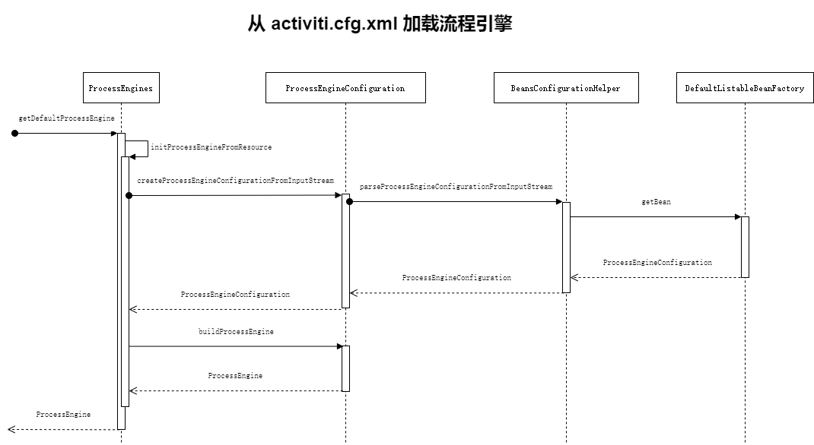
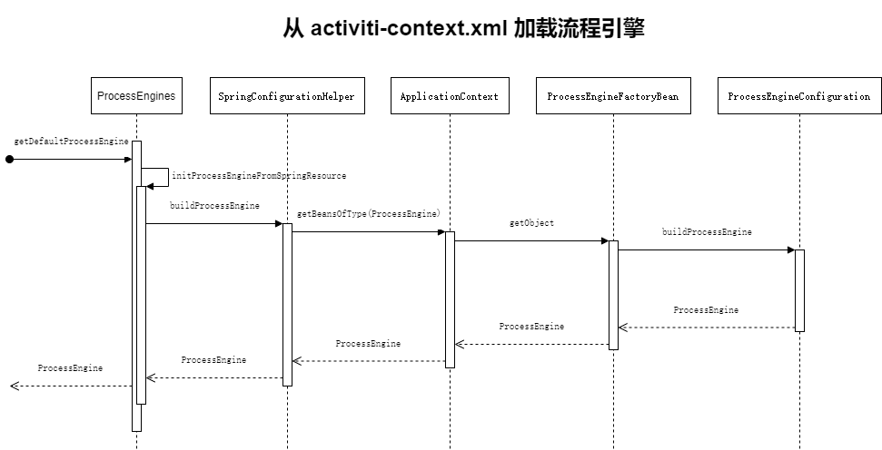

# 第2章 探险流程引擎
- [x] 2.1 [流程配置文件](#流程配置文件)
  - 2.1.1 [Activiti 配置风格](#Activiti-配置风格)
  - 2.1.2 [Spring 配置风格](#Spring-配置风格)
- [x] 2.2 流程引擎架构
- [x] 2.3 [构造流程引擎实例对象](#构造流程引擎实例对象)
  - 2.3.1 [初始化流程引擎之 Activit 配置风格](#初始化流程引擎之-Activit-配置风格)
  - 2.3.2 构造流程引擎实例对象
  - 2.3.3 创建流程引擎配置类实例
  - 2.3.4 初始化流程引擎
  - 2.3.5 [初始化流程引擎之 Spring 配置风格](#初始化流程引擎之-Spring-配置风格)
- [x] 2.4 [初始化流程引擎配置类](#初始化流程引擎配置类)
- [x] 2.5 [配置器](#配置器)
  - 2.5.1 初始化配置器
  - 2.5.2 [配置器实战](#配置器实战)
- [x] 2.6 [初始化流程引擎](#初始化流程引擎)
  - 2.6.1 [操作引擎表](#操作引擎表)
- [x] 2.7 [管理流程引擎](#管理流程引擎)
  - 2.7.1 注册流程引擎
  - 2.7.2 关闭流程引擎
- [x] 2.8 [流程引擎生命周期监听器](#流程引擎生命周期监听器)
- [x] 2.9 [其他方式构造引擎实例](#其他方式构造引擎实例)
  - 2.9.1 [ProcessEngineConfiguration 类创建引擎](#ProcessEngineConfiguration-类创建引擎)
  - 2.9.2 [编程方式创建引擎](#编程方式创建引擎)

## 流程配置文件

### Activiti 配置风格

依赖只需要：

```xml
<dependency>
    <groupId>org.activiti</groupId>
    <artifactId>activiti-engine</artifactId>
    <version>6.0.0</version>
</dependency>
```

配置文件：[activiti.cfg.xml](assets/activiti.cfg.xml)

### Spring 配置风格

依赖另外添加：

```xml
<dependency>
    <groupId>org.activiti</groupId>
    <artifactId>activiti-spring</artifactId>
    <version>6.0.0</version>
</dependency>
```

配置文件：[activiti-context.xml](assets/activiti-context.xml)

## 构造流程引擎实例对象

### 初始化流程引擎之 Activit 配置风格



### 初始化流程引擎之 Spring 配置风格



## 初始化流程引擎配置类

初始化：[`ProcessEngineConfigurationImpl#init()`](https://gitee.com/mirrors/Activiti/blob/activiti-6.0.0/modules/activiti-engine/src/main/java/org/activiti/engine/impl/cfg/ProcessEngineConfigurationImpl.java#L681)

## 配置器

初始化配置器：`ProcessEngineConfigurationImpl#initConfigurators()`

### 配置器实战

继承 `AbstractProcessEngineConfigurator`，然后配置 `ProcessEngineConfiguration#configurators`

## 初始化流程引擎

创建流程引擎：

- `ProcessEngineConfigurationImpl#buildProcessEngine()`

- `ProcessEngineImpl()`

大致步骤：

- 初始化属性
- 数据库生成
- 注册流程引擎
- 作业执行
- 流程监听器
- 转发事件

> 表生成策略 `databaseSchemaUpdate`：
>
> - `flase`：默认值。流程引擎启动时,首先从ACT_ GE_ PROPERTY表中查询Activiti引擎的版本值(NAME字段的值等于'schema. version') ,然后获取ProcessEngine接口中定义的VERSION静态变量值,两者进行对比，如果数据库中的表不存在或者表存在但版本不匹配则直接拋出异常。
> - `true`：流程引擎启动时会对所有的表进行更新操作(upgrade目录中的DDL脚本),如果数据库中的表不存在则开始创建表(create目录中的DDL脚本)。
> - `create_drop`：流程引擎启动时创建表,流程引擎关闭时删除表(流程引擎的关闭形.如processEngine.close( ))。
> - `drop-create`：流程引擎启动时首先删除数据库中存在的表然后重新创建表(该方式不需要手动关闭流程引擎),该操作非常危险,因此不建议正式环境使用。
> - `create`：流程引擎启动时直接创建表不管数据库是否存在表,这就意味着如果数据库中已经存在表,再次执行创建表的DDL肯定会报错,因此不建议使用。

### 操作引擎表

- `SchemaOperationsProcessEngineBuild`

- `DbSqlSession#performSchemaOperationsProcessEngineBuild()`

## 管理流程引擎

注册流程引擎：

- `ProcessEngines#registerProcessEngine()`

关闭流程引擎：

- `ProcessEngineImpl#close()`

## 流程引擎生命周期监听器

- 配置 `ProcessEngineConfiguration#processEngineLifecycleListener`

## 其他方式构造引擎实例

### ProcessEngineConfiguration 类创建引擎

- `ProcessEngineConfiguration#create*ProcessEngineConfiguration()`

- 然后 `ProcessEngineConfiguration#buildProcessEngine()`

### 编程方式创建引擎

```java
ProcessEngine processEngine = ProcessEngineConfiguration.createStandaloneProcessEngineConfiguration()
    .setJdbcUrl("jdbc:mysql://127.0.0.1:3306/activiti")
    .setJdbcDriver(Driver.class.getName())
    .setJdbcUsername("root")
    .setJdbcPassword("root")
    .buildProcessEngine();
```

