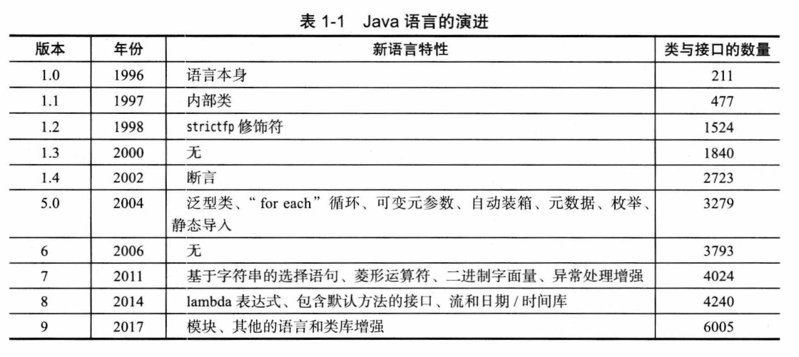

# 第 1 章 Java 程序设计概述

## 1.1 Java 程序设计平台

Java 本来有潜力成为一种卓越的程序设语言，但可能有些为时过晚。一旦一种语言得到广泛应用，与现存代码尴尬的**兼容性问题**就摆在了人们的面前。由于兼容性需求，新增的一些特性就没有原有特性那么简洁精练。

Java 并不只是一种语言，Java 是一个**完整的平台**，有一个庞大的库，其中包含了很多可重用的代码，以及一个提供诸如安全性、跨操作系统的可移植性以及自动垃圾收集等服务的执行环境。

## 1.2 Java“白皮书”的关键术语

Java 设计者编写了“白皮书”，用来解释设计的初衷以及完成的情况，并且发布了一个简短的摘要，包括下面 11 个关键术语：

1. **简单性**（Simple）
2. **面向对象**（Object-Oriented）
3. **分布式**（Distributed）
4. **健壮性**（Robust）
5. **安全性**（Secure）
6. **体系结构中立**（Architecture Neutral）
7. **可移植性**（Portable）
8. **解释型**（Interpreted）
9. **高性能**（High Performance）
10. **多线程**（Multithreaded）
11. **动态性**（Dynamic）

> **资源：**
>
> - **白皮书：** <https://www.oracle.com/technetwork/java/langenv-140151.html>。
> - **11 个关键术语：** <http://horstmann.com/corejava/java-an-overview/7Gosling.pdf>。

### 1.2.1 简单性

> **白皮书：** 我们希望构建一个无须深奥的专业训练就可以进行编程的系统，并且要符合当今的标准惯例。因此，尽管我们发现 C++ 不太适用，但在设计 Java 的时候还是尽可能地接近 C++，以便系统更易于理解。Java **剔除**了C++ 中许多很少使用、难以理解、容易混淆的特性。在我们看来，这些特性带来的麻烦远远多于它们的好处。
>
> “简单”的另一个方面是**小**。Java 的目标之一是支持开发能够在小型机器上独立运行的软件。基本的解释器以及类支持大约仅为 40 KB，再加上基础的标准类库和对线程的支持（基本上是一个自包含的微内核），大约需要增加 175 KB。

由于不断发展，Java 的类库已经相当庞大。不过还存在一个用于嵌入式设备具有较小类库的 **Java 微型版（Java Micro Edition）**。

### 1.2.2 面向对象

> **白皮书：** 简单地讲，面向对象设计是一种程序设计技术。它将重点放在数据（即对象）和对象的接口上。用木匠打一个比方：一个“面向对象的”木匠始终首先关注的是所制作的椅子，其次才是所使用的工具；一个“非面向对象的”木匠主要考虑的是所用的工具。在本质上，Java 的面向对象能力与 C++ 是一样的。

Java 与 C++ 的主要不同点在于**多重继承**，在 Java 中，取而代之的是更简单的**接口**概念。与 C++ 相比，Java 提供了更丰富的**运行时自省**功能。

### 1.2.3 分布式

> **白皮书：** Java 有一个丰富的例程库，用于处理像 HTTP 和 FTP 之类的 TCP/IP 协议。Java 应用程序能够通过 URL 打开和**访问网络**上的对象，其便**捷程**度就好像访问本地文件一样。

### 1.2.4 健壮性

> **白皮书：** Java 的设计目标之一在于使得 Java 编写的程序具有多方面的可靠性。Java 非常强调进行早期的问题检测、后期动态的（运行时）检测，以及消除容易出错的情况……Java 与 C/C++ 最大的不同在于 Java 采用的**指针模型**可以消除重写内存和损坏数据的可能性。

### 1.2.5 安全性

> **白皮书：** Java 要适用于网络/分布式环境。为了实现这个目标，安全性颇受重视。使用 Java 可以构建防病毒、防篡改的系统。

### 1.2.6 体系结构中立

> **白皮书：** 编译器生成一个体系结构中立的目标文件格式，这是一-种编译过的代码，只要有 Java 运行时系统，这些编译后的代码可以在许多处理器上运行。Java 编译器通过生成与特定的计算机体系结构无关的**字节码**指令来实现这-特性。精心设计的字节码不仅可以很容易地在任何机器上解释执行，而且还可以动态地转换成本地机器代码。

解释型虚拟机指令肯定会比运行机器指令慢很多，不过，虚拟机的一个选项，可以将执行最频繁的字节码序列转换成机器码，这一过程成为**及时编译**。

### 1.2.7 可移植性

> **白皮书：** 与 C 和 C++ 不同，Java 规范中没有“依赖具体实现”的地方。基本数据类型的**大小**以及有关**运算的行为**都有**明确**的说明。
>
> 作为系统组成部分的类库，定义了**可移植的接口**。例如，有一个抽象的 Window 类，并给出了在 UNIX、Windows 和 Macintosh 环境下的不同实现。

### 1.2.8 解释型

> **白皮书：** Java 解释器可以在任何移植了解释器的机器上直接执行 Java 字节码。由于连接是一个增量式且轻量级的过程，所以，开发过程也变得更加快捷，更加具有探索性。

在 Java 发展的前 20 年里，没有把重点放在解释器上，直到 **Java 9 提供了 jshell** 工具支持快捷而且具有探索性的编程。

### 1.2.9 高性能

> **白皮书：** 尽管对解释后的字节码性能已经比较满意，但在有些场合下还需要更高的性能。字节码可以（在运行时）动态地转换成对应运行这个应用的特定 CPU 的机器码。

**即时编译器**可以与传统编译器相媲美，而且在某些情况下超越了传统编译器。原因是可以监控哪些代码频繁执行，并优化这些代码以提高速度。

### 1.2.10 多线程

> **白皮书：** 多线程可以带来更快的交互响应和实时行为。

Java 是**第一个支持并发程序设计**的主流语言。从白皮书中可以看到**出发点是**并发程序设计确保当时的**用户界面不会“冻住”**。

### 1.2.11 动态性

> **白皮书：** 从很多方面来看，Java 与 C 或 C++ 相比更加具有动态性。它能够适应不断发展的环境。库中可以自由地添加新方法和实例变量，而对客户端却没有任何影响。在 Java 中找出运行时类型信息十分简单。

> **注释：** Java 成功推出后不久，微软发布了 **J++**，与 Java 有几乎相同的编程语言和虚拟机，后被 **C#** 取代。

## 1.3 Java applet 与 Internet

用户从 Internet 下载 Java 字节码，并在自己的机器上运行。在**网页中运行的 Java 程序称为 applet**。

如今，要在浏览器中使用 applet，这不仅需要一定水平，而且需要付出很大努力。例如访问 Jmol 网站（http://jmol.sourceforge.net/demo/aminoacids.html），可能会看到一个信息，警告你要适当地配置浏览器以允许运行 applet（🙋‍♂️已经不是使用 applet 了）。

> **🙋‍♂️怎样开启 applet：** [How do I enable Java in my web browser?](https://www.java.com/en/download/help/enable_browser.html)。

## 1.4 Java 发展简史

- 1991 年 Sun 公司 Green 项目，由 Patrick Naughton 和 James Gosling 带领设计的一种小型计算机语言。以 C++ 为基础，Gosling 称这门语言为 Oak（大概他喜欢办公室外的一颗橡树），后发现已经有一门语言叫 Oak，改名为 Java。
- 1994 年 First Person 公司（之前的 Green 项目）解散。
- 1995 年 Patrick Naughton 和 Jonathan Payne 使用 Java 开发了 HotJava 浏览器。
- 1996 年 Sun 发布了 Java 1.0。
- 1998 年发布了 1.2，并更名为“Java 2 标准版软件开发包 1.2 版”，除了 Java SE，还有 Java ME 和 Java EE。
- 2000 年和 2002 年 发布了 1.3 和 1.4，对 Java 2 版本做了增量式改进。
- 2004 年发布了重大改进版本 5.0（原定 1.5）。
- 2006 年发布了 6（没有后缀 .0）。
- 2009 年 Sun 被 Oracle 收购，发布了 Java 7。
- 2014 年发布了 Java 8。
- 2017 年发布了 Java 9，主要特性要一直追溯到 2008 年。
- 2018 年开始每 6 个月就发布一个 Java 版本。

**表 1-1  Java 语言的演进**



> **🙋‍♂️Java 版本发布：**
>
> - 发布计划：[List View](https://www.java.com/releases)、[View by Month](https://www.java.com/releases/matrix)、[All Releases](https://www.java.com/releases/fullmatrix/)。
>- 路线图：[Oracle Java SE Support Roadmap](https://www.oracle.com/java/technologies/java-se-support-roadmap.html)。
> - 长期支持版本（LTS）：7、8、11、17、21。
> 
>  2018 年 3 月发布的 10，9 月发布的 11，每年发布两个版本，那么 20xx 年 3 月发布的版本是：
>
> ```text
>(xx - 18) * 2 + 10
> ```

## 1.5 关于 Java 的常见误解

略。

