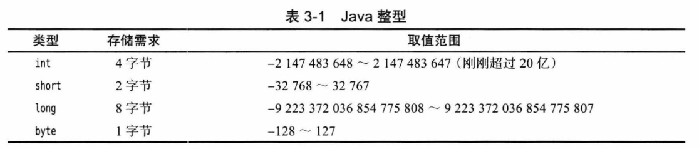
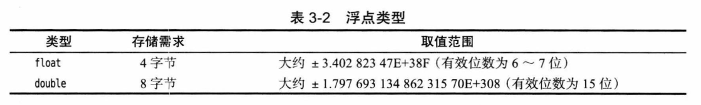
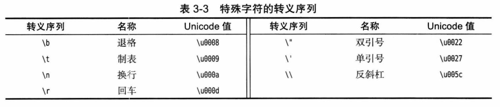
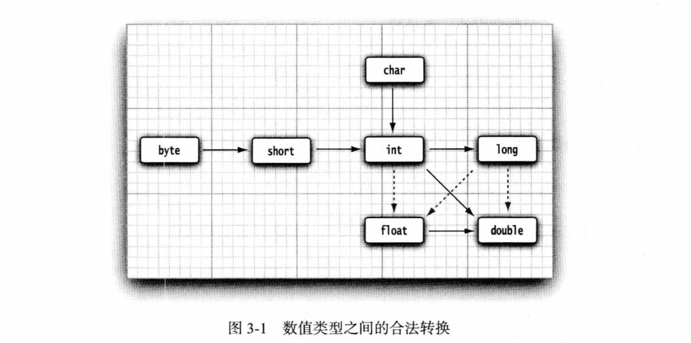
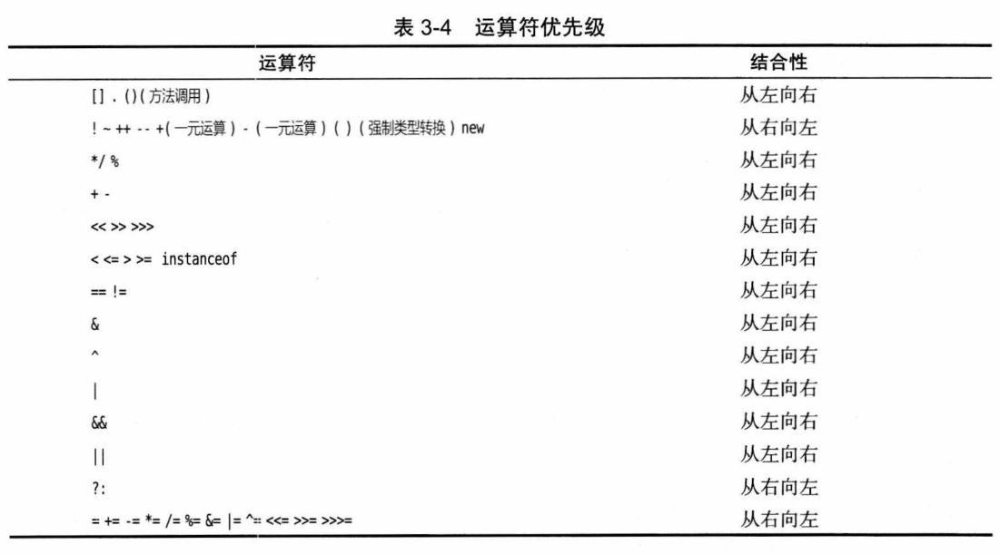
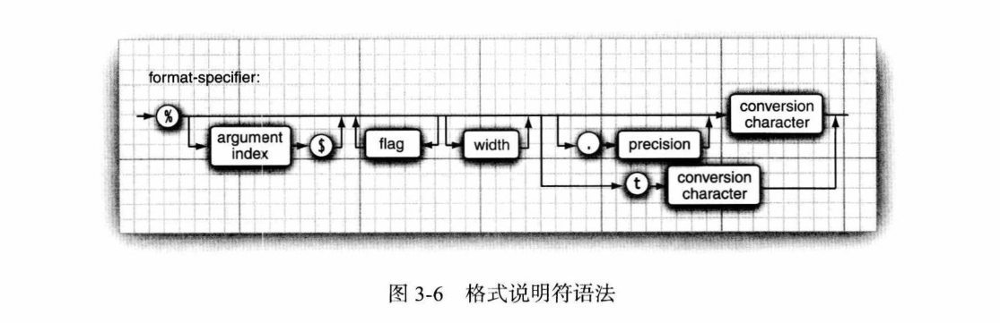
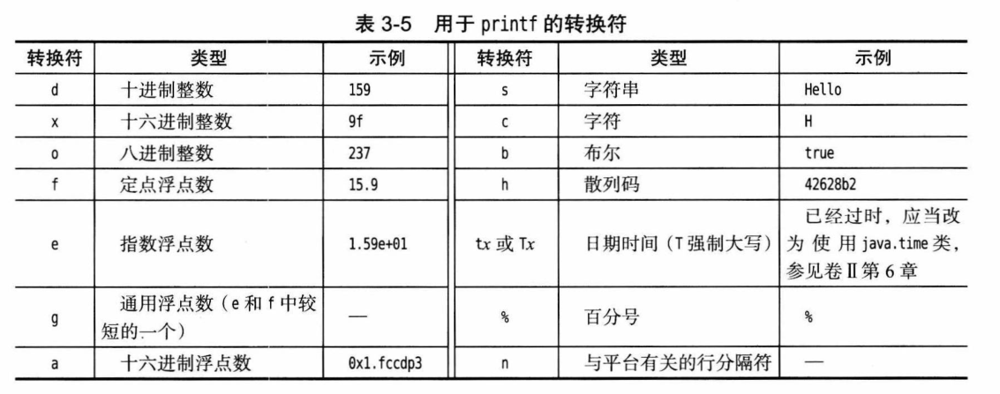
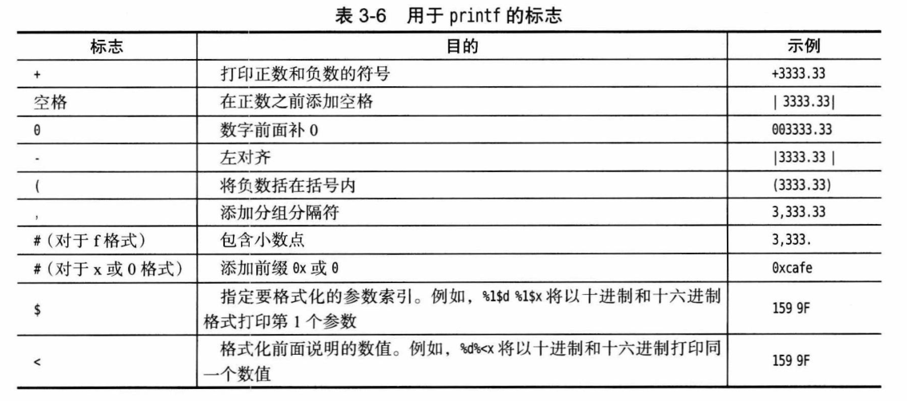
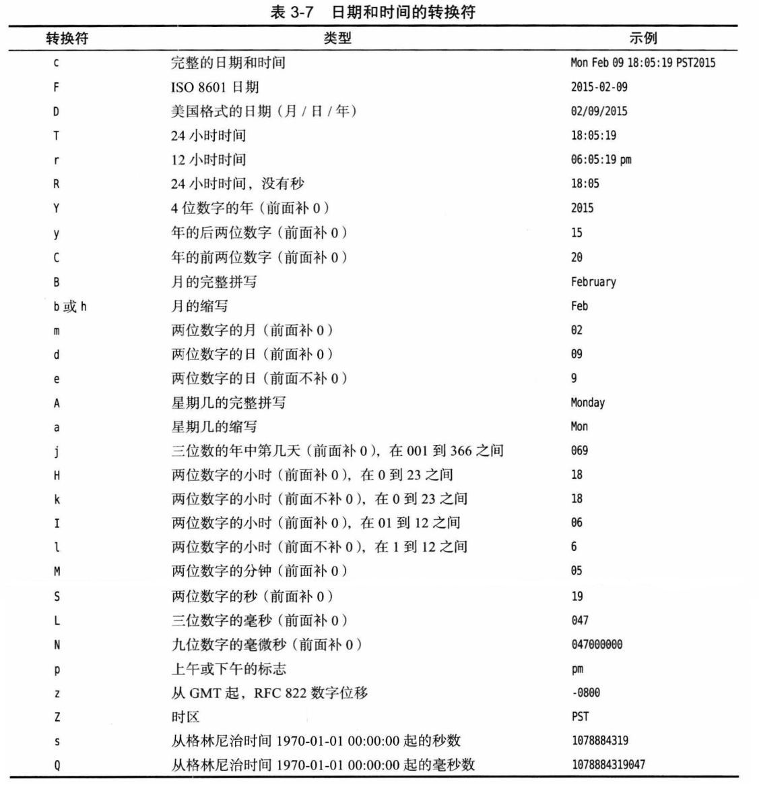

# 第 3 章 Java 的基本程序设计结构

## 3.1 一个简单的 Java 应用程序

- 文件名：源代码文件名必须与公共类名名字相同。
- 方法：Java 中的所有函数都是某个类的方法。

**main 方法：**

- public：根据 [Java 语言规范](https://docs.oracle.com/javase/specs)，`main` 方法必须声明为 `public`。
- bug：当 `main` 方法不为 `public` 时，某些版本存在 [bug](https://bugs.java.com/bugdatabase/view_bug.do?bug_id=4252539) 也可以运行，1.4 之后修复。
- exit：Java `main` 方法没有为操作系统返回“退出码”，正常结束退出码为 0，返回其他退出码使用 `System.exit` 方法。

## 3.2 注释

**3 种注释：**

- 单行注释：`//`。
- 多行注释：`/* */`。
- 文档注释：`/** */`。

## 3.3 数据类型

**8 种基本数据类型：**

- 4 种整型：`byte`、`short`、`int`、`long`。
- 2 种浮点类型：`float`、`double`。
- 1 种字符类型：`char`。
- 1 种布尔类型：`boolean`。

### 3.3.1 整型

**整型大小：**



**整型字面量：**

- 长整型：后缀 `l` 或 `L`。
- 十六进制：前缀 `0x` 或 `0X`。
- 八进制：前缀 `0`。
- 二进制：前缀 `ob` 或 `0B`。
- 下划线：更易读。

**无符号：**

- 没有无符号：Java 没有任何无符号形式的 `int`、`long`、`short` 或 `byte` 类型。
- 表示无符号：一个 `byte` 也可以表示 0 到 255 的范围，基于二进制算数运算的性质，只要不溢出，加法、减法和乘法都能正常计算；但是对于其他运算，需要调用 `Byte.toUnsignedInt(byte x)` 来得到一个 0 到 255 的 int 值，处理后再转换回 `byte`。

### 3.3.2 浮点类型



**浮点字面量：**

- 无后缀：默认为 `double`。
- float：`f` 或 `F`。
- double：`d` 或 `D`。

**浮点科学计数：**

- 十进制：`e`  或  `E`，基数为 10，例如：`0.125=1.25e-1`。
- 十六进制：`p`  或  `P`，基数为 2，例如：`0.125=2^-3=0x1.0p-3`。

**浮点特殊值：**

- 正无穷大：`Double.POSITIVE_INFINITY`。
- 负无穷大：`Double.NEGATIVE_INFINITY`。
- NaN：`Double.NaN`，注意：不能使用等于检测是否为 NaN，应该用 `Double.isNaN`。

### 3.3.3 char 类型

- 范围：从 `\u0000` 到 `\uFFFF`。

**当心注释中的 \u：**

  - 语法错误，因为 `\u000a` 会替换为一个换行符：

    ```java
    // \u000A is a newline
    ```

- 语法错误，因为 \u 后面并没有跟着 4 个十六进制数：

  ```java
  // look inside c:\users
  ```

**转义：**



### 3.3.4 Unicode 和 char 类型

**码点：**

- 码点可以分成 17 个代码平面（code plane），从 `U+0000` 到 `U+10FFFF`。
- 1 个基本多语言平面：basic multilingual plane，从 `U+0000` 到 `U+FFFF`。
- 16 个辅助平面：supplementary character，从 `U+10000` 到 `U+10FFFF`。

**UTF-16 编码：**

- 代码单元：char 类型描述了 UTF-16 编码中的一个代码单元。
- 替代区域（surrogate area）：第一个代码单元 `U+D800` 到 `U+DBFF`，第二个代码单元 `U+DC00` 到 `U+DFFF`，共 2048 个值。
- UTF-16 编码算法：https://tools.ietf.org/html/rfc2781。

### 3.3.5 boolean 类型

- Java 中整形和 boolean 之间不能进行相互转换。

## 3.4 变量与常量

### 3.4.1 声明变量

**变量名规则：**

- 开头：以字母开头，判断用 `Character.isJavaIdentifierStart()`。
- 组成：由字母或数字构成的序列，判断用 `Character.isJavaIdentifierPart()`。
  - 字母：包括 `A~Z`、`a~z`、 `_`、`$` 或在某种语言中表示字母的任何 Unicode 字符。
  - 数字：包括 `0~9` 和在某种语言中表示数字的任何 Unicode 字符。
- 大小写：敏感。
- 长度：基本没有限制。
- $：尽管合法，但不要自己使用，它只用在 Java 编译器或其他工具生成的名字中。

### 3.4.2 变量初始化

- 不能使用未初始化的变量。
- Java 10 开始可以使用 `var`。
- 不区分声明和定义。

### 3.4.3 常量

- 使用 `final` 定义常量。
- `const` 是 Java 保留的关键字。

### 3.4.4 枚举类型

略。

## 3.5 运算符

### 3.5.1 算术运算符

- 除法：两个操作数都是整数时，表示整除；否则，表示浮点除法。
- 除以 0：整数会产生一个异常，浮点数会得到无穷大或 `NaN`。

**strictfp：**

- 使用严格的浮点计算，保证可移植性。
- 作用于类、接口或方法上。
- 比精确计算慢。

### 3.5.2 数学函数与常量

**Math：**

- `floorMod`：对于正除数，余数总是正；负除数，余数总是负。
- 三角函数：`sin`、`cos`、`tan`、`atan`、`atan2`。
- 指数：`exp`、`log`、`log10`。
- 常量：`PI`、`E`。
- 不依赖平台：使用 `StrictMath` 类，实现了[FDLIBM（Freely Distributable Math Library，可自由分发的数学库）](https://www.netlib.org/fdlibm)。
- 错误处理：如溢出会悄悄返回错误结果而不做任何提醒，可以使用 `Math.xxxExact()` 错误时会抛出异常。

> **什么是 `floorMod`：**
>
> 调用 `floorDiv`，商一个整数，小于等于代数商。所以 y 正时，乘积更小，余数总是正；y 负时乘积更大，余数总是负数：
>
> ```java
> public static int floorMod(int x, int y) {
>     return x - floorDiv(x, y) * y;
> }
> ```

### 3.5.3 数值类型之间的转换

**数值合法转换：** 实线无信息丢失；虚线可能有精度丢失。



**运算时自动转换：**

当用一个二元运算符连接两个值时，先要将两个操作数转换为同一种类型，然后再进行计算：

- 如果两个操作数中有一个是 `double` 类型，另一个操作数就会转换为 `double` 类型。
- 否则，如果其中一个操作数是 `float` 类型，另一个操作数将会转换为 `float` 类型。
- 否则，如果其中一个操作数是 `long` 类型，另一个操作数将会转换为 `long` 类型。
- 否则，两个操作数都将被转换为 `int` 类型。

### 3.5.4 强制类型转换

略。

### 3.5.5 结合赋值和运算符

**注意：** 如果 x 是一个 int，则 `x += 3.5` 是合法的，会发生强制类型转换 `x = (int)(x + 3.5)`。

### 3.5.6 自增与自减运算符

略。

### 3.5.7 关系和 boolean 运算符

- `&&` 和 `||` 会“短路”。

### 3.5.8 位运算符

- `>>` 用符号位填充高位，`>>>` 用 0 填充高位。
- 右操作数取模：例如：`1<<35` 等同于 `1<<3`。

### 3.5.9 括号与运算符级别

**运算符优先级：**



## 3.6 字符串

### 3.6.1 子串

略。

### 3.6.2 拼接

- 字符串拼接：`+`、`join`、`repeat`。

### 3.6.3 不可变字符串

略。

### 3.6.4 检测字符串是否相等

略。

### 3.6.5 空串与 Null 串

略。

### 3.6.6 码点与代码单元

- 获取代码单元数量：`length`。

- 获取码点数量：`codePointCount`。

- 获取某个代码单元：`charAt`。

- 获取某个码点：`offsetByCodePoints` 然后 `codePointAt`。

- 遍历码点：

  ```java
  String sentence = "𝕆🍺";
  
  // 正向遍历
  for (int i = 0; i < sentence.length(); ) {
      int cp = sentence.codePointAt(i);
      if (Character.isSupplementaryCodePoint(cp)) i += 2;
      else i++;
      System.out.println(Character.toString(cp));
  }
  
  // 反向遍历
  for (int i = sentence.length(); i > 0; ) {
      i--;
      if (Character.isSurrogate(sentence.charAt(i))) i--;
      int cp = sentence.codePointAt(i);
      System.out.println(Character.toString(cp));
  }
  ```

- 字符串和码点互转：

  ```java
  // 字符串转换为码点，转换后遍历更容易
  int[] codePoints = str.codePoints().toArray();
  // 码点转换为字符串
  String str = new String(codePoints, 0, codePoints.length);
  ```

### 3.6.7 String API

略。

### 3.6.8 阅读联机 API 文档

- 文档地址：<https://docs.oracle.com/en/java/javase/index.html>。

### 3.6.9 构建字符串

- 单线程：`StringBuilder`。
- 多线程：`StringBuffer`。

## 3.7 输入与输出

### 3.7.1 读取输入

```java
Scanner in = new Scanner(System.in);
String next = in.next();
String nextline = in.nextLine();
int nextInt = in.nextInt();
```

**读取密码：**

```java
Console cons = System.console();
String username = cons.readLine("User name: ");
char[] passwd = cons.readPassword("Password: ");
```

### 3.7.2 格式化输出

**格式说明符语法：**



**转换符：**

- 可以使用 s 转换符格式化任意的对象。对于实现了 `Formattable` 接口的任意对象，将调用这个对象的 `formatTo` 方法；否则调用`toString` 方法将这个对象转换为字符串。



**转换标志：**

- `$`：参数索引值从 1 开始，避免与 0 标志混淆。
- `<`：再次引用前面的参数。



**时间转换符：**



### 3.7.3 文件输入与输出

- 路径：相对于 Java 虚拟机启动目录 `System.getProperty("user.dir")`。

## 3.8 控制流程

### 3.8.1 块作用域

- 不能在嵌套的两个块中声明相同的变量。

### 3.8.2 条件语句

略。

### 3.8.3 循环

略。

### 3.8.4 确定循环

略。

### 3.8.5 多重选择：switch 语句

**直通式（fallthrough）：**

- 编译器加上 `-Xlint:fallthrough` 选项，某个分支最后缺少一个 break 语句，编译器就会给出一个警告信息。
- 如果你确实想使用这种“直通式”（fallthrough）行为，可以在其外围方法加一个注解 `@SuppressWarning("fallthrough")`。

**case 类型：**

- `char`、`byte`、 `short` 或 `int` 的常量表达式
- 枚举常量。
- 字符串字面量：Java 7 开始。

### 3.8.6 中断控制流程的语句

**goto：**

- 尽管 Java 的设计者将 `goto` 作为保留字，但实际上并没有打算在语言中使用它。
- 用 `goto` 语句被认为是一种拙劣的程序设计风格。当然，也有一些程序员认为反对 `goto` 的呼声似乎有些过分（例如，Donald Knuth 就曾写过一篇名为《Structured Programming with goto statements》的著名文章）。这篇文章说，无限制地使用 `goto` 语句确实很容易导致错误，但在有些情况下，偶尔使用 `goto` 跳出循环还是有益处的。
- Java 设计者同意这种看法，甚至在 Java 语言中增加了一条新语句：带标签的 break。

**带标签的 break：** 可以用于 `if` 语句或者块语句，只能跳出语句块，而不能跳入语句块：

```java
label:
{
    ...
    if (condition) break label; // 退出块
}
// 执行 break 后跳转到这里
```

**带标签的 continue：** 将跳到与标签匹配的循环的首部。

## 3.9 大数

略。

## 3.10 数组

### 3.10.1 声明数组

- 声明：`int[] a` 或 `int a[]`。
- 初始化：`int[] smallPrimes = {2, 3, }`，最后一个值后面允许有逗号。
- 匿名数组赋值：`smallPrimes = new int[] {...}`。

### 3.10.2 访问数组元素

**数组元素初始值：**

- 数字初始化为 0。
- boolean 初始化为 false。
- 对象初始化为 null。

### 3.10.3 for each 循环

- 打印：`Arrays.toString`。

### 3.10.4 数组拷贝

- 拷贝：`Arrays.copyOf`。

### 3.10.5 命令行参数

- 程序名并没有存储在 args 数组中。

### 3.10.6 数组排序

- 排序：`Arrays.sort`。

### 3.10.7 多维数组

- 多维数组初始化，每一维都会 new：

  ```java
  double[][] balances = new double[NYEAES][NRATES];
  int[][] magicSquare = { {16, 3, 2, 13}, ... };
  ```

- 多维数组打印：`Arrays.deepToString`。

### 3.10.8 不规则数组

- 最后一维可以不初始化，为 `null`：

  ```java
  double[][] balances = new double[NYEAES][];
  ```

