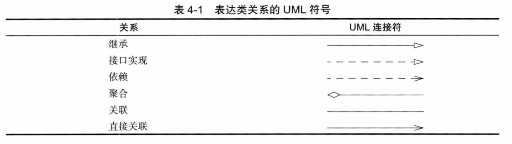
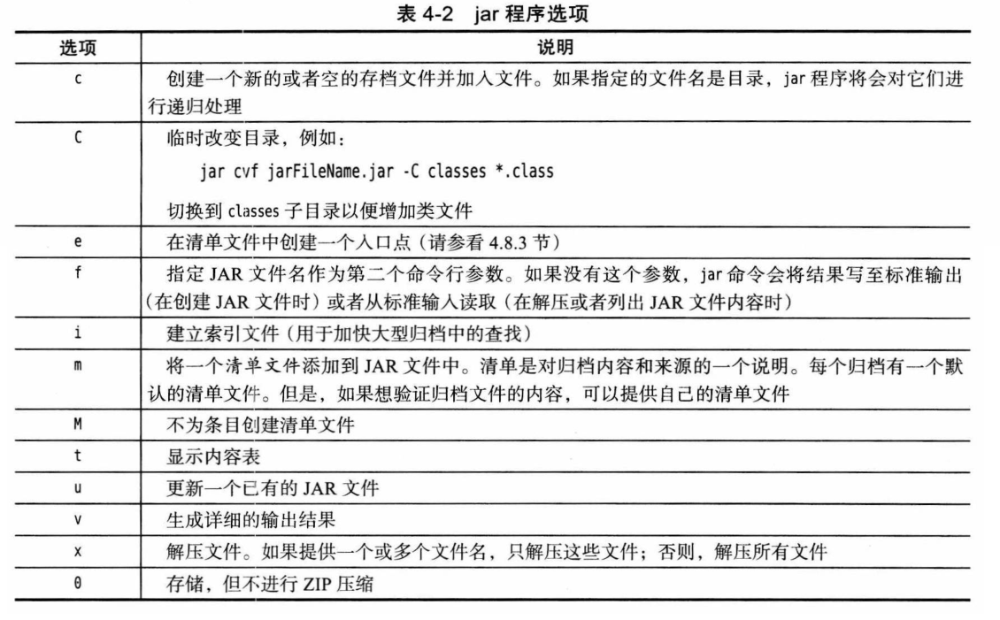

# 第 4 章 对象与类

## 4.1 面向对象程序设计概述

### 4.1.1 类

略。

### 4.1.2 对象

**对象的三个主要特征：**

- 对象的行为（behavior）：可以对对象完成哪些操作？
- 对象的状态（state）：调用方法时，对象会如何响应？
- 对象的标识（identity）：如何区分相同行为与状态的不同对象？

### 4.1.3 识别类

略。

### 4.1.4 类之间的关系

**类之间常见的关系：**

- 依赖（uses-a）。
- 聚合（has-a）。
- 继承（is-a）。



## 4.2 使用预定义类

### 4.2.1 对象与对象变量

略。

### 4.2.2 Java 类库中的 LocalDate 类

略。

### 4.2.3 更改器方法与访问器方法

略。

## 4.3 用户自定义类

### 4.3.1 Employee 类

略。

### 4.3.2 多个源文件的使用

略。

### 4.3.3 剖析 Employee 类

略。

### 4.3.4 从构造器开始

略。

### 4.3.5 用 var 声明局部变量

略。

### 4.3.6 使用 null 引用

略。

### 4.3.7 隐式参数与显式参数

略。

### 4.3.8 封装的优点

略。

### 4.3.9 基于类的访问权限

略。

### 4.3.10 私有方法

略。

### 4.3.11 final 实例字段

略。

## 4.4 静态字段与静态方法

### 4.4.1 静态字段

略。

### 4.4.2 静态常量

略。

### 4.4.3 静态方法

**static 的历史：**

- C 引入关键字 `static` 是为了表示退出一个块后依然存在的局部变量。 在这种情况下，术语“静态”是有意义的：变量一直保留，当再次进入该块时仍然存在。
- 随后，`static` 在 C 中有了第二种含义，表示不能从其他文件访问的全局变量和函数。为了避免引入一个新的关键字，所以重用了关键字 `static`。
- 最后，C++ 第三次重用了这个关键字，与前面赋予的含义完全无关，它指示属于类而不属于任何类对象的变量和函数。这个含义与 Java 中这个关键字的含义相同。

### 4.4.4 工厂方法

略。

### 4.4.5 main 方法

略。

## 4.5 方法参数

略。

## 4.6 对象构造

### 4.6.1 重载

略。

### 4.6.2 默认字段初始化

- 数值为 0，布尔值为 `false`，对象引用为 `null`。

### 4.6.3 无参数的构造器

- 如果类提供了至少一个构造器，则不会提供无参构造器。

### 4.6.4 显式字段初始化

略。

### 4.6.5 参数名

略。

### 4.6.6 调用另一个构造器

- 构造器的第一个语句 `this(...)` 调用同一个类的另一个构造器。

### 4.6.7 初始化块

- 无论使用哪个构造器，首先运行初始化块。
- 可以在初始化块中设置字段，即使这些字段在类后面才定义；但是，为了避免循环定义，不允许读取在后面初始化的字段。

**调用构造器的具体处理步骤：**

1.  如果构造器的第一行调用了另一个构造器，则基于所提供的参数执行第二个构造器。

2.  否则：

    a) 所有数据字段初始化为其默认值（0、false 或 null）。

    b) 按照在类声明中出现的顺序，执行所有字段初始化方法和初始化块。

3.  执行构造器主体代码。

### 4.6.8 对象析构与 finalize 方法

- 对象回收：~~`Object.finalize`~~，已废弃。
- 虚拟机退出：`Runtime.addShutdownHook`。

## 4.7 包

### 4.7.1 包名

- 嵌套包：从编译器的角度来看，嵌套的包之间没有任何关系。

### 4.7.2 类的导入

- 只能用星号（*）导入一个包，而不能使用 `import java.*`或`import java.*.*` 导入以 java 为前缀的所有包

**Java import 和 C++ #include 的区别，**没有共同之处：

- Java 可以显示给出全类名，完全避免使用 `import`；C++ 中无法避免使用 `#include`
- `import` 的唯一好处是简捷
- 在 C++ 中与包机制类似的是命名空间。可以认为 Java 中的 `package` 和 `import` 类似于 C++ 中的 `namespace` 和 `using` 指令

### 4.7.3 静态导入

略。

### 4.7.4 在包中增加类

略。

### 4.7.5 包访问

- 默认权限：包访问权限。

### 4.7.6 类路径

- 类路径可以是类根目录或 jar 文件路径。
- 多个路径 Windows 用 `;`，UNIX 用 `:` 隔开。
- 从 Java 6 开始可以在 Jar 文件路径中指定通配符 `*`，UNIX 中转义防止被 shell 扩展。

**注意：** javac 总是在当前目录中查找文件，但 java 虚拟机仅在类路径中包含“.”目录的时候才查看当前目录。如果类路径没有设置“.”，会出现程序可以编译，但不能运行。

### 4.7.7 设置类路径

- 选项：`-classpath`、`-cp`、`--class-path`（Java 9）。
- 环境变量：`CLASSPATH`。

## 4.8 JAR 文件

### 4.8.1 创建 JAR 文件

- 创建 jar 文件：`jar cvf jarFileName file1 file2 ...`。

**jar 命令选项：**



### 4.8.2 清单文件

- 路径：*META-INF/MANIFEST.MF。*
- 最小清单文件：`Manifest-Version: 1.0`。

**清单文件的规则：** [详见](https://docs.oracle.com/javase/10/docs/specs/jar/jar.html)

- 分为多个节，第一节称为主节。

- 节与节之间用空行分开。

- 随后的条目指定命名实体的属性，如单个文件、包或者 URL，都必须以一个 Name 条目开始。

  ```
  Manifest-Version: 1.0
  <lines describing this archive>
  
  Name: Woozle.class
  <lines describing this file>
  Name: com/mycompany/mypkg/
  <lines describing this package>
  ```

**创建更新清单文件：**

- 创建包含清单文件的 jar 文件：
  
  ```shell
  jar cfm jarFileName manifestFileName ...
  ```
  
- 更新清单文件：
  ```shell
  jar ufm MyArchive.jar manifest-additions.mf
  ```

### 4.8.3 可执行 JAR 文件

**指定可执行类：**

- 使用 e 选项指定入口类：

  ```shell
  jar cvfe MyProgram.jar com.mycompany.mypkg.MainAppClass <files to add>
  ```

- 清单文件中指定主类：

  ```
  Main-Class: com.mycompany.mypkg.MainAppClass
  ```


**包装成 exe：**

- [Launch4J](http://launch4j.sourceforge.net)
- [IzPack](http://izpack.org)

### 4.8.4 多版本 JAR 文件

- 路径：额外类文件放在 *META-INF/versions* 中。

- 增加不同版本的类文件，用 `--release`：

  ```shell
  jar uf MyProgram.jar --release 9 Application.class
  ```

- 从头构建多版本 jar 文件，用 `-C` 对应每个版本切换到不同目录：

  ```shell
  jar cf MyProgram.jar -C bin/8 . --release 9 -C bin/9 Application.class
  ```

- 编译不同版本，用 `--release` 和 `-d`。Java 9 之前使用 `-source`、`-target`、`-boot-classpath`：

  ```java
  javac -d bin/8 --release 8 ...
  ```
  
- javap 之类的工具并没有改造为可以处理多版本 jar 文件，可以使用：

  ```shell
  javap -classpath MyProgran.jar\!/META-INF/versions/9/Application.class
  ```

### 4.8.5 关于命令行选项的说明

- JDK 的命令行选项一直以来都是单个短横线开始，jar 命令是个例外，可以没有短横线。
- Java 9 开始多字母选项使用两个短横线，[详见](http://openjdk.java.net/jeps/293)。

## 4.9 文档注释

### 4.9.1 注释的插入

**javadoc 从下面几项中抽取信息：**

- 模块
- 包
- 公共类与接口
- 公共的和受保护的字段
- 公共的和受保护的构造器及方法

**格式：**

- 以 `/**` 开始，`*/` 结束。
- 可以使用 html。

- 等宽用 `{@code ...}` 而不是 `<code></code>`，不同操心转义符。

### 4.9.2 类注释

略。

### 4.9.3 方法注释

略。

### 4.9.4 字段注释

略。

### 4.9.5 通用注释

- 作者：`@author name`。
- 版本：`@version text`。

**超链接：**

- `@see reference`：将在 see also 增加超链接，可以添加多个，必须放在一起。reference 可以是：
  - `package.class#feature label`
  - `<a href="...">label</a>`
  - `"text"`
- 注释任何位置：`{@link package.cass#feature label}`。

### 4.9.6 包注释

- package-info.java：`/** */` 的注释开始，后面是一个 package 语句。
- package.html：会抽取 body 之间的文本。

### 4.9.7 注释抽取。

- 生成：

  ```shell
  javadoc -d docDirectory nameOfPackage1 nameOfPackage2 ...
  javadoc -d docDirectory *.java
  ```

- 转换源代码文件为 html：`-linksource`。
- 提供概要：`-overview finename.html`。
- [详见](https://docs.oracle.com/javase/9/javadoc/javadoc.htm)。

## 4.10 类设计技巧

略。
