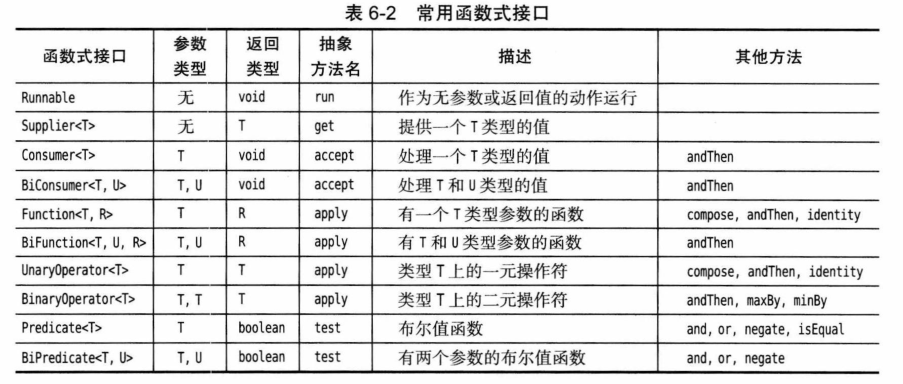
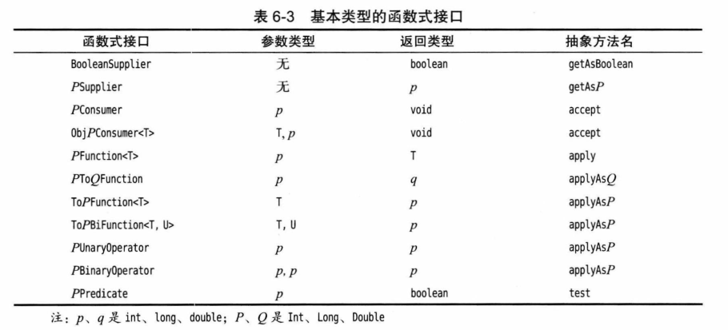

# 第 6 章 接口、lambda 表达式与内部类

## 6.1 接口

### 6.1.1 接口的概念

略。

### 6.1.2 接口的属性

略。 

### 6.1.3 接口与抽象类

略。

### 6.1.4 静态和私有方法

- Java 8 中，允许在接口中增加静态方法。
- Java 9 中，接口中的方法可以是 `private` 的静态或实例方法。

### 6.1.5 默认方法

略。

### 6.1.6 解决默认方法冲突

**接口默认方法冲突：**

如果先在一个接口中将一个方法定义为默认方法，然后又在超类或另一个接口中定义同样的方法：

1.  超类优先。如果超类提供了一个具体方法，同名而且有相同参数类型的默认方法会被忽略。
2.  接口冲突。如果一个接口提供了一个默认方法，另一个接口提供了一个同名而且参数类型（不论是否是默认参数）相同的方法，必须覆盖这个方法来解决冲突。

**不要定义 Object 的默认方法：**

- 例如，不能为 `toString` 或 `equals` 定义默认方法，尽管对于 List 之类的接口很有吸引力。由于超类优先规则，这样的方法无法超越 `Object.toString` 或 `Object.equals`。

### 6.1.7 接口与回调

略。

### 6.1.8 Comparator 接口

略。

### 6.1.9 对象克隆

- Object 的 `clone` 方法是 `protected`。
- `Cloneable` 接口是标记接口。
- 数组都有一个 `clone` 方法，包含原数组的所有副本。

**对象实现克隆：**

1.  实现 `Cloneable` 接口。
2.  重新定义 `clone` 方法，并指定 `public` 修饰符。

## 6.2 lambda 表达式

### 6.2.1 为什么引入 lambda 表达式

略。

### 6.2.2 lambda 表达式的语法

略。

### 6.2.3 函数式接口

略。

### 6.2.4 方法引用

**方法引用的 3 种形式：**

- `object::instanceMethod`，所有参数传递到实例方法，等价于 `x,y -> object.instanceMethod(x,y)`。
- `Class:staticMethod`，所有参数传递到静态方法，等价于 `x,y -> Class.staticMethod(x, y)`。
- `Class::instanceMethod`，第 1 个参数成为方法的隐式调用者，等价于 `x,y -> x.instanceMethod(y)`。

---

- 可以使用 `this::instanceMethod` 和 `super::instanceMethod`。

### 6.2.5 构造器引用

- `Class::new`。

### 6.2.6 变量作用域

- lambda 表达式中捕获的变量必须是事实最终变量，这个变量初始化之后就不会再为它赋值。这个限制是为了并发执行的安全问题。
- `this` 是指创建这个 lambda 表达式的方法的 `this`。

### 6.2.7 处理 lambda 表达式

**常用函数式接口：**



**基本类型的函数式接口：**



**@FunctionalInterface：** 推荐，不是必须，注解后编译器会检查。

### 6.2.8 再谈 Comparator

- 提取：`Comparator.comparing`。
- null 处理：`Comparator.nullsFirst`。
- 逆序：`Comparetor.naturalOrder`。

## 6.3 内部类

- 内部类可以访问外围类的数据字段，包括 `private`。

### 6.3.1 使用内部类访问对象状态

略。

### 6.3.2 内部类的特殊语法规则

- 外部类引用：`OuterClass.this`。
- 调用内部类构造器：`outerObject.new InnerClass(construction parameters)`。
- 内部类所有的静态字段都必须是 `final`。
- 内部类不能有 `static` 方法。

### 6.3.3 内部类是否有用、必要和安全

略。

### 6.3.4 局部内部类

- 局部内部类不能有访问说明符，作用域被限定在声明这个局部类的块中。

### 6.3.5 由外部方法访问变量

- 局部内部类不仅能访问外部类的字段，还能访问局部事实最终变量。

### 6.3.6 匿名内部类

- 匿名内部类：如果构造参数列表的结束小括号后面跟一个开始大括号，就是在定义匿名内部类。

- 双括号初始化：外层双括号是匿名子类，内层双括号是对象初始化块：
  
  ```java
  new ArrayList<String>() {{ add("xxx"; add("xxx"); }};
  ```
  
- 获取静态方法所在的类：

  ```java
  new Object(){}.getClass().getEnclosingClass();
  ```

### 6.3.7 静态内部类

- 在接口中声明的内部类自动是 `static` 和 `public`。

## 6.4 服务加载器

**示例：** ServiceLoaderTest

- 配置：`META-INF/services/FooInterface` 中写入接口实现类。
- 加载：`ServiceLoader.load(FooInterface.class)`。

## 6.5 代理

### 6.5.1 何时使用代理

略。

### 6.5.2 创建代理对象

**示例：** ProxyTest

- 实现 `InvocationHandler`。
- 创建代理类：`Proxy.newProxyInstance`。

### 6.5.3 代理类的特性

- 所有代理类都扩展 `Proxy` 类。
- 一个代理类只有一个实例字段 —— 即调用处理器，在`Proxy` 超类中定义。
- 没有定义代理类的名字，将生成以 `$Proxy` 开头的类名。
- 多次调用得到同一个类的多个对象，通过 `Proxy.getProxyClass` 获取这个类。
- 代理类总是 `public` 和 `final`。
- 如果代理类实现的所有接口都是 `public`，这个代理类就不属于任何特定的包；否则，所有非公共的接口都必须属于同一个包，同时，代理类也属于这个包。
- 可以通过调用 `Proxy.isProxyClass` 方法检测一个特定的 Class 对象是否表示一个代理类。

