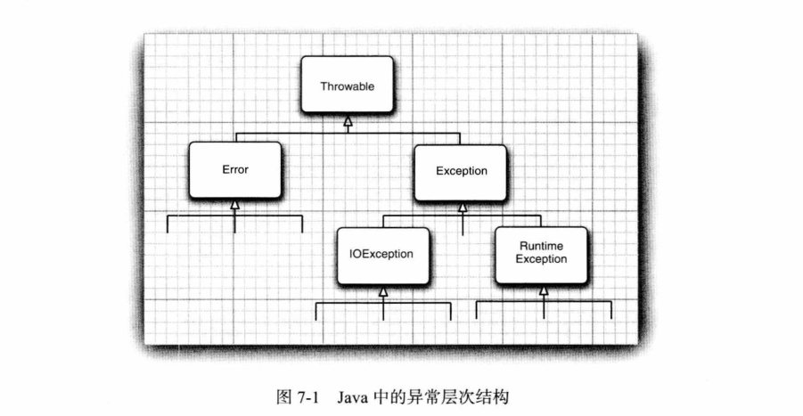
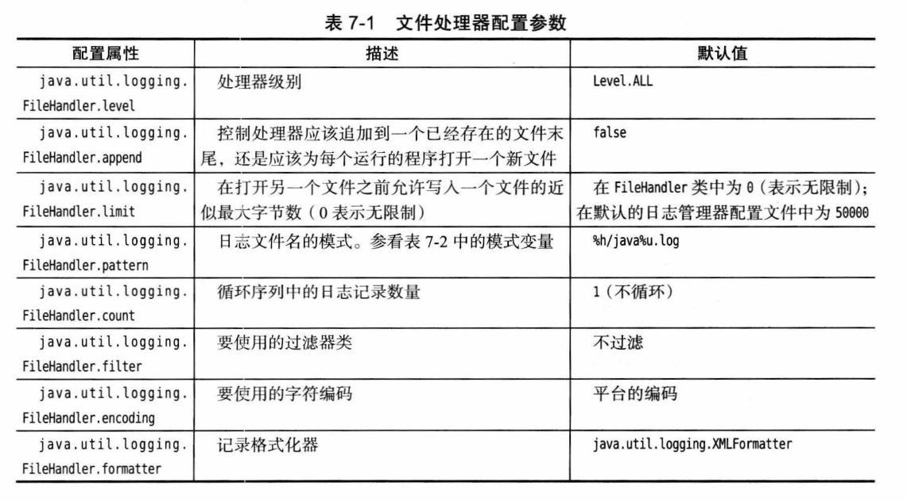
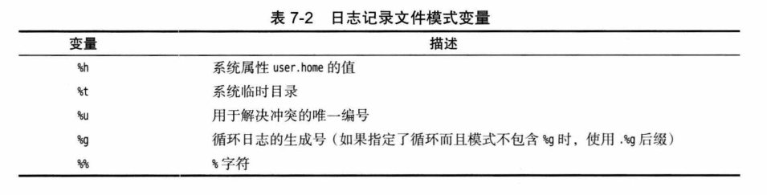

# 第 7 章 异常、断言和日志

## 7.1 处理错误

### 7.1.1 异常分类

**异常结构：**



- 由编程错误导致的异常属于 `RuntimeException`；程序本身没有问题，由于像 I/O 错误这类问题导致的异常属于其他异常。
- 如果出现 `RuntimeException` 异常，那么就一定是你的问题。
- 派生于 `Error` 类或 `RuntimeException` 类的所有异常称为非检型查异常；所有其他异常称为检查型异常。

### 7.1.2 声明检查型异常

略。

### 7.1.3 如何抛出异常

略。

### 7.1.4 创建异常类

略。

## 7.2 捕获异常

### 7.2.1 捕获异常

略。

### 7.2.2 捕获多个异常

略。

### 7.2.3 再次抛出异常与异常链

略。

### 7.2.4 finally 子句

略。

### 7.2.5 try-with-Resources 语句

略。

### 7.2.6 分析堆栈轨迹元素

- 打印异常堆栈：`Throwable.printStackTrace`。
- 遍历异常堆栈：`StackWalker.getInstance().foreach/walk`。

**示例：** 打印 factorial 的调用栈：StackTraceTest

## 7.3 使用异常的技巧

1.  异常处理不能代替简单的测试。
2.  不要过分细化异常。
3.  充分利用异常层次结构。
4.  不要压制异常。
5.  在检测错误时，“苛刻”要比放任更好。
6.  不要羞于传递异常。

## 7.4 使用断言

### 7.4.1 断言的概念

- 断言允许在测试期间检查，在生产代码中自动删除这些检查。
- 条件断言：`assert condition`。
- 添加断言异常信息：`assert condition : expression`：expresson 的值会传递给 `AssertionError`。

### 7.4.2 启用和禁用断言

- 默认情况下断言是禁用的。
- 启用：`-enableassertions` 或 `-ea` 。
- 启用类或包：`-ea:MyClass` 启用某个类，`-ea:com.mycompany.mylib` 启用某个包。
- 禁用：`-disableassertions:xx` 或 `-da:xx` 在某个类或包中禁用。
- 系统类：不能应用于没有类加载器的“系统类”，使用 `-enablesystemassertions` 或 `-esa` 启用。

### 7.4.3 使用断言完成参数检查

略。

### 7.4.4 使用断言提供假设文档

略。

## 7.5 日志

### 7.5.1 基本日志

- 全局日志记录器：`Logger.getGloal`。

### 7.5.2 高级日志

- 默认 INFO 级别。
- 获取日志记录器：`Logger.getLogger`。
- 手动传入类方法信息：`logp`。
- 进出日志：`entering`、`exiting`，FINER 级别，以 ENTRY 和 RETURN 开头。
- 抛出异常日志：`throwing`，FINER 级别，以 THROW 开头。

### 7.5.3 修改日志管理器配置

- 默认位置 *conf/logging.properties*，Java 9 之前位于 *jre/lib/logging.properties*。

- 修改配置文件位置：`-Djava.util.logging.config.file=configFile`。

- 可以在程序中设置配置文件位置：

  ```java
  System.setProperty("java.util.logging.config.file", file);
  LogManager.getLogManager().readConfiguration();
  ```

- Java 9 可以使用 `LogManager.getLogManager().updateConfiguration(mapper)`。
- 可以使用 [jconsole](https://oracle.com/technetwork/articles/java/jconsole-1564139.html#LoggingControl) 改变正在运行程序的日志级别。

### 7.5.4 本地化

- 创建时指定语言包，使用 {0} 占位符：

  ```java
  static Logger getLogger(String name, String resourceBundleName)
  ```

- 打印时指定语言包：

  ```java
  void logrb(Level level, ResourceBundle bundle, String msg, Object... params)
  ```

### 7.5.5 处理器

- 日志记录器将日志发送到自己的处理器和父日志记录器的处理器。
- 日志处理器：`FileHandler`、`SocketHandler`、`StreamHandler`。
- 添加日志处理器：`logger.addHandler`。

**文件处理器配置：**



**文件模式变量：**



### 7.5.6 过滤器

- 设置过滤器：`logger.setFilter`。

### 7.5.7 格式化器

- 设置格式化器：`handler.setFormatter`。

**示例：** 文件和窗口日志 handler：LoggingImageViewer。

> **注意：** 书上源码运行不会打印日志，把每次调用 `Logger.getLogger("com.horstmann.corejava")` 抽取成一个 logger 并设置日志级别为 ALL 就显示了。

### 7.5.8 日志技巧

略。

## 7.6 调试技巧

略。
