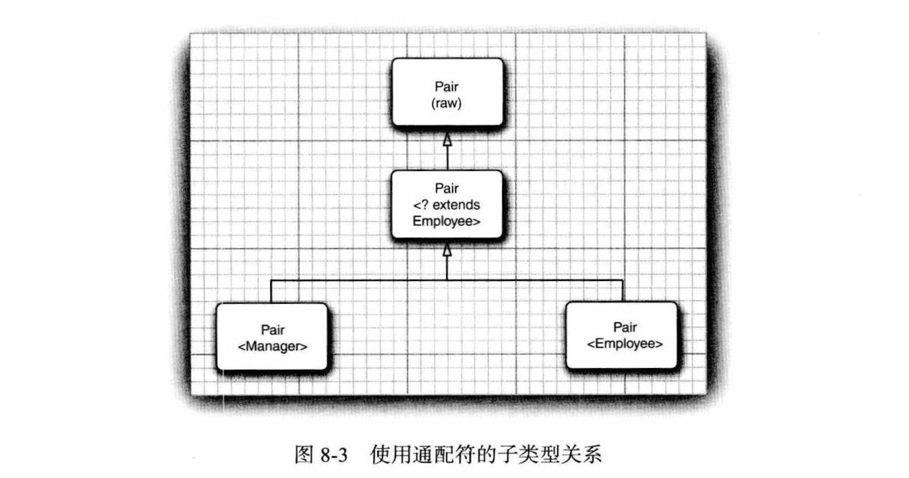
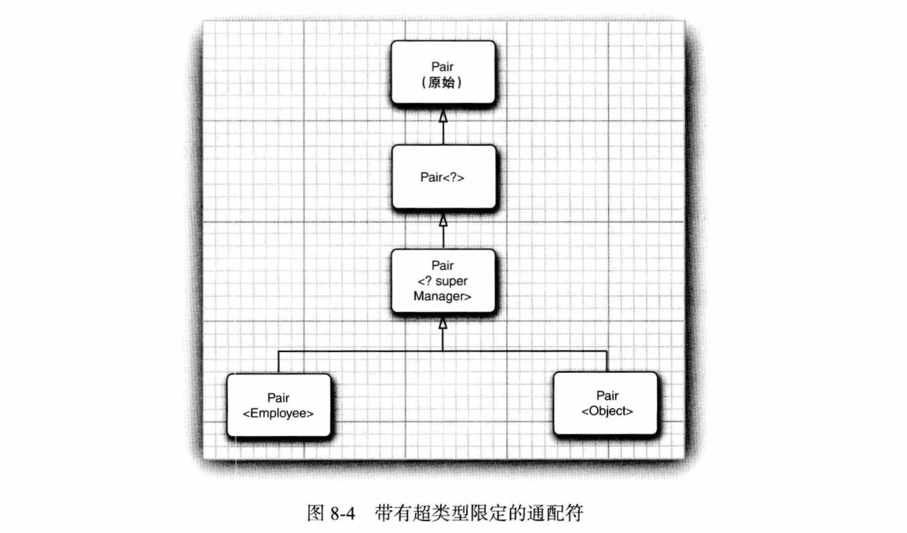

# 第 8 章 泛型程序设计

## 8.1 为什么要使用泛型程序设计

### 8.1.1 类型参数的好处

略。

### 8.1.2 谁想成为泛型程序员

略。

## 8.2 定义简单泛型类

**泛型变量名：**

- Java 库使用 E 表示集合的元素类型。
- K 和 V 分别表示 Map 键和值的类型。
- T（必要时相邻字母 U 和 S）表示“任意类型”。

## 8.3 泛型方法

- 泛型方法可以在普通类中定义，也可以在泛型类中定义。
- 调用泛型方法时，可以把具体类型包围在尖括号中，放在方法名前面，大多数情况下可以省略。

  ```java
  ArrayAlg.<String>getMiddle();
  ```

## 8.4 类型变量的限定

- 一个类型变量或通配符可以有多个限定：`T extends Comparable & Serializable`。
- 最多可以有一个限定可以是类，必须是限定列表中的第一个。

## 8.5 泛型代码和虚拟机

### 8.5.1 类型擦除

- 类型变量会被擦除，并替换为第一个限定类型，无限定类型则替换为 Object。

- 为了提高效率，应该将标记接口放在限定列表的末尾：

  ```java
  // 原始类型会用 Serializable 替换 T，编译器在必要时强制类型转换为 Comparable
  class Interval<T extends Serializable & Comparable>
  ```

### 8.5.2 转换泛型表达式

- 调用擦除了返回类型的方法、访问泛型字段，编译器会插入强制类型转换。

### 8.5.3 转换泛型方法

**桥方法解决方法擦除带来的 2 个问题：**

1.  方法参数失去多态：与父类方法重载，而不是覆盖，失去了多态性。解决办法是虚拟机自动生成桥方法：

    ```java
    class DateInterval extends Pair<LocalDate> {
        // 与父类方法 setSecond(Object second) 重载，失去多态性
        public void setSecond(LocalDate second) { ... }

        // 生成的桥方法
        public void setSecond(Object second) {
            setSecond((LocalDate)second);
        }
    }
    ```

2.  相同参数，不同的返回类型：Java 代码不能这样，但是虚拟机由参数和返回类型共同指定一个方法，因此没问题：

    ```java
    class DateInterval extends Pair<LocalDate> {
        // 与父类方法 Object getSecond() 参数相同，但是返回值不同
        public LocalDate getSecond() { ... }
    
        // 生成的桥方法
        public Object getSecond() {
            return (LocalDate)getSecond();
        }
    }
    ```

**协变也有桥方法：** 桥方法不仅用于泛型类型，还用于有协变的返回类型（covariant return type）：

```java
public class Employee implements Cloneable {
    public Employee clone() throws CloneNotSupportedException() { ... }

    // 生成的桥方法
    public Object clone() throws CloneNotSupportedException() {
        return (Employee)clone();
    }
}
```

> **总结：**
>
> - 自动覆写泛型父类擦除方法，转发给自己，以此实现多态和协变返回类型。
> - 用 `javap -c` 可以看到生成的桥方法，添加了上面的示例到 *v1ch08/bridgeMethod* 中。

### 8.5.4 调用遗留代码

- 对局部变量或方法加注解关闭代码检查：`@SuppressWarnings("unchecked")`。

## 8.6 限制与局限性

### 8.6.1 不能用基本类型实例化类型参数

- 因为 Object 不能存储基本类型。

### 8.6.2 运行时类型查询只适用于原始类型

- `instanceof` 不能使用泛型：

  ```java
  if (a instanceof Pair<String>) // ERROR
  ```

- 强制类型转换：

  ```java
  Pair<String> p = (Pair<String>) a; // warning -- can only test that a is a Pair
  ```

- `getClass`：

  ```java
  if (stringPair.getClass() == employeePair.getClass()) // they are equal
  ```

### 8.6.3 不能创建参数化类型的数组

- 不能创建参数化类型的数组：

  ```java
  var table = new Pair<String>[10]; // ERROR
  ```

- 不能创建是因为数组只检查擦除后的类型，为了安全。

- 尽管不能创建，但是能声明。

- 可以声明通配类型的数组，然后进行强制类型转换：

  ```java
  var table = (Pair<String>) new Pair<?>[10];
  ```

> [知乎 - java 为什么不支持泛型数组？](https://www.zhihu.com/question/20928981)

### 8.6.4 Varargs 警告

- 对于可变参数泛型数组，规则有所放松，只会得到一个警告，而不是错误：

  ```java
  public static <T> void addAll(Collection<T> coll, T... ts);
  ```

- 可以用 `@SuppressWarnings("unchecked")` 或 `@SafeVarargs` 注解方法抑制警告：

- Java 9 开始 `@SafeVarags` 只能用于声明 `static`、`final` 或 `private` 的方法，因为其他方法可能被覆盖，使得这个注解没有意义。

- 可以使用 `@SafeVarags` 消除创建泛型数组的限制：

  ```java
  @SafeVarags
  static <E> E[] array(E... array) { return array; }
  Pair<String>[] table = array(pair1, pair2);
  
  // 隐藏着危险
  Object[] objarray = table;
  // 能顺利运行，不会出现 ArrayStoreException，但是处理 table[0] 时会得到异常
  objarray[0] = new Pair<Employee>();
  ```

### 8.6.5 不能实例化类型变量

**不能 new T()：**

- Java 8 之后让调用者提供构造器表达式：

  ```java
  var p = Pair.makePair(String::new);
  public static <T> Pair<T> makePair(Supplier<T> constr) {
      return new Pair<>(constr.get(), constr.get());
  }
  ```

- 传统方式传入 Class：

  ```java
  var p = Pair.makePair(String.class);
  public static <T> Pair<T> makePair(Class<T> cl) {
      return new Pair<>(cl.getConstructor.newInstance(), cl.getConstructor.newInstance());
  }
  ```

### 8.6.6 不能构造泛型数组

- 如果作为一个类的私有字段，可以将数组声明为擦除类型，使用时强制类型转换：

  ```java
  public class ArrayList<E> {
      private Object[] elements;
      @SuppressWarnings("unchecked")
      public E get(int n) { return (E) elements[n]; }
      public void set(int n, E e) { elements[n] = e; }
  }
  ```

- 需要返回 T[] 数组，则可以让用户提供数组构造表达式：

  ```java
  public static <T extends Comparable> T[] minmax(IntFunction<T[]> constr, T... a) {
      T[] result = constr.apply(2);
  }
  ArrayAlg.minmax(String[]::new, ...)
  ```

- 传统方式：

  ```java
  public static <T extends Comparable> T[] minmax(T... a) {
      T[] result = (T[]) Array.newInstance(a.getClass().getComponentType(), 2);
  }
  ```

### 8.6.7 泛型类的静态上下文中类型变量无效

- 不能在静态字段或方法中引用类的类型变量。

### 8.6.8 不能抛出或捕获泛型类的实例

- 泛型类不能扩展 `Trowable`：

  ```java
  public class Problem<T> extends Exception // ERROR -- can't extend Throwable
  ```

- `catch` 子句不能使用泛型变量：

  ```java
  catch (T e) // ERROR -- can't catch type variable
  ```

### 8.6.9 可以取消对检查型异常的检查

- 可以利用泛型取消检查型异常的检查机制，利用这个技术可以包装 Runnable 接口允许抛出检查异常：

  ```java
  interface Task {
      void run() throws Exception;
  
      @SuppressWarnings("unchecked")
      static <T extends Throwable> void throwAs(Throwable t) throws T {
          throw (T) t;
      }
  
      static Runnable asRunnable(Task task) {
          return () -> {
              try {
                  task.run();
              } catch (Exception e) {
                  Task.<RuntimeException>throwAs(e);
              }
          };
      }
  }
  ```


### 8.6.10 注意擦除后的冲突

- 例如 `equals` 会冲突：

  ```java
  public boolean equals(T o) // ERROR -- both methods have same erasure, yet neither overrides the other
  ```

- 如果两个接口是同一个泛型接口的不同参数化，一个类不能同时实现这个两个接口：

  ```java
  class Employee implements Comparable<Employee> { ... }
  class Manager extends Employee implements Comparable<Manager> { ... } // ERROR
  // 因为不能实现两个下面桥方法
  public int compareTo(Object other) { return compareTo((X) other); }
  ```

## 8.7 泛型类型的继承规则

- 无论 `S` 和 `T` 有什么关系，通常，`Pair<S>` 和 `Pair<T>` 没有任何关系。

## 8.8 通配符类型

### 8.8.1 通配符概念

- 不能传入参数：

  ```java
  // 编译器只知道需要 Employee 的某个子类型，不知道具体是什么类型，拒绝传递任何特定的类型
  void setFirst(? extends Employee);
  ```

- 可以作为返回值：

  ```java
  ? extends Employee getFirst();
  Employee e = getFirst();
  ```

**使用通配符的子类型关系：**



### 8.8.2 通配符的超类型限定

- 可以传入子类：

  ```java
  // 可以传递 Manager 或其子对象
  void setFirst(? super Manager);
  ```

- 只能返回 Object：

  ```java
  ? super Manager getFirst();
  Object e = getFirst();
  ```

- 区别于接受通配符泛型：

  ```java
  // 可以传 Pair<Employee> 和 Pair<Object>
  void foo(Pair<? super Manager> p);
  ```

**带有超类型限定的通配符：**



- 带有超类限定的通配符允许写入一个泛型对象，带有子类限定的通配符允许读取一个泛型对象。
- `<T extends Comparable<T>>` 在处理 LocalDate 会有问题，因为 LocalDate 的父类 ChronnoLocalDate 实现了 Comparable，可以使用超类通配符解决：`<T extends Comparable<? super T>>`。

> [知乎 - Java 泛型 <? super T> 中 super 怎么 理解？与 extends 有何不同？](https://www.zhihu.com/question/20400700)
>
> - PECS（Producer Extends Consumer Super）原则：Extends 读取，Super 写入。

> **总结：** 要区别通配符泛型**自己的方法**和**接受通配符泛型**的方法：
>
> - 通配符泛型的方法：PECS。
> - 接受通配符泛型：继承关系。

### 8.8.3 无限定通配符

- 无限定通配符：`?`。

### 8.8.4 通配符捕获

略。

## 8.9 反射和泛型

### 8.9.1 泛型 Class 类

略。

### 8.9.2 使用 Class\<T\>参数进行类型匹配

略。

### 8.9.3 虚拟机中的泛型类型信息

**Type 接口的子类型：**

- Class 类，描述具体类型。
- TypeVariable 接口，描述类型变量。
- WildcardType 接口，描述通配符。
- ParameterizedType 接口，描述泛型类或接口。
- GenericArrayType 接口，描述泛型数组。

**示例：** *GenericReflectionTest*

### 8.9.4 类型字面量

**示例：** *TypeLiterals*

- 关于泛型问答：<http://angelikalanger.com/GenericsFAQ/JavaGenericsFAQ.html>

