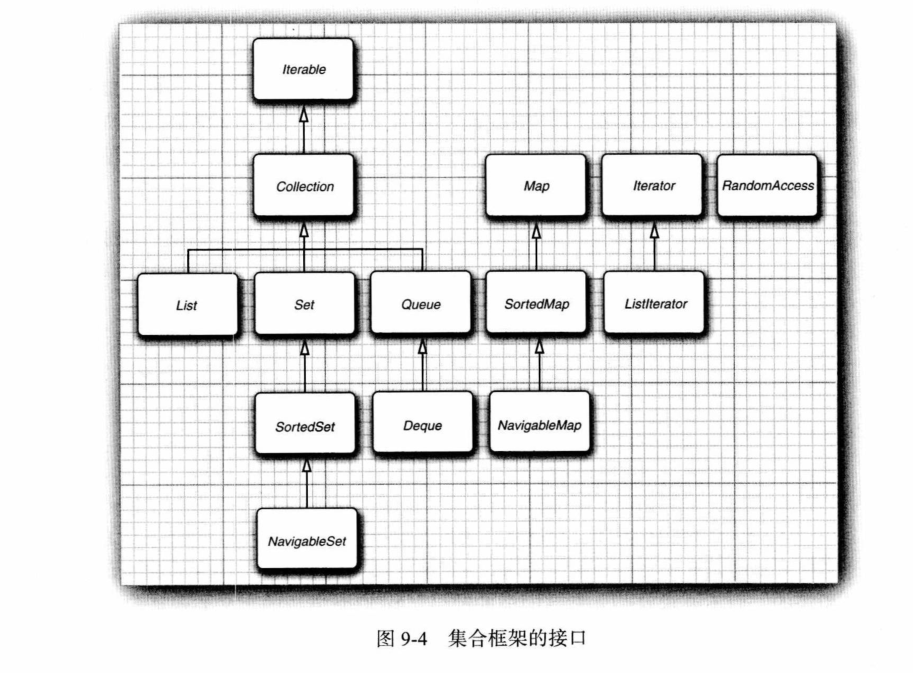
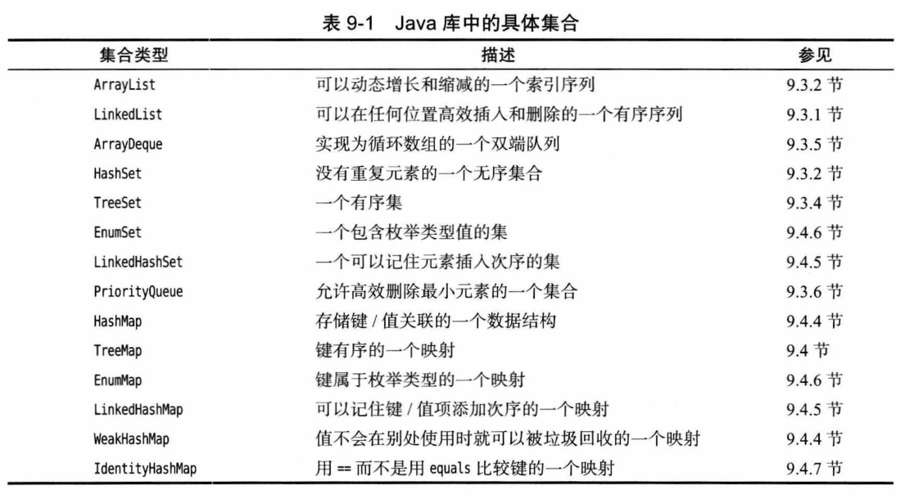

# 第 9 章 集合

## 9.1 Java 集合框架

### 9.1.1 集合接口与实现分离

略。

### 9.1.2 Collection 接口

略。

### 9.1.3 迭代器

- 迭代器位于两个元素之间。

### 9.1.4 泛型实用方法

略。

## 9.2 集合框架中的接口

**集合框架的接口：**

- 为了避免对链表随机访问，Java 1.4 引入了标记接口 `RandomAccess`。

## 9.3 具体集合

**Java 库中的具体集合：**

### 9.3.1 链表

- `ListIterator`：可以添加 `add`，反向遍历 `previous`。
- `remove` 会删除上一个元素，如果调用了 `previous`，将删除右边的元素。
- 不能连续调用两次 `remove`。

### 9.3.2 数组列表

略。

### 9.3.3 散列集

- Java 8 中，桶满时使用平衡二叉树（之前是链表）。
- 桶数设置为预计元素个数的 75% ~ 150%。
- 有些人认为最好桶数设置为素数，标准库使用的 2 的幂，默认 16。
- 装填因子 0.75，桶满 75% 以上会再散列，新桶是原来的 2 倍。

### 9.3.4 树集

略。

### 9.3.5 队列与双端队列

略。

### 9.3.6 优先队列

略。

## 9.4 映射

### 9.4.1 基本映射操作

略。

### 9.4.2 更新映射条目

- 条件：`putIfAbsent`。
- 合并：`merge`。

### 9.4.3 映射视图

略。

### 9.4.4 弱散列映射

略。

### 9.4.5 链接散列集与映射

- 删除策略：`linkedHashMap.removeEldestEntry`。

### 9.4.6 枚举集与映射

略。

### 9.4.7 标识散列映射

- `IdentityMap`：使用 `==`。

## 9.5 视图与包装器

### 9.5.1 小集合

- Java 9：`List.of`、`Set.of`、`Map.of`、`Map.ofEntries`。

### 9.5.2 子范围

- `subSet`、`headSet`、`tailSet`

### 9.5.3 不可修改的视图

- `Collections.unmodifiableXxx`。

### 9.5.4 同步视图

- `Collecitons.synchronizedXxx`。

### 9.5.5 检查型视图

- `Collections.checkXxx`。

### 9.5.6 关于可选操作的说明

略。

## 9.6 算法

### 9.6.1 为什么使用泛型算法

略。

### 9.6.2 排序与混排

略。

### 9.6.3 二分查找

略。

### 9.6.4 简单算法

略。

### 9.6.5 批操作

略。

### 9.6.6 集合与数组的转换

略。

### 9.6.7 编写自己的算法

略。

## 9.7 遗留的集合

### 9.7.1 Hashtable 类

略。

### 9.7.2 枚举

略。

### 9.7.3 属性映射

略。

### 9.7.4 栈

略。

### 9.7.5 位集

**示例：** 素数 - 埃拉托色尼筛选法：*Sieve*

