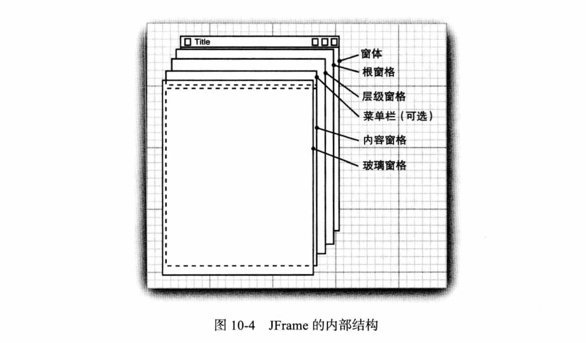
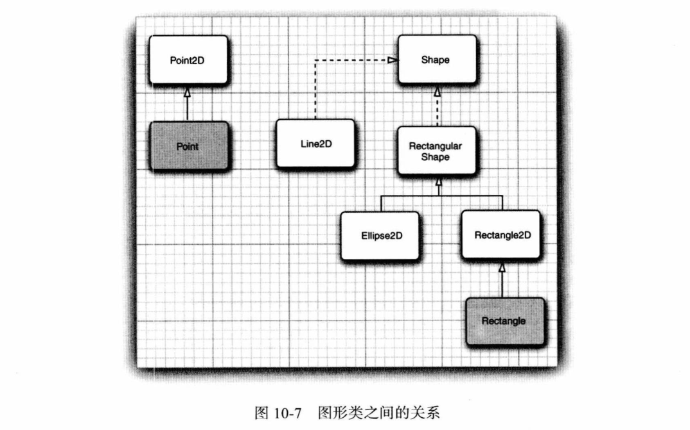
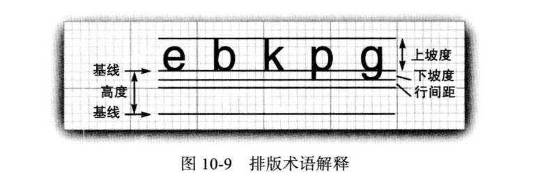
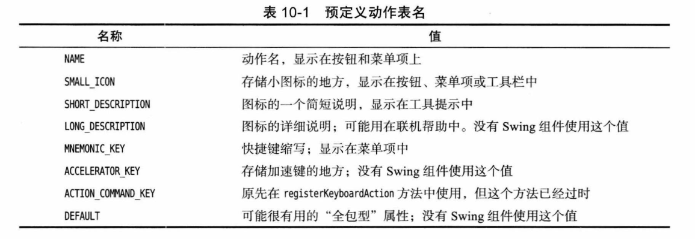
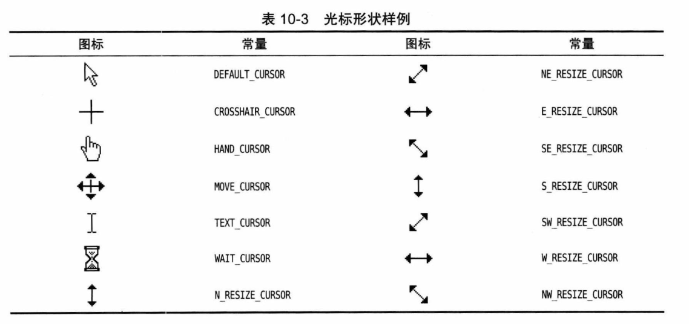
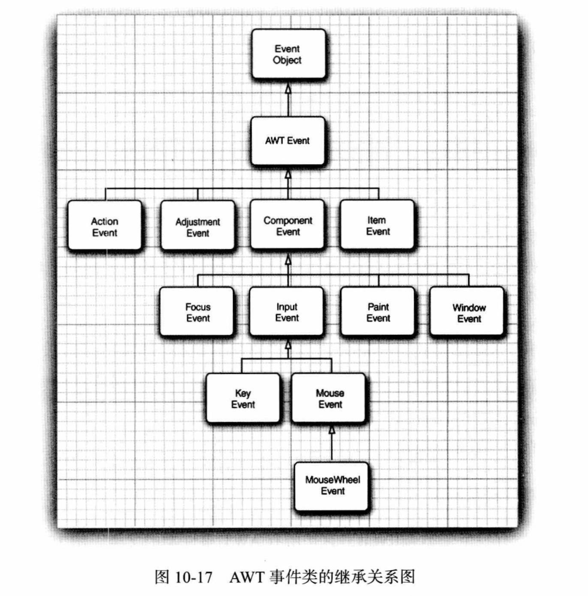
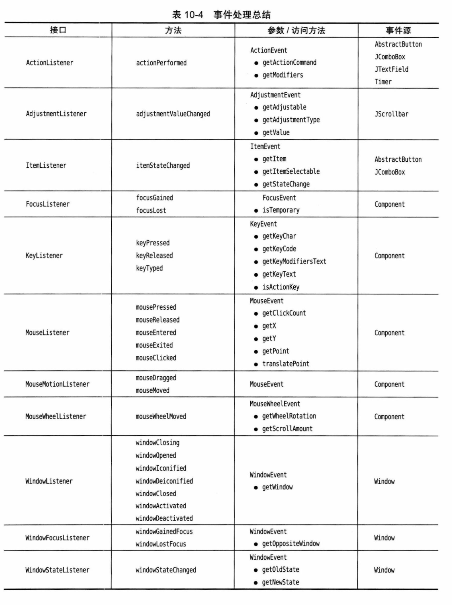

# 第 10 章 图形用户界面程序设计

## 10.1 Java 用户界面工具包简史

**AWT：**

- Java 1.0 提供了 AWT（Abstract Window Toolkit，抽象窗口工具包）。
- 基于“对等元素”、“最小公分母”实现的可移植库，没有原生应用漂亮。
- 不同平台的 AWT 存在不同的 bug，被嘲弄“一次编写，到处调试”。

**Swing：**

- 1996 年，Netscape 创建了 IFC（Internet Foundation Class）GUI 库，采用与 AWT 完全不同的工作方式。
- IFC 将按钮、菜单等用户界面元素绘制在空白窗口上，底层窗口系统所需的唯一功能就是能够显示一个窗口，并在这个窗口中绘制。因此不同平台外观和行为一样。
- Sun 公司与 Netscape 合作完善了这种方法，创建了 Swing 用户界面库，作为 Java 1.1 的一个扩展，Java 1.2 标准库的一部分。
- Swing 现在是不基于对等元素的 GUI 工具包的官方名字。

**Swing 和 AWT 的关系：**

- Swing 不是完全替代 AWT，而是构建在 AWT 架构之上。
- Swing 只是提供了更加强大的用户界面组件，还是在使用 AWT 的基本机制，特别是事件处理。

**JavaFX：**

- 2007 年 Sun 引入完全不同的 GUI 包 JavaFX，希望与 Flash 竞争。
- JavaFX 在 Java 虚拟机上运行，但是使用 JavaFX 脚本语言。
- 2011 年，Oracle 发布了 JavaFX 2.0，提供了 Java API。
- Java 7 update 6 开始，JavaFX 与 JDK 和 JRE 一起打包，Java 11 开始不再打包到 Java 中。

## 10.2 显示窗体

- Swing 版本的 `JFrame` 扩展了 AWT 的 `Frame` 类。
- `JFrame` 是极少数几个不绘制在画布上的 Swing 组件之一。
- 绝大多数 Swing 组件类都以“J”开头，如果不小心忘记加上“J”，可能属于 AWT 组件，要注意这种错误。

### 10.2.1 创建窗体

**示例：** *SimpleFrameTest*

- 在分派线程中执行：`EventQueue.invokeLater`。
- 窗体默认大小 0 × 0 像素：`setSize`。
- 窗体默认不可见：`setVisible`。
- 窗体关闭时的响应动作：`setDefaultCloseOperation(JFrame.EXIT_ON_CLOSE)`。

### 10.2.2 窗体属性

- `setLocation`：窗体位置，屏幕左上角为原点。
- `setBounds`：窗体位置和大小。
- `setIconImage`：标题栏图标。
- `setTitle`：标题。
- `setResizable`：是否允许改变窗体大小。
- 获取屏幕大小：`Toolkit.getDefaultToolkit().getScreenSize()`

## 10.3 在组件中显示信息

**JFrame 的内部结构：**



- 不要自己调用 `paintComponent`。

**示例：** *NotHelloWorld*

- 绘制文本：`g.drawString`。

- 首选大小：

  ```java
  public Dimension getPreferredSize() {
      return new Dimension(DEFAULT_WIDTH, DEFAULT_HEIGHT);
  }
  ```

### 10.3.1 处理 2D 图形

- 2D 图形：`Point2D`、`Line2D`、`Rectangle2D`、`Ellipse2D` 等，都实现了 `Shape` 接口。
- 提供了 `float` 和 `double` 两个版本，例如：`Rectangle2D.Float` 和 `Rectangle2D.Double`。
- 尽管 `Rectangle2D.Float` 对象存储 `float` 值，但 `getWidth` 会返回 `double`。

**图形类之间的关系：**



**示例：** *DrawTest*

- `ellipse.setFrame`。
- `circle.setFrameFromCenter`。

### 10.3.2 使用颜色

- 设置颜色：`g2.setPaint(Color.RED)`。
- 填充：`g2.fill`。会在右侧和下方少绘制一个像素。
- 设置背景颜色：`component.setBackground`。
- 设置前景颜色：`component.setForeground`。

### 10.3.3 使用字体

- 获取可用字体：`GraphicsEnvironment.getLocalGraphicsEnvironment().getAvailableFontFamilyNames()`。

- AWT 定义了 5 个逻辑字体名：SansSerif、Serif、Monospaced、Dialog、DialogInput。

**排版术语解释：** 基线（baseline）、上坡度（ascent）、坡顶（ascenter）、下坡度（descent）、坡底（descenter）、行间距（leading）



**获取字体矩形范围：**

```java
FontRenderContext context = g2.getFontRenderContext();
Rectangle2D bounds = f.getStringBounds(message, context);
```

- 高度是上坡度、下坡度和行间距的和。
- 相对坐标为左边基线，顶部 y 为负，所以上坡度为：`-bounds.getY()`；

---

- 获取字体度量：`LineMetrics metrics = f.getLineMetrics(message, context);`。
- 没有 `Graphic2D` 时获取字体上下文：`getFontMetrics(f).getFontRenderContext();`。

**示例：** *FontTest*，绘制基线和字符串外框矩形。

### 10.3.4 显示图像

- 绘制图像：

  ```java
  Image image = new ImageIcon(filename).getImage();
  g.drawImage(image, x, y, null);
  ```

- 拷贝区域：`g.copyArea`。

## 10.4 事件处理

### 10.4.1 基本事件处理概念

- 添加事件处理：`addActionListener`。

### 10.4.2 实例：处理按钮点击事件

**示例：** *ButtonTest*

### 10.4.3 简洁地指定监听器

略。

### 10.4.4 适配器类

- 窗口事件处理：`addWindowListener`。
- 适配器：`WindowsAdapter`。

### 10.4.5 动作

**Action 接口**：

```java
// 扩展了 ActionListener
void actionPerformed(ActionEvent event);

// 禁用时关联的菜单或工具栏变成灰色。
void setEnabled(boolean b);
boolean isEnabled();

// 存储任意名/值对，有一些预定义动作名
void putValue(String key, Object value);
Object getValue(String key);

// 动作属性变化监听器
void addPropertyChangeListener(PropertyChangelistener listener);
void removePropertyChangelistener(PropertyChangeListener listener);
```

**预定义动作名：**



**示例：** *ActionTest*

- 按钮添加动作：`new JButton(blueAction)`。

- 按键添加动作：

  ```java
  // 将按键映射到任意对象，习惯上用 "none" 表示空动作
  InputMap inputMap = buttonPanel.getInputMap(JComponent.WHEN_ANCESTOR_OF_FOCUSED_COMPONENT);
  inputMap.put(KeyStroke.getKeyStroke("ctrl B"), "panel.blue");
  // 将对象映射到动作
  ActionMap actionMap = buttonPanel.getActionMap();
  actionMap.put("panel.blue", blueAction);
  ```

**输入映射条件：**


1. 检查有输人焦点的组件的 `WHEN_FOCUSED` 映射。如果这个按键存在，而且启用了相应的动作，则执行这个动作，并停止处理。
2. 从有输人焦点的组件开始，检查其父组件的 `WHEN_ANCESTOR_0F_FOCUSED_COMPONENT` 映射。一旦找到这个按键的映射，而且相应的动作已经启用，就执行这个动作，并停止处理。
3. 查看有输人焦点的窗口中的所有可见和已启用的组件，看是否在一个 `WHEN_IN_FOCUSED_WINDOW` 映射中注册了这个按键。给这些组件一个执行对应动作的机会（按照按键注册的顺序）。一旦执行第一个启用的动作，就停止处理。

### 10.4.6 鼠标事件

- 鼠标点击：`MouseListener`。
  - 点击 `mouseClicked`，获取点击次数 `mouseEvent.getClickCount`。
- 鼠标移动事件 `MouseMotionListener`。
  - 鼠标在组件内部才会调用 `mouseMoved`；即使鼠标拖动到组件外面，`mouseDragged` 也会被调用。
- 获取鼠标预定义样式：`Cursor.getPredefinedCursor`。
- 设置鼠标样式：`setCursor`。

**鼠标形状：**



**示例：** *MouseTest*

### 10.4.7 AWT 事件继承层次

**AWT 事件类的继承关系图：**



**常用语义事件：**

- `ActionEvent`：对应按钮点击、菜单选择、选择列表项或在文本域中按回车。
- `AdjustmentEvent`：用户调节滚动条。
- `ItemEvent`：用户从复选框或列表框中选择一项。

**常用底层事件：**

- `KeyEvent`：一个键按下或释放。
- `MouseEvent`：鼠标键按下、释放、移动或拖动。
- `MouseWheelEvent`：鼠标滚轮转动。
- `FocusEvent`：某个组件获得焦点或失去焦点。
- `WindowEvent`：窗口状态改变。

**重要的 AWT 监听器接口、事件和事件源：**



## 10.5 首选项 API

**Preferences：**

- 提供平台无关的中心存储库，对程序员透明。Windows 使用注册表，Linux 使用本地文件。
- 树状结构，节点路径类似 */com/mycompany/myapp*。
- 从用户或系统根开始：`Preferences root = Preferences.userRoot/systemRoot()`。
- 访问节点：`Preferences node= root.node("/com/mycompany/myapp")`。
- 类的包名作为路径：`Preferences node = Preferences.user/systemNodeForPackage(this.getClass())`。
- 读：`getXxx(Xxxkey, Xxx defval)`，必须指定默认值。
- 写：`putXxx(String key, Xxx value)`。
- 所有键：`keys`。
- 节点名和键最多 80 个字符，字符串值最多 8192 个字符。
- 导出子树或节点，用 XML 保存：`exportSubtree`、`exportNode`。
- 导入：`importPreferences`。

> - 用户注册表在 *`HKEY_CURRENT_USER\SOFTWARE\JavaSoft\Prefs`*。
> - 系统注册表在 *`HKEY_LOCAL_MACHINE\SOFTWARE\JavaSoft\Prefs`*。

**示例：** *preferences/ImageViewer*。

