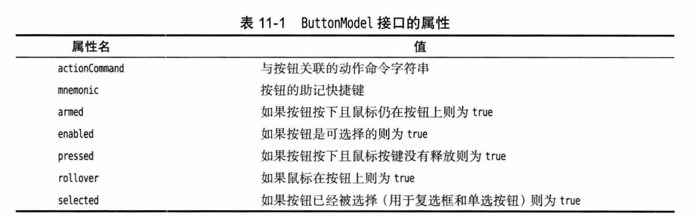
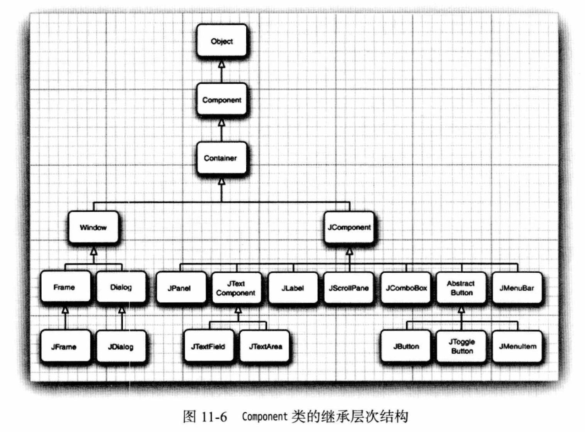
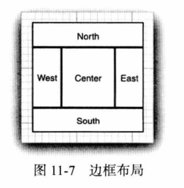

# 第 11 章 Swing 用户界面组件

## 11.1 Swing 和模型–视图–控制器设计模式

- 每个 `JButton` 对象都存储着一个按钮模型对象 `ButtonModel`，通过 `getModel` 获取。
- 模型不存储按钮标签或者图标，仅凭模型无法知道它的外观。

**ButtonModel 接口的属性**



## 11.2 布局管理概述

### 11.2.1 布局管理器

- `JPanel` 默认是 `FlowLayout` 流布局管理器。
- 设置布局管理器：`setLayout`。

**Component 类的继承层次结构：**



### 11.2.2 边框布局

- `JFrame` 默认是 `BorderLayout` 边框布局。
  
- 默认为 `BorderLayout.CENTER`。
- 重复添加会被取代。

### 11.2.3 网格布局

- 网格布局：`GridLayout`。

## 11.3 文本输入

### 11.3.1 文本域

- `JTextField`。

### 11.3.2 标签和标签组件

- `JLabel`。
- 可以在按钮、标签和菜单使用 HTML：`<html>...</html>`。

### 11.3.3 密码域

- `JPasswordFiled`。

### 11.3.4 文本区

- `JTextArea`。

### 11.3.5 滚动窗格

- `JScrollPane`。

**示例：** *text/TextComponentTest*。

## 11.4 选择组件

### 11.4.1 复选框

- `JCheckBox`。

**示例：** *checkBox/CheckBoxTest*。

- 全字母语句：The quick brown fox jumps over the lazy dog.

### 11.4.2 单选按钮

- `ButtonGroup`、`JRadioButton`。

**示例：** *radioButton/RadioButtonTest*。

### 11.4.3 边框

- 创建边框：`BorderFactory.createXxxBorder`。
- 标题边框：`BorderFactory.createTitledBorder`。
- 组合边框：`BorderFactory.createCompoundBorder`。
- 斜角边框：`SoftBevelBorder`。
- 线框：`LineBorder`。
- 设置边框：`setBorder`。

**示例：** *border/BorderTest*。

### 11.4.4 组合框

- `JComboBox`。

**示例：** *checkBox/CheckBoxTest*。

### 11.4.5 滑动条

- `JSlider`。
- 设置刻度：`setMajor/MinorTickSpacing`，显示还需要 `setPaintTicks(true)`。
- 是否对其刻度：`setSnapToTicks`。
- 是否显示刻度标记：`setPaintLables`。
- 设置刻度标签：`setLabelTable`。
- 是否显示轨迹：`setPaintTrack`。
- 是否逆向：`setInverted`。

**示例：** *slider/SliderTest*。

## 11.5 菜单

### 11.5.1 菜单构建

- 设置菜栏：`frame.setJmenuBar(new JMenubar())`。
- 添加菜单：`menuBar.add(new JMenu("Edit"))`。
- 添加菜单项：
  - `editMenu.add(new JMenuItem("Paste"))`。
  - `editMenu.add("Paste")`。
  - `editMenu.add(new AbstractAction("Paste"))`。
- 添加分割线：`editMenu.addSeparator()`。
- 添加监听器：`pasteItem.addActionListner()`。

### 11.5.2 菜单项中的图标

- `new JMenuItem("Cut", new ImageIcon(cut.gif))`。
- 设置文本位置：`cutItem.setHorizontalTextPosition`。
- 为动作添加图标：`cutAction.put(Action.SMALL_ICON, new ImageIcon(cut.gif))`。

### 11.5.3 复选框和单选按钮菜单项

- 复选框：`JCheckBoxMenuItem`。
- 单选按钮：`ButtonGroup`、`JRadioButtonMenuItem`。

### 11.5.4 弹出菜单

- `JPopupMenu`。
- 设置弹出菜单：`panel.setComponentPopupMenu`。
- 继承父组件的弹出菜单：`child.setInheritsPupupMenu`。

### 11.5.5 键盘助记符和加速器

- 添加助记符：`new JMenuItem("About", 'A')`。
- 设置助记符：`helpMenu.setMnemonic('H')`。
- 设置加下划线的字符：`setDisplayMnemonicIndex`。
- 动作设置助记符：`aboutAction.putValue(Action.MNEMONIC_KEY, new Integer('A'))`；
- 快捷键：`openItem.setAccelerator(KeyStoke.getKeyStroke("ctrl o"))`。

### 11.5.6 启用和禁用菜单项

- `setEnabled`。

**示例：** *menu/MenuFrameTest*。

### 11.5.7 工具条

- 只有在边框布局管理器才能拖拽。
- `JToolBar(SwingConstants.VERTICAL)`。

### 11.5.8 工具提示

- `button.setToolTipText("Exit")`。
- `action.putValue(Action.SHORT_DESCRIPTION, "Exit")`。

**示例：** *toolBar/ToolBarTest*。

## 11.6 复杂的布局管理

### 11.6.1 网格包布局

- 不需要指定底层网格的行数和列数，会根据信息猜测。

- 给容器设置 `GridBagLayout`，添加组件时设置 `GridBagConstraints`：

  ```java
  var layout = new GridBagLayout();
  panel.setLayout(layout);
  var constraints = new GridBagConstraints();
  constraints.weightx = 100;
  constraints.weighty = 100;
  constraints.gridx = 0;
  constraints.gridy = 2;
  constraints.gridwidth = 2;
  constraints.gridheight = 1;
  panel.add(component, constraints); 
  ```

#### 11.6.1.1 gridx、gridy、gridwidth 和 gridheight 参数

- `gridx`、`gridy` 分别指定左上角的列、行位置，从 0 开始。
- `gridwidth`、`gridheight` 分别为占据大小。

#### 11.6.1.2 增量字段 weightx 和 weighty

- 设置为 0 时，不会扩大或缩小。

#### 11.6.1.3 fill 和 anchor 参数

- fill 拉伸：`GridBagConstraints.NONE`、`HORIZONTAL`、`VERTICAL`、`BOTH`。
- 没有拉伸指定 anchor 位置：`GridBagConstraints.CENTER`、`NORTH`、`NORTHEASET` 等。

#### 11.6.1.4 填充

- margin：`insets.left`、`top`、`right`、`bottom`。
- padding：`ipadx`、`ipady`。

#### 11.6.1.5 指定 gridx、gridy、gridwidth 和 gridheight 参数的备用方法

- `gridx` 和 `gridy` 设置为相对位置 `GridBagConstraints.RELATIVE`，会按照标准流添加。
- `gridheight` 和 `gridheight` 可以设置 `GridBagConstraints.REMAINDER` 用于最后一个组件。

#### 11.6.1.6 网格包布局技巧

略。

#### 11.6.1.7 使用帮助类管理网格包约束

- *gridbag/GBC*。

**示例：** *gridbag/GridBagLayoutTest*。

### 11.6.2 定制布局管理器

**示例：** *circleLayout/CircleLayoutTest*

- 实现 `LayoutManager`。

## 11.7 对话框

### 11.7.1 选项对话框

**JOptionPane：**

- `showMessageDialog`：显示一条消息并等待用户点击 OK。
  - 无返回值。
- `showConfirmDialog`：显示一条消息并等待用户确认（如 OK/Cancel）。
  - 类型：`DEFAULT_OPTION`、`YES_NO_OPTION`、`YES_NO_CANCEL_OPTION`、`OK_CANCEL_OPTION`。
  - 返回值：`OK_OPTION`、`CANCEL_OPTION`、`YES_OPTION`、`NO_OPTION`、`CLOSED_OPTION`。
- `showOptionDialog`：显示一条消息并获得用户在一组选项中的选择。
  - 返回选项索引。
  - 选项数组可以是：String、Icon、Component 和其他对象。
- `showInputDialog`：显示一条消息并获得用户输人的一行文本。
  - 返回输入的字符串。

**消息类型：** `JOptionPane.ERROR_MESSAGE`、`INFORMATION_MESSAGE`、`WARNING_MESSAGE`、`QUESTION_MESSAGE`、`PLAIN_MESSAGE`。

**消息可以是：**

- String：绘制字符串。
- Icon：显示图标。
- Component：显示组件。
- 0bject[]：显示数组中的所有对象，依次叠加。
- 任何其他对象：调用 toString 方法来显示结果字符串。

**示例：** *optionDialog/OptionDialogTest*。

### 11.7.2 创建对话框

**示例：** *dialog/DialogTest*

- 继承 `JDialog`。

### 11.7.3 数据交换

**示例：** *dataExchange/DataExchangeTest*。

### 11.7.4 文件对话框

- 创建：`var chooser = new JFileChooser`。
- 工作目录：`chooser.setCurrentDirectory(new File("."))`。
- 默认选中文件：`chooser.setSelectedFile(new File(filename))`。
- 是否允许多选：`chooser.setMultiSelectionEnabled(true)`。
- 选择文件或目录：`chooser.setFileSelectionMode()`
  - `JFileChooser.FILES_ONLY`。
  - `JFileChooser.DIRECTORIES_ONLY`。
  - `JFileChooser.FILES_AND_DIRECTORIES`。

- 显示：
  - `chooser.showDialog(parent, "xxx")`。
  - `chooser.showOpenDialog(parent)`。
  - `chooser.showSaveDialog(parent)`。

- 获取返回：`chooser.getSelectedFile[s]`。
- 文件过滤器：`chooser.setFileFilter(new FileNameExtensionFilter)`。
- 清除文件过滤器：`chooser.resetChoosableFilters()`。
- 是否可以选择所有：`chooser.setAcceptAllFileFilterUsed(false)`。

**FileView：**

- 可以自定义文件图标描述，点击目录是否打开等。

**示例：** *fileChooser/FileChooserTest*。

- 文件选择事件：

  ```java
  chooser.addPropertyChangeListener(event -> {
              if (event.getPropertyName() == JFileChooser.SELECTED_FILE_CHANGED_PROPERTY)
  ```
