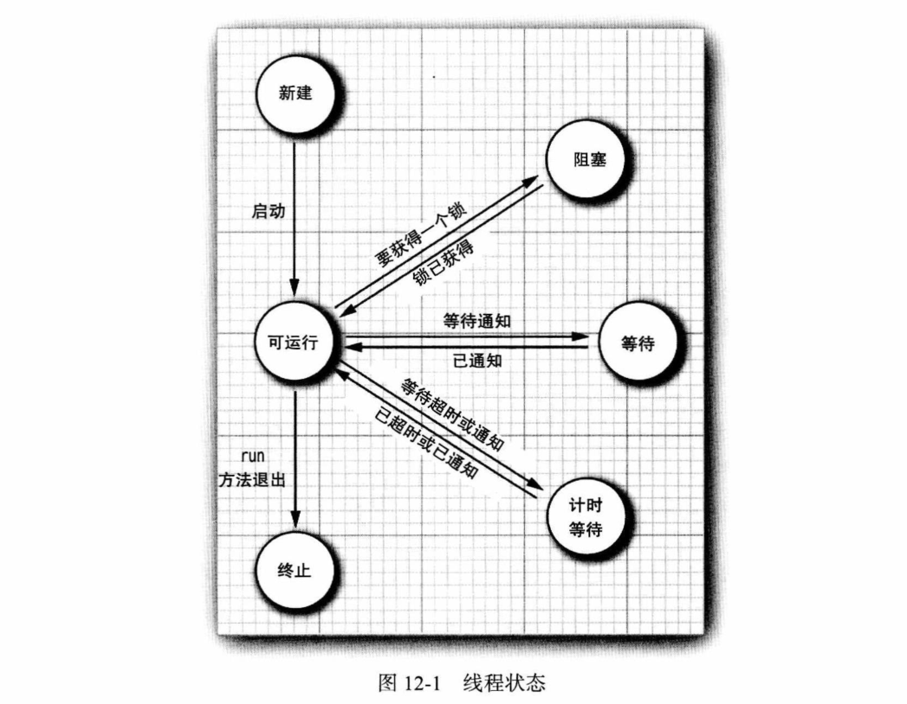
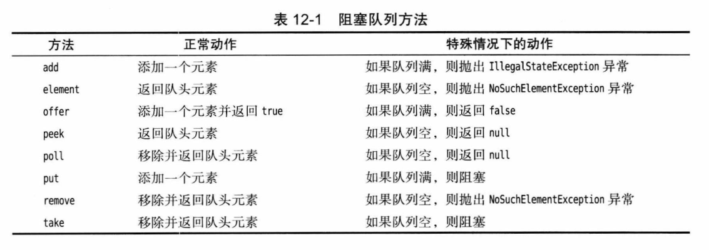
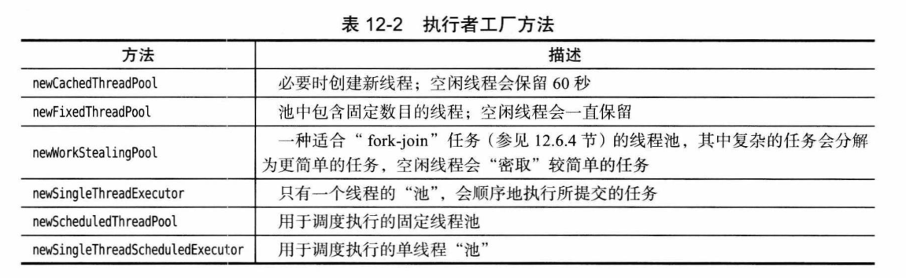

# 第 12 章 并发

- 对于更复杂的系统级程序设计，建议看《Java 并发编程实战（Java Concurrency in Practice）》。

## 12.1 什么是线程

略。

## 12.2 线程状态

- 获取当前状态：`getState`。

**线程的 6 种状态：**

- New（新建）。
- Runnable（可运行）。
- Blocked（阻塞）。
- Waiting（等待）。
- Timed waiting（计时等待）。
- Terminated（终止）。

### 12.2.1 新建线程

- `new Thread(r)` 之后是新建状态。

### 12.2.2 可运行线程

- `thread.start()` 之后处于可运行状态，可能在运行，也可能没有运行。

### 12.2.3 阻塞和等待线程

- 阻塞或等待时消耗最少的资源。
- 试图获取一个内部的对象锁（不是 `java.util.concurrent` 中的 Lock），而这个锁被其他线程占有，会进入阻塞状态。
- 等待另一个线程通知时，会进入等待状态，阻塞与等待状态没有太大区别：
  - `Object.wait。`
  - `Thread.join`。
  - 等待 `Lock` 或 `Condition`。
- 调用超时方法会进入计时等待状态：
  - `Thread.sleep`。
  - `Object.wait`。
  - `Thread.join`。
  - `Lock.tryLock`。
  - `Condition.await`。

### 12.2.4 终止线程

- `run` 方法正常退出，线程自然终止。
- 没有捕获的异常终止了 `run` 方法，线程意外终止。
- `stop`、`suspend`、`resume` 已被废弃。

## 12.3 线程属性

### 12.3.1 中断线程

- `stop` 已被废弃；用 `interrupt` 方法设置中断状态，用 `Thread.currentThread().isInterrupted()` 检查。
- 在 `sleep` 或 `wait` 的阻塞线程上调用 `interrupt` 会抛出 `InterruptedException` 异常。
- `Thread.interrupted()` 检查当前线程是否被中断，并且清除当前线程的中断状态；`t.isInterrupted()` 不会清除。
- 不要抑制中断异常，抛出去或者设置中断状态。

### 12.3.2 守护线程

- `t.setDaemon(true)`，只剩下守护线程，虚拟机就会退出。

### 12.3.3 线程名

- `t.setName`。

### 12.3.4 未捕获异常的处理器

- 设置默认：`Thread.setDefaultUncaughtExceptionHandler`。
- 当前线程设置：`t.setUncaughtExceptionHandler`。

**ThreadGroup：**

1. 如果该线程组有父线程组，那么调用父线程组的 `uncaughtException` 方法。
2. 否则，如果 `Thread.getDefaultExceptionHandler` 方法返回一个非 `null` 的处理器，则调用该处理器。
3. 否则，如果 `Throwable` 是 `ThreadDeath` 的一一个实例，什么都不做。
4. 否则，将线程的名字以及 `Throwable` 的栈轨迹输出到 `System.err`。

### 12.3.5 线程优先级

- `t.setPriority`。

## 12.4 同步

### 12.4.1 竞态条件的一个例子

**示例：** `unsynch/UnsynchBankTest`。

### 12.4.2 竞态条件详解

略。

### 12.4.3 锁对象

- `ReentrantLock`。

### 12.4.4 条件对象

**示例：** `synch/SynchBankTest`

- 条件：`lock.newCondition`。
- 等待并释放锁：`await`，通常使用方式是 `while(!条件) c.await()`。
- 唤醒：`signal/signalAll`。
- 拥有锁才能调用 `await`、`signal/all`。

### 12.4.5 synchronized 关键字

**示例：** `synch2/SynchBankTest2`

- 实例方法锁实例对象，静态方法锁类对应的 class。
- 等待唤醒：`obj.wait()`、`obj.notify/all`、`Obj.class.wait`、`Obj.class.notify/all`。

### 12.4.6 同步块

- `synchronized(obj)`。

### 12.4.7 监视器概念

略。

### 12.4.8 volatile 字段

- `volatile` 保证可见性，不提供原子性。

### 12.4.9 final 变量

- `final` 保证可见性。

### 12.4.10 原子性

- `AtomicXxx`：`incrementAndGet`、`compareAndSet`、`updateAndGet`、`accumulateAndGet`、`getAndUpdate`、`getAndAccumulate`。
- `XxxAdder`、`XxxAccumulator`。

### 12.4.11 死锁

略。

### 12.4.12 线程局部变量

- `ThreadLocal`。
- `ThreadLocalRandom`。

### 12.4.13 为什么废弃 stop 和 suspend 方法

- `stop` 废弃因为随时可能被停止，虽然会释放持有的锁，但是同步方法可能执行到一半，使对象处于不一致状态。
- `suspend` 容易导致死锁：被挂起的线程等着被恢复，将其挂起的线程等待获得锁。

## 12.5 线程安全的集合

### 12.5.1 阻塞队列

**阻塞队列方法：**

- `poll` 和 `peek` 返回 `null` 指示失败，因此插入 `null` 是非法的。

### 12.5.2 高效的映射、集和队列

- `ConcurrentHashMap`、`ConcurrentSkipListMap`、`ConcurrentSkipListSet`、`ConcurrentLinkedQueue`。
- `size` 方法不一定在常量时间内完成操作，通常需要遍历。
- `size` 超过 `int` 使用 `mappingCount` 返回 `long`。
- 返回弱一致性的迭代器，不一定能反应它们构造之后的所有更改，但是同一个值不会返回两次，也不会抛出 `ConcurrentModificationException` 异常。

### 12.5.3 映射条目的原子更新

略。

### 12.5.4 对并发散列映射的批操作

略。

### 12.5.5 并发集视图

- `ConcurrentHashMap.newKeySet()`。

### 12.5.6 写数组的拷贝

- `CopyOnWriteArrayList`、`CopyOnWriteArraySet`。

### 12.5.7 并行数组算法

- `Arrays.parallelSort/SetAll/Prefix`。

### 12.5.8 较早的线程安全集合

- `Collections.SynchronizedXxx`。

## 12.6 任务和线程池

### 12.6.1 Callable 与 Future

略。

### 12.6.2 执行器

**执行者工厂方法：**

### 12.6.3 控制任务组

略。

### 12.6.4 fork-join 框架

略。

## 12.7 异步计算

### 12.7.1 可完成 Future

略。

### 12.7.2 组合可完成 Future

略。

### 12.7.3 用户界面回调中的长时间运行任务

略。

## 12.8 进程

### 12.8.1 建立一个进程

略。

### 12.8.2 运行一个进程

略。

### 12.8.3 进程句柄

略。
