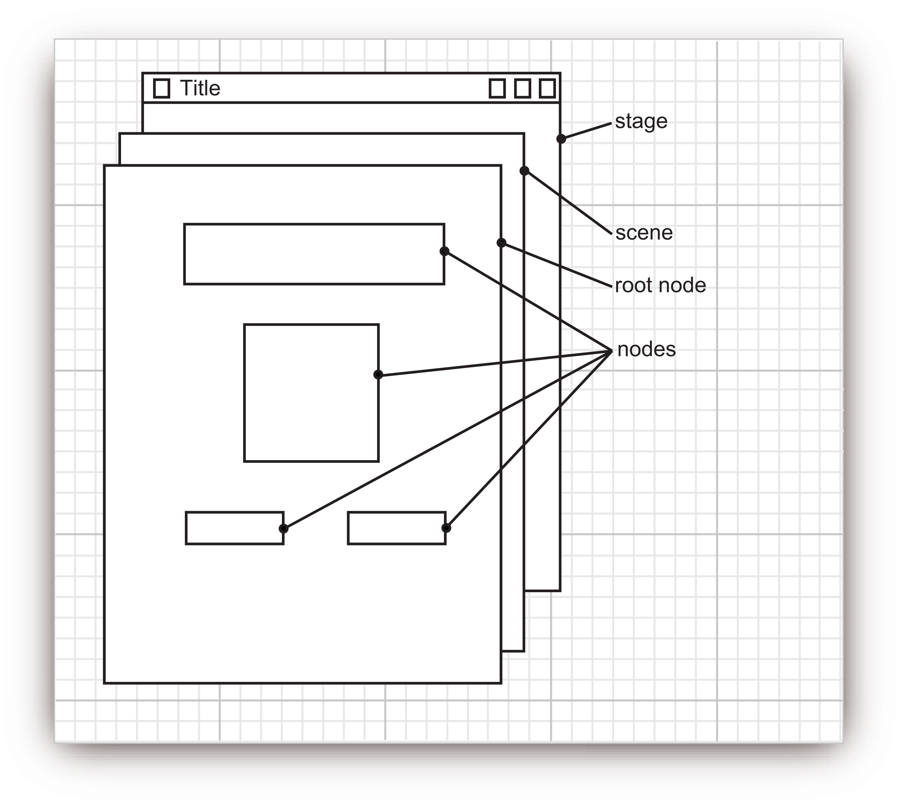
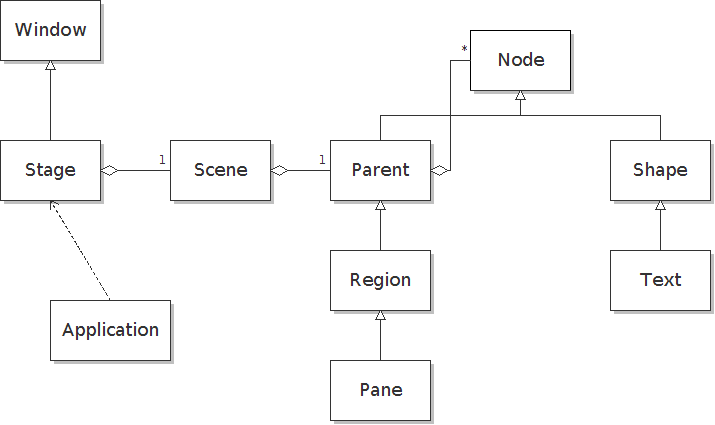

# 第 13 章 JavaFX

## 13.1 Java GUI 编程简历史

略。

## 13.2 显示场景中的信息

### 13.2.1 我们的第一个 JavaFX 应用

**示例：** `notHelloWorld/NotHelloWorld`。

**Stage 的内部结构：**

**JavaFX 核心类之间的关系：**

### 13.2.2 绘制形状

**示例：** `draw/DrawTest`。

### 13.2.3 文本和图像

**示例：** `font/FontTest`。

## 13.3 事件处理

### 13.3.1 实现事件处理器

- `button.setOnAction`。
- `stage.setOnCloseRequest`。

### 13.3.2 属性变化的反应

**示例：** `event/EventTest`

- `slider.valueProperty().addListener`。

### 13.3.3 键盘和鼠标事件

**示例：** `mouse/MouseTest`。

## 13.4 布局

### 13.4.1 布局窗格

**示例：** `gridPane/GridPaneDemo`。

### 13.4.2 FXML

**示例：** `fxml/FXMLDemo`

- `@FXML` 注入组件。

### 13.4.3 CSS

**示例：** `css/CSSDemo`。

## 13.5 用户界面控制

### 13.5.1 文本输入

**示例：** `text/TextControlTest`。

### 13.5.2 选择

**示例：** `choices/ChoiceTest`。

### 13.5.3 菜单

**示例：** `menu/MenuTest`。

### 13.5.4 简单对话框

**示例：** `dialogs/DialogDemo`。

### 13.5.5 控制装置

**示例：** `fancy/FancyControls`。

## 13.6 属性和绑定

### 13.6.1 JavaFX 属性

略。

### 13.6.2 绑定

**示例：** `binding`。

## 13.7 用户界面回调中的长时间运行任务

**示例：** `uitask/TaskDemo`。