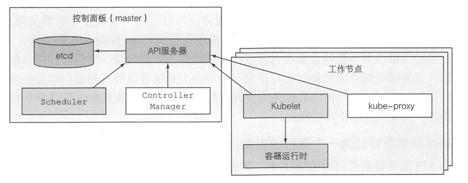
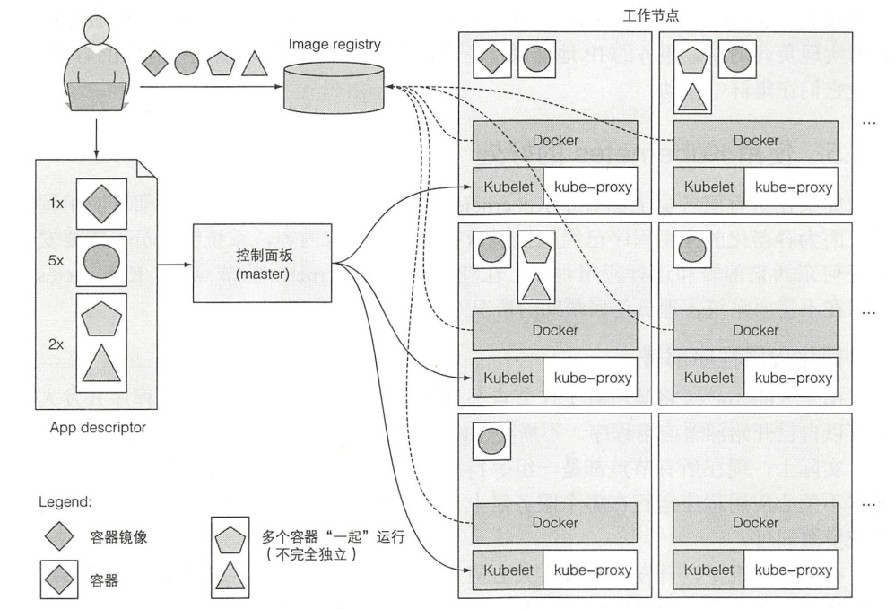

# 1 Kubernetes 介绍

- Kubernetes 是希腊语中的 “领航员”或“舵手”的意思。

## 1.1 Kubernetes 系统的需求

### 1.1.1 从单体应用到微服务

略。

### 1.1.2 为应用程序提供一个一致的环境

略。

### 1.1.3 迈向持续交付 ：DevOps 和无运维

略。

## 1.2 介绍容器技术

### 1.2.1 什么是容器

略。

### 1.2.2 Docker 容器平台介绍

略。

### 1.2.3 rkt——一个 Docker 的替代方案

- [rkt](https://github.com/rkt/rkt)（已停止维护）。

## 1.3 Kubernetes 介绍

### 1.3.1 初衷

略。

### 1.3.2 深入浅出地了解 Kubernetes

略。

### 1.3.3 Kubernetes 集群架构

**节点：**

- 主节点：承载着 Kubernetes 控制和管理整个集群系统的控制面板。
- 工作节点：运行用户实际部署的应用。

**图 1.9 组成一个 Kubernetes 集群的组件：**

**控制面板：**

- Kubernetes API 服务器：用户和其他控制面板组件都要和它通信。
- Scheculer：调度用户的应用（为应用的每个可部署组件分配一个工作节点）。
- Controller Manager：执行集群级别的功能，如复制组件、持续跟踪工作节点 、处理节点失败等。
- etcd：一个可靠的分布式数据存储，它能持久化存储集群配置。

**工作节点：**

- Docker、rtk 或其他的容器类型。
- Kubelet：与 API 服务器通信，并管理它所在节点的容器。
- Kubernetes Service Proxy（kube-proxy）：负责组件之间的负载均衡网络流量。

### 1.3.4 在 Kubernetes 中运行应用

**图 1.10 Kubernetes 体系结构的基本概述和在它之上运行的应用程序：**

### 1.3.5 使用 Kubernetes 的好处

略。

## 1.4 本章小结

略。
