# 第4章 背景案例

## 4.1 简单的账户注册服务

## 4.2 需求阐述

### 4.2.1 需求用例

### 4.2.2 界面原型 484.3简要设计

### 4.3.1 接口

### 4.3.2 模块结构

*图 4-4 注册账户服务包图*

各个模块的作用：

-   `com.juvenxu.mvnbook.account.service`：系统的核心，它封装了所有下层细节，对外暴露简单的接口。这实际上是一个 Facade 模式，了解设计模式的读者应该能马上理解。
-   `com.juvenxu.mvnbook.account.web`：顾名思义，该模块包含所有与 web 相关的内容，包括可能的 JSP、Servlet、web.xml 等，它直接依赖于 `com.juvenxu.mvnbook.account.service` 模块，使用其提供的服务。
-   `com.juvenxu.mvnbook.account.persist`：处理账户信息的持久化，包括增、删、改、查等，根据实现，可以基于数据库或者文件。
-   `com.juvenxu.mvnbook.account.captcha`：处理验证码的 key 生成、图片生成以及验证等，这里需要第三方的类库来帮助实现这些功能。
-   `com.juvenxu.mvnbook.account.email`：处理邮件服务的配置、激活邮件的编写和发送等工作。

## 4.4 小结

