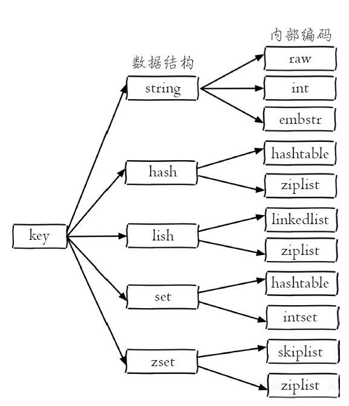

# 第2章 API的理解和使用

## 2.1 预备

### 2.1.1 全局命令

| 💡 **键的相关操作** |
| ------------------ |

```shell
# 【查看所有键】时间复杂度为o(n)，线上环境禁止使用
KEYS *

# 【查看键总数】时间复杂度为o(1)
DBSIZE

# 【检查键是否存在】
EXISTS key

# 【删除键】返回结果为成功删除键的个数
DEL key [key ...]

# 【设置键过期时间】
EXPIRE key seconds

# 【查看键过期时间】-1:没设置过期时间；-2:键不存在
TTL key

# 【查看键的数据类型】
TYPE key
```

### 2.1.2 数据结构和内部编码

| 💡 **Redis 的五种数据结构** |
| -------------------------- |

- 字符串（string）
- 哈希（hash）
- 列表（list）
- 集合（set）
- 有序集合（zset）

```shell
#【查看内部编码】
object encoding key
```

<center><i>图 2-2 Redis 数据结构和内部编码</i></center>



### 2.1.3 单线程架构

## 2.2 字符串

### 2.2.1 命令

| 💡 **字符串命令** |
| ---------------- |

```shell
# 【设置值】
SET k value [EX seconds] [PX milliseconds] [NX|XX]
  EX # 秒级过期
  PX # 毫秒级过期
  NX # 不存在，用于添加
  XX # 必须存在，用于更新

# 【设置过期时间】
SETEX key seconds value

# 【不存在则设置】
SETNX key value

# 【获取值】
GET key

# 【批量设置值】
MSET key value [key value ...]

# 【批量获取值】
MGET key [key ...]

# 【自增】不存在等同0，字符串不能转换为对应类型报错
INCR key
DECR key
INCRBY key increment
DECRBY key decrement
INCRBYFLOAT key increment

# 【追加值】不存在等同空字符串
APPEND key value

# 【字符串长度】默认用UTF-8编码，一个汉字三个字节
STRLEN key

# 【设置并返回原值】
GETSET key value

# 【设置指定位置的字符】
SETRANGE key offeset value

# 【获取部分字符串】
GETRANGE key start end
```

### 2.2.2 内部编码

| 💡 **字符串的内部编码** |
| ---------------------- |

字符串类型的内部编码有 3 种：

- int：8 个字节的长整型。
- embstr：小于等于 39 个字节的字符串。
- raw：大于 39 个字节的字符串。

### 2.2.3 典型使用场景

## 2.3 哈希

### 2.3.1 命令

| 💡 **哈希命令** |
| -------------- |

```shell
# 【设置值】
HSET key field value

# 【获取值】
HGET key field

# 【删除field】
HDEL key field [field ...]

# 【计算field个数】
HLEN key

# 【批量获取field】
HMGET key field [field ...]

# 【批量设置field】
HMSET key field value [field value ...]

# 【判断field是否存在】
HEXISTS key field

# 【获取所有field】
HKEYS key

# 【获取所有value】
HVALS key

# 【获取所有的field-value】
HGETALL key

# 【自增】
HINCRBY key field increment
HINCRBYFLOAT key field increment

# 【计算value的字符串长度】
HSTRLEN key field
```

### 2.3.2 内部编码

| 💡 **哈希内部编码** |
| ------------------ |

哈希类型的内部编码有两种：

-   ziplist（压缩列表）：元素个数小于 hash-max-ziplist-entries（默认 512 个），同时所有值都小于 hash-max-ziplist-value 配置（默认 64 字节）
-   hashtable（哈希表）：无法满足 ziplist 的条件时

### 2.3.3 使用场景

## 2.4 列表

### 2.4.1 命令

| 💡 **列表命令** |
| -------------- |


<center><i>表 2-4 列表的四种操作类型</i></center>

| 操作类型 | 操作                            |
| -------- | ------------------------------- |
| 添加     | `RPUSH`、`LPUSH`、`LINSERT`     |
| 查       | `LRANGE`、`LINDEX`、`LLEN`      |
| 删除     | `LPOP`、`RPOP`、`LREM`、`LTRIM` |
| 修改     | `LSET`                          |
| 阻塞操作 | `BLPOP`、`BRPOP`                |

```shell
# 【添加元素】
RPUSH key value [value ...]
LPUSH key value [value ...]

# 【向某个元素前或者后插入元素】查找等于pivot元素
LINSERT key BEFORE|AFTER pivot value

# 【获取指定范围内的元素列表】
# 1. 下标从左到右是0到n-1，从右到左是-1到-n，即负数下标=正数下标-n
# 2. 含start和end
LRANGE key start stop

# 【获取列表指定索引下标的元素】
LINDEX key index

# 【获取列表长度】
LLEN key

# 【弹出元素】
LPOP key
RPOP key

# 【删除指定元素】
# 1. count>0，从左到右删除count个
# 2. count<0，从右到左删除|count|个
# 3. count=0，删除所有
LREM key count value

# 【按照索引范围修剪列表】含start和end
LTRIM key start end

# 【修改指定索引下标的元素】
LSET key index newValue

# 【阻塞弹出元素】单位为秒，0不限时；一旦有一个键弹出立即结束
BLPOP key [key ...] timeout
BRPOP key [key ...] timeout
```

### 2.4.2 内部编码

| 💡 **列表内部编码** |
| ------------------ |

-   ziplist（压缩列表）：元素个数小于 list-max-ziplist-entries（默认 512 个），同时每个元素的值都小于 list-max-ziplist-value（默认64字节）
-   linkedlist（链表）：无法满足 ziplist 的条件时

>   📝 Redis 3.2 版本提供了 quicklist 内部编码，简单地说它是以一个 ziplist 为节点的 linkedlist，设计原理可以参考：https://matt.sh/redis-quicklist

### 2.4.3 使用场景

>   📝 **使用场景：**
>
>   -   `LPUSH `+ `LPOP` = Stack（栈）
>   -   `LPUSH` + `RPOP` = Queue（队列）
>   -   `LPUSH` + `LTRIM` = Capped Collection（有限集合）
>   -   `LPUSH` + `BRPOP` = Message Queue（消息队列）

## 2.5 集合

### 2.5.1 命令

| 💡 **集合命令** |
| -------------- |

```shell
# 【添加元素】
SADD key element [element ...]

# 【删除元素】
SREM key element [element ...]

# 【元素个数】
SCARD key

# 【判断元素是否在集合中】
SISMEMBER key element

# 【随机从集合返回指定个数元素】默认1个
SRANDMEMBER key [count]

# 【从集合随机弹出元素】
SPOP key [count]

# 【获取所有元素】
SMEMBERS key

# 【交集、并集、差集】
SINTER key [key ...]
SUNION key [key ...]
SDIFF key [key ...]

# 【交集、并集、差集的结果保存】
SINTERSTORE destination key [key ...]
SUNIONSTORE destination key [key ...]
SDIFFSTORE destination key [key ...]
```

### 2.5.2 内部编码

| 💡 **集合内部编码** |
| ------------------ |

-   intset（整数集合）：元素都是整数且元素个数小于 set-max-intset-entries（默认 512 个）时
-   hashtable（哈希表）：无法满足 intset 条件时

### 2.5.3 使用场景

## 2.6 有序集合

### 2.6.1 命令

| 💡 **有序集合命令** |
| ------------------ |

```shell
# 【添加成员】
ZADD key [NX|XX] [CH] [INCR] score member [score member ...]
  NX   # 不存在，用于添加
  XX   # 存在，用于更新
  CH   # 默认返回添加的个数，指定后返回变化（包含score）的个数
  INCR # 增加score

# 【成员个数】
ZCARD key

# 【某个成员的分数】
ZSCORE key member

# 【成员的排名】0开始
ZRANK key member
ZREVRANK key member

# 【删除成员】
ZREM key member [member ...]

# 【增加成员的分数】
ZINCRBY key increment member

# 【返回指定排名范围的成员】
ZRANGE key start end [WITHSCORES]
ZREVRANGE key start stop [WITHSCORES]

# 【返回指定分数范围的成员】
# min max  (开区间 [闭区间 -inf +inf
ZRANGEBYSCORE key min max [WITHSCORES] [LIMIT offset count]
ZREVRANGEYSCORE key max min [WITHSCORES] [LIMIT offset count]

# 【返回指定分数范围成员个数】
ZCOUNT key min max

# 【删除指定排名内的升序元素】
ZREMRANGEBYRANK key start end

# 【删除指定分数范围的成员】
ZREMRANGEBYSCORE key min max

# 【交集、并集】
ZINTERSTORE destination numkeys key [key ...] [WEIGHTS weight [weight ...]] [AGGREGATE SUM|MIN|MAX]
ZUNIONRSTORE destination numkeys key [key ...] [WEIGHTS weight [weight ...]] [AGGREGATE SUM|MIN|MAX]
  numkeys # 需要做交集计算键的个数
```

### 2.6.2 内部编码

| 💡 **有序集合内部编码** |
| ---------------------- |

-   ziplist（压缩列表）：元素个数小于 zset-max-ziplist-entries （默认 128 个），同时每个元素的值都小于 zset-max-ziplist-value（默认 64 字节）时
-   skiplist（跳跃表）：不满足 ziplist 的条件时

### 2.6.3 使用场景

## 2.7 键管理

### 2.7.1 单个键管理

| 💡 **键的相关操作** |
| ------------------ |

```shell
# 【键重命名】rename如果newkey已存在会被覆盖
RENAME key newkey
RENAMENX key newkey

# 【随机返回一个键】
RANDOMKEY

# 【设置过期时间】键不存在，返回0；过期时间负数直接删除
EXPIRE key seconds       # 键在seconds秒后过期
EXPIREAT key timestamp   # 键在秒级时间戳timestamp后过期
PEXPIRE key milliseconds
PEXPIREAT key milliseconds-timestamp

# 【查看过期时间】-1:没设置过期时间；-2:键不存在
TTL key  # 秒
PTTL key # 毫秒

# 【清除过期时间】
PERSIST key
```

>   🔔 **注意**
>
>   -   对于字符串类型键，执行 set 命令会去掉过期时间
>   -   不支持二级数据结构过期功能

| 💡 **键迁移** |
| ------------ |

```shell
# 【move】
MOVE key db

# 【dump+restore】非原子
DUMP key # RDB 格式
RESTORE key ttl serialized-value [REPLACE] # ttl 0 表示不过期

# 【migrate】原子
MIGRATE host port key|"" destination-db timeout [COPY] [REPLACE] [KEYS key ...]
  key            # 指定key，用KEYS指定多个时设置为空字符串
  destination-db # 库
  timeout        # 迁移超时时间
  COPY           # 迁移后不删除源键
  REPLACE        # 不管目标Redis是否存在该键都会进行数据覆盖
  KEYS           # 迁移多个键
```

<center><i>表 2-9 move、dump+restore、migrate 三个命令比较</i></center>

| 命令           | 作用域        | 原子性 | 支持多个键 |
| -------------- | ------------- | ------ | ---------- |
| move           | Redis实例内部 | 是     | 否         |
| dump + restore | Redis实例之间 | 否     | 否         |
| migrate        | Redis实例之间 | 是     | 是         |

### 2.7.2 遍历键

| 💡 **遍历键** |
| ------------ |

```shell
# 【全量遍历键】*：任意字符；?：一个字符；[ab][1-2]：任意一个；\：转义
KEYS pattern

# 【渐进式遍历键】
SCAN cursor [MATCH pattern] [COUNT count]
  cursor # 游标第一次用0，后续用返回的，再次0说明遍历完
  count  # 默认10，设置后返回可能比这个大

# 【“集合”类型遍历】
HSCAN|SSCAN|ZSCASN key cursor [MATCH pattern] [COUNT count]
```

### 2.7.3 数据库管理

| 💡 **数据库管理** |
| ---------------- |

```shell
# 【切换数据库】
SELECT index

# 【清空当前库】
FLUSHDB

# 【清空所有数据库】
FLUSHALL
```

## 2.8 本章重点回顾

- Redis 提供 5 种数据结构，每种数据结构都有多种内部编码实现。
- 纯内存存储、IO 多路复用技术、单线程架构是造就 Redis 高性能的三个因素。
- 由于 Redis 的单线程架构，所以需要每个命令能被快速执行完，否则会存在阻塞 Redis 的可能，理解 Redis 单线程命令处理机制是开发和运维 Redis 的核心之一。
- 批量操作（例如 `MGET`、`MSET`、`HMSET` 等）能够有效提高命令执行的效率，但要注意每次批量操作的个数和字节数。
- 了解每个命令的时间复杂度在开发中至关重要，例如在使用 `KEYS`、`HGETALL`、`SMEMBERS`、`ZRANGE` 等时间复杂度较高的命令时，需要考虑数据规模对于 Redis 的影响。
- `PERSIST` 命令可以删除任意类型键的过期时间，但是 `SET` 命令也会删除字符串类型键的过期时间，这在开发时容易被忽视。
- `MOVE`、`DUMP+RESTORE`、`MIGRAGE` 是 Redis 发展过程中三种迁移键的方式，其中 `MOVE` 命令基本废弃，`MIGRATE` 命令用原子性的方式实现了 `DUMP+RESTORE`，并且支持批量操作，是 Redis Cluster 实现水平扩容的重要工具。
- `SCAN` 命令可以解决 `KEYS` 命令可能带来的阻塞问题，同时 Redis 还提供了 `HSCAN`、`SSCAN`、`ZSCAN` 渐进式地遍历 `HASH`、`SET`、`ZSET`。
