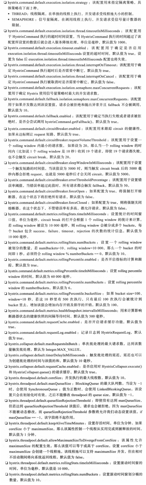

# 第6章 Hystrix服务容错处理

## 6.1 Hystrix

**示例：** *hystrix-native-demo/.../demo1-7*。

### 6.1.1 Hystrix的简单使用

- 依赖：

  ```xml
  <dependency>
      <groupId>com.netflix.hystrix</groupId>
      <artifactId>hystrix-core</artifactId>
  </dependency>
  ```

- 编写一个 HystrixCommand：

  ```java
  public class MyHystrixCommand extends HystrixCommand<String> {
  
      private final String name;
  
      public MyHystrixCommand(String name) {
          super(HystrixCommandGroupKey.Factory.asKey("MyGroup"));
          this.name = name;
      }
  
      @Override
      protected String run() {
          return this.name + ":" + Thread.currentThread().getName();
      }
  
  }
  ```

- 调用：

  ```java
  // 同步调用
  String result = new MyHystrixCommand("yinjihuan").execute();
  System.out.println(result); // yinjihuan:hystrix-MyGroup-1
  // 异步调用
  Future<String> future = new MyHystrixCommand("yinjihuan").queue();
  System.out.println(future.get()); // yinjihuan:hystrix-MyGroup-2
  ```

- 组名会被应用到线程名。

### 6.1.2 回退支持

- 超时会调用 `getFallback`。

### 6.1.3 信号量策略配置

- 配置信号量策略：

  ```java
  super(HystrixCommand.Setter
        .withGroupKey(HystrixCommandGroupKey.Factory.asKey("MyGroup"))
        .andCommandPropertiesDefaults(
            HystrixCommandProperties.Setter()
            .withExecutionIsolationStrategy(
                HystrixCommandProperties.ExecutionIsolationStrategy.SEMAPHORE
            )
        )
       );
  ```

- 线程为：`main`。

### 6.1.4 线程隔离策略配置

- 默认采用线程策略，可以配置一些参数：

  ```java
  super(Setter
        .withGroupKey(HystrixCommandGroupKey.Factory.asKey("MyGroup"))
        .andCommandPropertiesDefaults(
            HystrixCommandProperties.Setter()
            .withExecutionIsolationStrategy(
                HystrixCommandProperties.ExecutionIsolationStrategy.THREAD
            )
        ).andThreadPoolPropertiesDefaults(
            HystrixThreadPoolProperties.Setter()
            .withCoreSize(10)
            .withMaxQueueSize(100)
            .withMaximumSize(100)
        )
       );
  ```

### 6.1.5 结果缓存

- 缓存 key：

  ```java
  @Override     
  protected String getCacheKey() {         
      return String.valueOf(this.name); 
  }
  ```

- 初始化上下文：

  ```java
  HystrixRequestContext context = HystrixRequestContext.initializeContext();
  String result = new MyHystrixCommand("yinjihuan").execute();
  ...
  context.shutdown();
  ```

### 6.1.6 缓存清除

- `HystrixRequestCache.getInstance(GETTER_KEY, HystrixConcurrencyStrategyDefault.getInstance()).clear(name);`。

### 6.1.7 合并请求

- 合并命令：

  ```java
  class MyHystrixCollapser extends HystrixCollapser<List<String>, String, String> {
                                // HystrixCollapser<BatchReturnType, ResponseType, RequestArgumentType>
      // 转发给批量执行命令
      @Override
      protected HystrixCommand<List<String>> createCommand(final Collection<CollapsedRequest<String, String>> requests) {
          return new BatchCommand(requests);
      }
  
      // 将批量执行的结果对应到单个请求
      @Override
      protected void mapResponseToRequests(List<String> batchResponse,
                                           Collection<CollapsedRequest<String, String>> requests) {
          int count = 0;
          for (CollapsedRequest<String, String> request : requests) {
              request.setResponse(batchResponse.get(count++));
          }
      }
  }
  ```

## 6.2 在Spring Cloud中使用Hystrix

### 6.2.1 简单使用

- 添加依赖：

  ```xml
  <dependency>
      <groupId>org.springframework.cloud</groupId>
      <artifactId>spring-cloud-starter-netflix-hystrix</artifactId>
  </dependency>
  ```

- 开启：`@EnableHystrix` 或 `@EnableCircuiteBreaker`。

- 指定失败时的调用方法：`@HystrixCommand(fallbackMethod = "")`。

### 6.2.2 配置详解

**参考：** <https://github.com/Netflix/Hystrix/wiki/Configuration>。

<details>
    <summary>hystrix配置：</summary>
    
</details>

### 6.2.3 Feign整合Hystrix服务容错

- 启用：`feign.hystrix.enabled=true`。
- 回退类：`@FeignClient(fallback=UserRemoteClientFallback.class)`。
- 回退工厂，可以知道异常： `@FeignClient(fallbackFactory=UserRemoteClientFallbackFactory.class)`。

### 6.2.4 Feign中禁用Hystrix

- 全部禁用：`feign.hystrix.enabled=true`。

- 部分禁用（每次返回新的 Feign）：

  ```java
  @Configuration
  public class FeignConfiguration {
      @Bean @Scope("prototype")
      public Feign. Builder feignBuilder() {
          return Feign. builder( );
      }
  }
  ```

## 6.3 Hystrix监控

- 访问：http://localhost:8086/actuator/hystrix.stream。
- 随便调用接口就有数据了：<http://localhost:8086/callHello>。

## 6.4 整合Dashboard查看监控数据

- 依赖：spring-cloud-starter-netflix-hystrix-dashboard。
- 启用：`@EnableHystrixDashboard`。
- 访问：<http://localhost:9011/hystrix>。

## 6.5 Turbine聚合集群数据

### 6.5.1 Turbine使用

- 监控集群，需要注册中心。

- 依赖：spring-cloud-starter-netflix-turbine。

- 启用：`@EnableTurbine` 和 `@EnableDiscoveryClient`。

- 配置：

  ```properties
  # 需要聚合的服务名称
  turbine.appConfig=hystrix-feign-demo
  # Turbine 需要聚合的集群名称
  turbine.aggregator.clusterConfig=default
  # 集群名表达式
  turbine.clusterNameExpression=new String("default")
  ```

- 访问：<http://localhost:9011/turbine.stream>。

### 6.5.2 context-path导致监控失败

- 配置后缀：`turbine.instanceUrlSuffix=/<context-path>/hystrix.stream`。
- 多个服务为每个服务配置一个集群：`turbine.instanceUrlSuffix.集群名`。
- 参考：<https://github.com/Netflix/Turbine/wiki/Configuration-(1.x)>。

## 6.6 本章小结

略。
