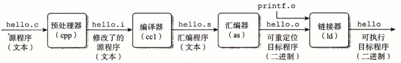
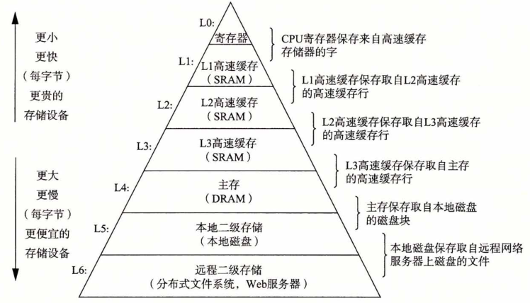

# 第1章 计算机系统漫游

如果你**全力投身学习**本书中的概念，**完全理解底层计算机系统**以及它对应用程序的影响，那么你会步上**成为为数不多的“大牛”**的道路。

## 1.1 信息就是位+上下文

## 1.2 程序被其他程序翻译成不同的格式

| 💡 **程序编译的各个阶段** |
| ------------------------ |

**预处理器**、**编译器**、**汇编器**和**链接器**这四个阶段一起构成了编译系统（compilation system）。



<center><i>图 1-3 编译系统</i></center>

## 1.3 了解编译系统如何工作是大有益处的

- 优化程序性能
- 理解链接时出现的错误
- 避免安全漏洞

## 1.4 处理器读并解释储存在内存中的指令

### 1.4.1 系统的硬件组成

- 总线
- I/O 设备
- 主存
- 处理器

### 1.4.2 运行hello程序

## 1.5 高速缓存至关重要

## 1.6 存储设备形成层次结构



<center><i>图 1-9 一个存储器层次结构的示例</i></center>

## 1.7 操作系统管理硬件

### 1.7.1 进程

### 1.7.2 线程

### 1.7.3 虚拟内存

### 1.7.4 文件

## 1.8 系统之间利用网络通信

## 1.9 重要主题

### 1.9.1 Amdahl定律

| 💡 **什么是阿姆达尔定律** |
| ------------------------ |

Gene Amdahl 对提升系统某一部分性能所带来的效果做出了简单却有见地的观察，这个观察被称为 Amdahl 定律（Amdahl's law）：
$$
T_{new}=(1-\alpha)T_{old}+(\alpha T_{old})/k=T_{old}[(1-\alpha)+\alpha/k]
$$

- T<sub>old</sub>：提升前需要的总时间
- α ：提升部分占总时间的比值

- κ：提升比例
- T<sub>new</sub>：提升后需要的总时间

加速比为：


$$
S = \frac1{(1-\alpha)+\alpha/k}\\
$$
例如：对某系统的 60% 提升了 3 倍速度，加速比等于 1/(0.4+0.6/3)=1.67。虽然对系统的主要部分做了重大改进，但是系统的加速比明显小于这部分的加速比。

**Amdahl 定律的主要观点：想要显著加速整个系统，必须提升全系统中相当大部分的速度**

Amdahl定律一个有趣的特殊情况是考虑 κ 趋向于 ∞ 时的效果，即加速的部分加速到不需要时间：
$$
s = \frac1{(1-\alpha)}
$$
这时：上面例子中 60% 加速到不耗时间，加速比仍然只有 1/(1-0.6)=2.5 倍

### 1.9.2 并发和并行

| 💡 **并发和并行** |
| ---------------- |

并发（concurrency）：是一个通用的概念，指一个同时具有多个活动的系统

并行（parallelism）：用并发来使一个系统运行得更快，可以在计算机系统的多个抽象层次上运用，由高到低三个层次：

- 线程级并发：超线程
- 指令集并行：超标量处理器
- 单指令、多数据并行：SIMD，Single Instruction Multiple Data

> 💁‍♂️ [【知乎】并发与并行的区别是什么？](https://www.zhihu.com/question/33515481)
>
> - 并发是对需求侧的描述，并行才是对实现侧的描述，这两根本不是同一个范畴的东西
> - 并发指的是代码的性质，并行指的是物理运行状态
> - 并发是指同时有很多事要做，你可以串行处理也可以并行处理，并行是指同时做多件事
>
> ```java
> interface Concurrency { }
> class Parallelism implements Concurrency { }
> class Serialism implements Concurrency { }
> ```

### 1.9.3 计算机系统中抽象的重要性

## 1.10 小结

## 参考文献说明

## 练习题答案

