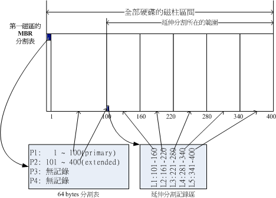
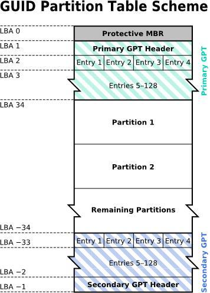

# 第二章 、主机规划与磁盘分区

## 2.1 Linux与硬件的搭配

### 2.1.1 认识计算机的硬件配备

略。

### 2.1.2 选择与Linux搭配的主机配备

略。

### 2.1.3 各硬件装置在Linux中的文件名

| 设备                     | 设备在 Linux 内的文件名                                      |
| ------------------------ | ------------------------------------------------------------ |
| SCSI/SATA/USB 硬盘和 USB | /dev/sd[a-p]                                                 |
| VirtI/O 接口             | /dev/vd[a-p]（用于虚拟机内）                                 |
| 软盘驱动器               | /dev/fd[0-7]                                                 |
| 打印机                   | /dev/lp[0-2]（25 针打印机） /dev/usb/lp[0-15]（USB 接口） |
| 鼠标                     | /dev/input/mouse[0-15]（通用） /dev/psaux（PS/2 接口） /dev/mouse（当前鼠标） |
| CDROM/DVDROM             | /dev/scd[0-1]（通用） /dev/sr[0-1]（通用，CentOS 较常见） /dev/cdrom（当前 CDROM） |
| 磁带                     | /dev/ht0（IDE 接口） /dev/st0（SATA/SCSI 接口） /dev/tape（当前磁带） |
| IDE 硬盘                 | /dev/hd[a-d]（旧式系统才有）                                 |

- 参考：[Github - devices.txt](https://github.com/torvalds/linux/blob/master/Documentation/admin-guide/devices.txt) 或 [Kernel -  devices.txt](https://www.kernel.org/doc/Documentation/admin-guide/devices.txt)。

### 2.1.4 使用虚拟机学习

略。

## 2.2 磁盘分区

### 2.2.1 磁盘连接的方式与装置文件名的关系

- MBR：早期磁盘第一个扇区有重要信息称为 MBR (Master Boot Record) 格式。
- GPT：分区表 GUID partition table。

### 2.2.2 MSDOS(MBR) 与 GPT 磁盘分区表(partition table)

**MBR 分区：**

- MBR 安装开机管理程序的地方，有 446 bytes，记录整颗硬盘分区的状态，有 64 bytes。
- 64 bytes 分为四组记录区，分为主分区和扩展分区（🙋‍♂️可以理解为二级指针）。
- 主要分区和扩展分区最多可以有四个。
- 扩展分区最多只能有一个。
- 逻辑分区是由扩展分区持续切割出来的分区槽。
- 逻辑分区的数量依操作系统而不同，在 Linux 系统中已经可以突破 63 个以上的分区限制。
- sda[1-4] 为主分区和扩展分区，逻辑分区从 sda5 开始。
- 因为每个分区表仅有 16 bytes，最大支持 2.2T 容量。

**MBR 分区示意图：**

**GPT 分区：**

- 过去一个扇区 512bytes，大多数使用逻辑区块地址（Logical Block Address，LBA）划分磁盘，从 LBA0 开始。
- GPT 使用了 34 个 LBA 区块来纪录分区信息，磁盘的最后 33 个 LBA 拿来作备份。
- LBA0：MBR 相容区块，前 446 bytes 一样，存储开机管理程序，后面存放一个标识 GPT 的特殊标识。
- LBA1：GPT 表头纪录。分区表本身的位置与大小、备份用的 GPT 分区、分区表的检验机制码（CRC32）。
- LBA2-33：实际纪录分区信息处。
  - 每个 LBA 都可以纪录 4 笔分区纪录，默认有 4*32 = 128 个分区纪录。
  - 提供了 64bits 来记载开始/结束的扇区号码，最大容量：264 * 512 bytes = 263 * 1 Kbytes = 233*TB = 8 ZB 。

**GPT 分区示意图：**

### 2.2.3 开机流程中的 BIOS 与 UEFI 开机检测程序

- 如果安装多重引导，最好先安装 Windows 再安装 Linux。因为 Linux 的 boot loader 会自动加入 Windows；Windows 会覆盖。

### 2.2.4 Linux安装模式下，磁盘分区的选择(极重要)

- 新手：分 */* 与 */swap* 即可。

## 2.3 安装Linux前的规划

### 2.3.1 选择适当的distribution

- CentOS-7-x86_64-Everything-1503-01.iso：1503 代表 15 年 3 月，01 代表 7.1。

### 2.3.2 主机的服务规划与硬件的关系

略。

### 2.3.3 主机硬盘的主要规划

略。

### 2.3.4 鸟哥的两个实际案例

略。

## 2.4 重点回顾

略。

## 2.5 本章习题

略。

## 2.6 参考数据与延伸阅读

略。
