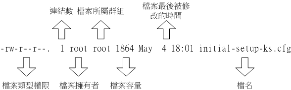
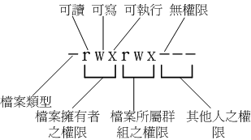

# 第五章 、Linux 的文件权限与目录配置

## 5.1 使用者与群组

略。

## 5.2 Linux 文件权限概念

### 5.2.1 Linux文件属性

**文件属性示意图：**



**文件的类型与权限：**



**文件类型：**

- d：目录。
- -：文件。
- l：链接文件。
- b：存储设备。
- c：串行设备（一次性读取），如键鼠。

### 5.2.2 如何改变文件属性与权限

**`chgrp` - 修改所属组：**

```shell
chgrp [-R] dirname/filename ...
```

**`chown` - 修改所属用户：**

```shell
chown [-R] 账号名称 文件或目录
chown [-R] 账号名称:组名 文件或目录
chown user.group file
```

**`chmod` - 修改权限：**

```shell
chmod [-R] 644 文件或目录
chmod [ugoa] [+-=] [rwx],多个逗号隔开
```

### 5.2.3 目录与文件之权限意义：

略。

### 5.2.4 Linux文件种类与扩展名

略。

## 5.3 Linux目录配置

### 5.3.1 Linux目录配置的依据--FHS

略。

### 5.3.2 目录树(directory tree)

略。

### 5.3.3 绝对路径与相对路径

略。

### 5.3.4 CentOS 的观察

略。

## 5.4 重点回顾

略。

## 5.5 本章练习

略。

## 5.6 参考数据与延伸阅读

略。
