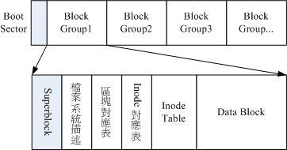
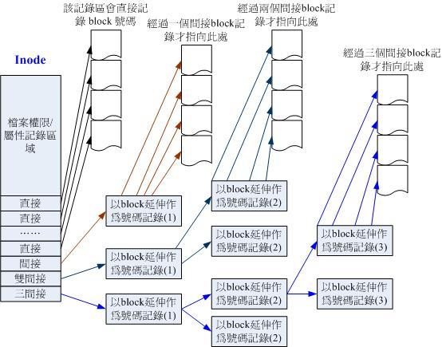

# 第七章 、Linux 磁盘与文件系统管理

## 7.1 认识 Linux 文件系统

### 7.1.1 磁盘组成与分区的复习

略。

### 7.1.2 文件系统特性

**索引式文件系统：**

- superblock：记录此 filesystem 的整体信息，包括 inode/block 的总量、使用量、剩余量， 以及文件系统的格式与相关信息等。
- inode：记录文件的属性，一个文件占用一个 inode，同时记录此文件的数据所在的 block 号码。
- block：实际记录文件的内容，若文件太大时，会占用多个 block。

### 7.1.3 Linux 的 EXT2 文件系统(inode)


**图 7.1.3 ext2 文件系统示意图：**



**Data Block 大小带来的 Ext2 文件系统限制：**

| Block 大小         | 1KB  | 2KB   | 4KB  |
| ------------------ | ---- | ----- | ---- |
| 最大单一文件限制   | 16GB | 256GB | 2TB  |
| 最大文件系统总容量 | 2TB  | 8TB   | 16TB |

**Inode Table：**

- 该文件的存取模式（read/write/excute）。
- 该文件的拥有者与群组（owner/group）。
- 该文件的容量。
- 该文件建立或状态改变的时间（ctime）。
- 最近一次的读取时间（atime）。
- 最近修改的时间（mtime）。
- 定义文件特性的标志（flag），如 SetUID...。
- 该文件真正内容的指向 （pointer）。

**inode 特点：**

- 每个 inode 大小均固定为 128 bytes (新的 ext4 与 xfs 可设定到 256 bytes)。
- 每个文件仅会占用一个 inode，因此文件系统能够建立的文件数量与 inode 的数量有关。
- 系统读取文件时需要先找到 inode，并分析 inode 所记录的权限与用户是否符合，若符合才能够开始实际读取 block 的内容。

**inode 指向 block：** 12 个直接，间接、双间接、三间接各 1 个：



**Superblock（超级区块）：**

- block 与 inode 的总量。
- 未使用与已使用的 inode / block 数量。
- block 与 inode 的大小（block 为 1, 2, 4K，inode 为 128 bytes 或 256bytes）。
- filesystem 的挂载时间、最近一次写入数据的时间、最近一次检验磁盘（fsck）的时间等文件系统的相关信息。
- 一个 valid bit 数值，若此文件系统已被挂载，则 valid bit 为 0，若未被挂载，则 valid bit 为 1。
- 一般大小为 1024 bytes，一个文件系统仅有一个 Superblock，其他 Block Group 如果有作为备份。

**Filesystem Description（文件系统描述说明）：**

- 描述每个 block group 的开始与结束的 block 号码，以及说明每个区段（superblock、bitmap、inodemap、data block）分别介于哪一个 block 号码之间。

**block bitmap（区块对照表）：**

- 可以知道哪些 block 是空的。

**inode bitmap（inode 对照表）：**

- 记录使用与未使用的 inode 号码。

**`dumpe2fs` - 查询 Ext 家族 superblock 信息的指令：**

- CentOS 7 现在是以 xfs 作为预设文件系统，要 ext 格式才能看。

```shell
dumpe2fs 选项 装置文件名
-b  # 列出保留为坏轨的部分
-h  # 仅列出 superblock 的数据，不会列出其他的区段内容
```


### 7.1.4 与目录树的关系

**目录：**

- 文件系统会分配一个 inode 与至少一块 block 给该目录。
- inode 记录该目录的相关权限与属性，并可记录分配到的那块 block 号码。
- block 记录在这个目录下的文件名与该文件占用的 inode 号码数据。

**文件：**

- ext2 会分配一个 inode 与相对于该文件大小的 block 数量给该文件。

**目录树读取：**

- 文件名的记录是在目录的 block 当中，因此新增、删除、更名文件名与目录的 w 权限有关。

### 7.1.5 EXT2/EXT3/EXT4 文件的存取与日志式文件系统的功能

**数据的不一致状态：**

- 写入的数据仅有 inode table 和 data block，superblock、 block bitmap 与 inode bitmap 等 metadata 没有更新。
- ext2 检查很耗时。

**日志式文件系统：**

- 预备：当系统要写入一个文件时，会先在日志记录区块中纪录某个文件准备要写入的信息。
2. 实际写入：开始写入文件的权限与数据；开始更新 metadata 的数据。
3. 结束：完成数据与 metadata 的更新后，在日志记录区块当中完成该文件的纪录。
3. 可以达到快速修复文件系统。

### 7.1.6 Linux 文件系统的运作

略。

### 7.1.7 挂载点的意义 (mount point)

- 不同文件挂载到不同文件系统 inode 可能一样。

### 7.1.8 其他 Linux 支持的文件系统与 VFS

- 查看支持的文件系统：`ls -l /lib/modules/$(uname -r)/kernel/fs`。
- 已加载到内存中支持的文件系统：`cat /proc/filesystems`。

### 7.1.9 XFS 文件系统简介

**Ext 缺点：**

- 支持度最广，但格式化超慢，预先规划出所有的 inode/block/meta data 等数据。

**XFS 分区：**

- 资料区（data section）：包括 inode/data block/superblock 等数据，分为多个储存区群组（allocation groups）。inode 与 block 都是
  系统需要用到时， 这才动态配置产生。
- 文件系统活动登录区（log section）：纪录文件系统的变化，可以将 SSD 磁盘作为 xfs 的登录区。
- 实时运作区（realtime section）：当有文件要被建立时，会在这个区段里面找一个到数个的 extent 区块，将文件放置在这个区块内，等到分配完毕后，再写入到 data section 的 inode 与 block 去。

**`xfs_info` - 查看 xfs 文件系统数据：**

```shel
xfs_info 挂载点|装置文件名
```

## 7.2 文件系统的简单操作

### 7.2.1 磁盘与目录的容量

**`df` - 显示磁盘的相关信息：**

```shell
df 选项 目录或文件名
-a  # 列出所有的文件系统，包括系统特有的 /proc 等文件系统
-k  # 以 KBytes 的容量显示各文件系统
-m  # 以 MBytes 的容量显示各文件系统
-h  # 以人们较易阅读的 GBytes, MBytes, KBytes 等格式自行显示。
-H  # 以 M=1000K 取代 M=1024K 的进位方式
-T  # 连同该 partition 的 filesystem 名称 (例如 xfs) 也列出
-i  # 不用磁盘容量，而以 inode 的数量来显示
```

**`du` - 显示每个文件和目录的磁盘使用空间：**

```shell
du 选项 文件或目录名称
-a  # 列出所有的文件与目录容量，默认仅统计目录，不含
-h  # 以人们较易读的容量格式 (G/M) 显示
-s  # 列出总量，而不列出每个各别的目录占用容量
-S  # 不包括子目录下的总计，与 -s 有点差别
-k  # 以 KBytes 列出容量显示
-m  # 以 MBytes 列出容量显示
```

### 7.2.2 实体链接与符号链接： ln

**硬链接（Hard Link ）：**

- 目录下新增一个文件链接到某 inode 号码。
- 不能跨文件系统。
- 不能链接目录。
- 任何一个删除后，其他还在。

**符号链接（Symbolic Link ）：**

- 源文件删除后，符号链接文件就打不开了。
- 类似于 Windows 的快捷方式。

**`ln` - 为文件创建链接：**

```shell
ln 选项 源文件 目标文件
-s  # 如果不加任何参数就进行连结，那就是 hard link，至于 -s 就是 symbolic link
-f  # 如果 目标文件 存在时，就主动的将目标文件直接移除后再建立
```

## 7.3 磁盘的分区、格式化、检验与挂载

### 7.3.1 观察磁盘分区状态

**`lsblk` - 列出系统上的所有磁盘列表：**

```shell
lsblk 选项 [device]
-d  # 仅列出磁盘本身，并不会列出该磁盘的分区数据
-f  # 同时列出该磁盘内的文件系统名称
-i  # 使用 ASCII 的线段输出，不要使用复杂的编码 (再某些环境下很有用)
-m  # 同时输出该装置在 /dev 底下的权限数据 (rwx 的数据)
-p  # 列出该装置的完整文件名！而不是仅列出最后的名字
-t  # 列出该磁盘装置的详细数据，包括磁盘队列机制、预读写的数据量大小等
```

**`blkid` - 列出装置的 UUID 等参数。**

**`parted` - 列出磁盘的分区表类型与分区信息：**

```shell
parted 设备名 print
```

### 7.3.2 磁盘分区： gdisk/fdisk

**`gdisk` - GPT 磁盘分区：**

```shell
gdisk 装置名称
d   # 删除分区
l   # 分区类型列表
n   # 新建分区
p   # 分区列表
q   # 退出
w   # 保存

cat /proc/partitions  # 查看分区
partprobe -s          # 动态更新分区
```

**`fdisk` - MBR 磁盘分区。**

### 7.3.3 磁盘格式化(建置文件系统)

**`mkfs.xfs` - 格式化 xfs 文件系统：**

```shell
mkfs.xfs 选项 装置名称
# 关于单位：没有加单位则为 bytes 值，可以用 k、m、g、t、p（小写），s 比较特殊，指的是 sector 的个数
-b  # block 容量，可由 512 到 64k，不过最大容量限制为 Linux 的 4k
-d  # 重要的 data section 的相关参数值，主要的值有：
    agcount=数值  # 设定需要几个储存群组(AG)，通常与 CPU 有关
    agsize=数值   # 每个 AG 设定为多少容量，通常 agcount/agsize 只选一个设定即可
    file          # 格式化的装置是个文件而不是个装置（例如虚拟磁盘）
    size=数值     # data section 的容量，你可以不将全部的装置容量用完
    su=数值       # 当有 RAID 时，stripe 的数值，与底下的 sw 搭配使用
    sw=数值       # 当有 RAID 时，用于储存数据的磁盘数量（须扣除备份磁盘与备用磁盘）
    sunit=数值    # 与 su 相当，单位是 sector（512 bytes）
    swidth=数值   # su*sw 的数值，单位是 sector（512 bytes）
-f  # 如果装置内已经有文件系统，则强制格式化
-i  # 与 inode 相关的设定，主要的设定值有：
    size=数值     # 最小是 256 bytes 最大是 2k，一般保留 256 就足够使用了
    internal=0|1  # log 装置是否为内建？预设为 1 内建，如果要用外部装置，使用底下设定
    logdev=device # log 装置为后面指定的 device，需设定 internal=0
    log=数值      # 指定这块登录区的容量，通常最小得要有 512 个 block，大约 2M 以上
-L  # 后面接这个文件系统的标签名 Label name
-r  # 指定 realtime section 的相关设定值，常见的有：
    extsize=数值  # 一般不须设定，但有 RAID 时，最好设定与 swidth 的数值相同，最小为 4K 最大为 1G。
```

**`mkfs.ext4` - 格式化 ext4 文件系统：**

```shell
mkfs.ext4 选项 装置名称
-b  # 设定 block 的大小，有 1K, 2K, 4K 的容量
-L  # 后面接这个装置的标头名称
```

### 7.3.4 文件系统检验

**`xfs_repair` - 修复 XFS 文件系统：**

```shell
xfs_repair 选项 装置名称
-f  # 后面的装置其实是个文件而不是实体装置
-n  # 单纯检查并不修改文件系统的任何数据
-d  # 通常用在单人维护模式底下，针对根目录（/）进行检查与修复的动作。很危险！不要随便使用！
```

**`fsck.ext4` - 修复 ext4 文件系统：**

```shell
fsck.ext4 选项 装置名称
-p  # 当文件系统在修复时，若有需要回复 y 的动作时，自动回复 y 来继续进行修复动作
-f  # 强制检查，一般来说，如果 fsck 没有发现任何 unclean 的标志，不会主动进入进一步检查
-D  # 针对文件系统下的目录进行优化配置
-b  # 后面接 superblock 的位置。利用文件系统内备份的 superblock 来尝试修复，一般来说，superblock 备份1K block 放在 8193, 2K block 放在 16384, 4K block 放在 32768
```

### 7.3.5 文件系统挂载与卸除

**`mount` - 文件系统挂载：**

```shell
mount [-t 文件系统] LABEL='' | UUID='' | 装置文件名 挂载点
mount --bind 源目录 挂载目录
-a  # 依照配置文件 /etc/fstab 的数据将所有未挂载的磁盘都挂载上来
-l  # 单纯的输入 mount 会显示目前挂载的信息。加上 -l 可增列 Label 名称
-t  # 可以加上文件系统种类来指定欲挂载的类型。常见的 Linux 支持类型有：xfs、ext3、ext4、reiserfs、vfat、iso9660(光盘格式)、nfs、cifs、smbfs（后三种为网络文件系统类型）
-n  # 在默认的情况下，系统会将实际挂载的情况实时写入 /etc/mtab 中，以利其他程序的运作，但在某些情况下（例如单人维护模式）为了避免问题会刻意不写入，此时就得要使用 -n 选项。
-o  # 后面可以接一些挂载时额外加上的参数，比方说账号、密码、读写权限等：
    async, sync   # 此文件系统是否使用同步写入（sync）或异步（async）的内存机制，请参考文件系统运作方式。预设为 async。
    atime,noatime # 是否修订文件的读取时间（atime）。为了效能，某些时刻可使用 noatime
    ro, rw        # 挂载文件系统成为只读（ro）或可擦写（rw）
    auto, noauto  # 允许此 filesystem 被以 mount -a 自动挂载(auto)
    dev, nodev    # 是否允许此 filesystem 上，可建立装置文件。dev 为可允许
    suid, nosuid  # 是否允许此 filesystem 含有 suid/sgid 的文件格式
    exec, noexec  # 是否允许此 filesystem 上拥有可执行 binary 文件
    user, nouser  # 是否允许此 filesystem 让任何使用者执行 mount。一般来说，mount 仅有 root 可以进行，但下达 user 参数，则可让一般 user 也能够对此 partition 进行 mount。
    defaults      # 默认值为：rw, suid, dev, exec, auto, nouser, and async
    remount       # 重新挂载，这在系统出错，或重新更新参数时，很有用
```

- */etc/filesystems*：系统指定的测试挂载文件系统类型的优先级。
- */proc/filesystems*：Linux 系统已经加载的文件系统类型。
- 驱动程序：`ls /lib/modules/$(uname -r)/kernel/fs/`。

**`unmount` - 文件系统卸载：**

```shell
umount 选项 装置文件名或挂载点
-f  # 强制卸除，可用在类似网络文件系统 (NFS) 无法读取到的情况下
-l  # 立刻卸除文件系统，比 -f 还强
-n  # 不更新 /etc/mtab 情况下卸除
```

### 7.3.6 磁盘/文件系统参数修订

**`mknod` - 创建字符设备文件和块设备文件：**

```shell
mknod 装置文件名 选项 [Major] [Minor]
b  # 设定装置名称成为一个周边储存设备文件，例如磁盘等
c  # 设定装置名称成为一个周边输入设备文件，例如鼠标/键盘等
p  # 设定装置名称成为一个 FIFO 文件
```

**`xfs_admin` - 修改 XFS 文件系统的 UUID 与 Label name：**

```shell
xfs_admin 选项 装置文件名
-l        # 列出这个装置的 label name
-u        # 列出这个装置的 UUID
-L lable  # 设定这个装置的 Label name
-U uuid   # 设定这个装置的 UUID
```

**`tune2fs` - 修改 ext4 的 label name 与 UUID：**

```shell
tune2fs 选项 装置文件名
-l  # 类似 dumpe2fs -h 的功能，将 superblock 内的数据读出来
-L  # 修改 LABEL name
-U  # 修改 UUID
```

## 7.4 设定开机挂载

### 7.4.1 开机挂载 /etc/fstab 及 /etc/mtab

***/etc/fstab*：**

```text
[装置/UUID 等] [挂载点] [文件系统] [文件系统参数] [dump] [fsck]
```

- 实际记录到 */etc/mtab* 与 */proc/mounts*。
- 出问题后无法修改 */etc/fstab* 时，使用 `mount -n -o remount,rw /`。

### 7.4.2 特殊装置 loop 挂载 (映象档不刻录就挂载使用)

**loop 挂载光盘：**

```shell
mkdir /data/centos_dvd
mount -o loop /tmp/CentOS-7.0-1406-x86_64-DVD.iso /data/centos_dvd
```

**loop 挂载文件：**

```shell
# 新建文件
dd if=/dev/zero of=/srv/loopdev bs=1M count=512
# 格式化文件
mkfs.xfs -f /srv/loopdev
# 挂载
mount -o loop /srv/loopdev /mnt
```

## 7.5 内存置换空间(swap)之建置

### 7.5.1 使用实体分区槽建置swap

```shell
# 创建 swap 分区
gdisk /dev/vda
    n     # 创建
    +512M # 指定大小
    8200  # 类型为 swap
    p     # 查看
    w     # 写入
# 刷新
partprobe
# 查看分区
lsblk
# 建立
mkswap /dev/vda6
# 查看内存
free
# 挂载
swapon /dev/vda6
# 查看 swap 详情
swapon -s
# 永久 /etc/fstab
UUID="6b17e4ab-9bf9-43d6-88a0-73ab47855f9d" swap swap defaults 0 0
```

### 7.5.2 使用文件建置swap

```shell
# 创建文件
dd if=/dev/zero of=/tmp/swap bs=1M count=128
# 创建
mkswap /tmp/swap
# 挂载
swapon /tmp/swap
# 查看
swapon -s
# 卸载
swapoff /tmp/swap
```

## 7.6 文件系统的特殊观察与操作

### 7.6.1 磁盘空间之浪费问题

略。

### 7.6.2 利用 GNU 的 parted 进行分区行为(Optional)

**`parted` - 分区：**

```shell
parted [装置] [指令 [参数]]
    mkpart [primary|logical|extended] [ext4|vfat|xfs] 开始 结束  # 新增分区
    [unit mb] print # 打印分区
    rm [partition]  # 删分区
```

## 7.7 重点回顾

略。

## 7.8 本章习题 - 第一题一定要做

略。

## 7.9 参考数据与延伸阅读

略。
