# Mermaid 的使用

## 流程图

### 节点类型

```
graph LR
		默认
		box[方形]
    round(圆角)
    stadium([体育场形])
    subroutine[[子例程]]
    database[(数据库)]
    circle((圆形))
    asymmetric>非对称]
    rhombus{菱形}
    hexagon{{六角形}}
    parallelogram1[\平行四边形1\]
    parallelogram2[/平行四边形2/]
    trapezoid1[/梯形1\]
    trapezoid2[\梯形2/]
```

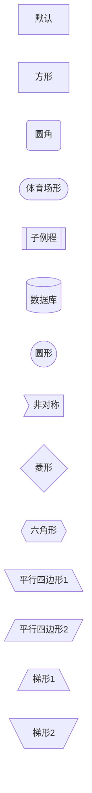

### 节点样式

```
graph LR
    A(A)-->B(B)
    style A fill:#f9f,stroke:#333,stroke-width:4px
    style B fill:#bbf,stroke:#f66,stroke-width:2px,color:#fff,stroke-dasharray: 5 5
```

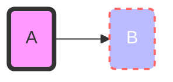

```
graph LR
    A:::someclass --> B
    classDef someclass fill:#f96;
```

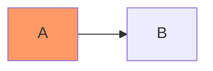

### 方向

- TB - top to bottom
- TD - top-down/ same as top to bottom
- BT - bottom to top
- RL - right to left
- LR - left to right

### 连线类型

```
graph LR
    A1 --- B1 -- 直线 --- C1 ---|直线| D1
    A2 --> B2 -- 箭头 --> C2 ---|箭头| D2
    A3 -.- B3 -.虚线.- C3 -.-|虚线| D3
    A4 -.-> B4 -.虚线箭头.-> C4 -.->|虚线箭头| D4
    A5 === B5 ==粗线=== C5 === |粗线| D5
    A6 ==> B6 ==粗线箭头==> C6 ===|粗线箭头| D6
```

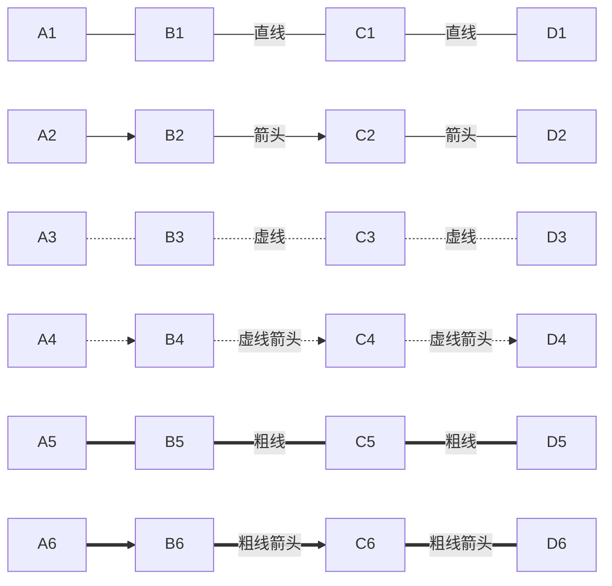

> 💁‍♂️ **注意：**
>
> `-` 或 `=` 的个数会影响长度
>
> | Length            | 1      | 2       | 3        |
> | ----------------- | ------ | ------- | -------- |
> | Normal            | `---`  | `----`  | `-----`  |
> | Normal with arrow | `-->`  | `--->`  | `---->`  |
> | Thick             | `===`  | `====`  | `=====`  |
> | Thick with arrow  | `==>`  | `===>`  | `====>`  |
> | Dotted            | `-.-`  | `-..-`  | `-...-`  |
> | Dotted with arrow | `-.->` | `-..->` | `-...->` |

**flowchart：**

```
flowchart LR
    A1 --o B1
    B1 --x C1
    A2 o--o B2
    B2 <--> C2
    C2 x--x D2
```

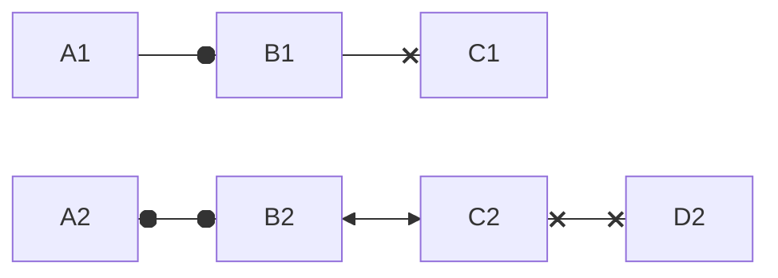

### 同时连线

```
graph TB
   A1 --> B1 & C1 --> D1
   A2 & B2--> C2 & D2
```

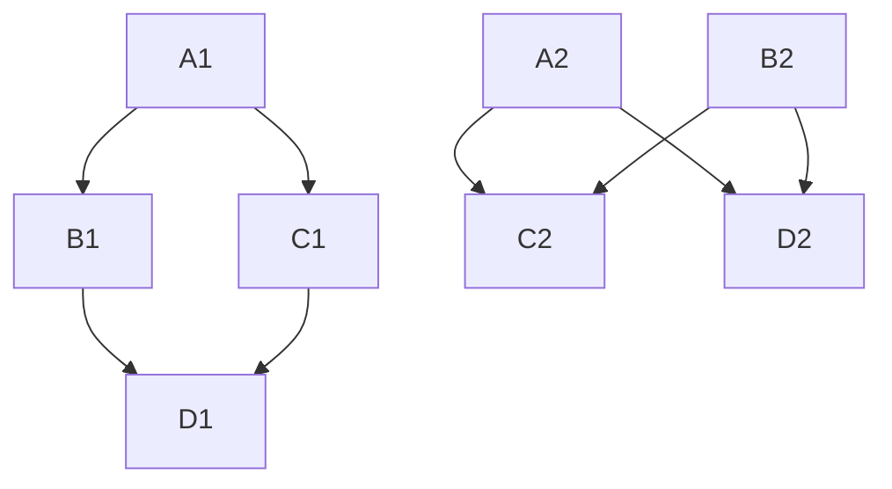

### 子流程

```
graph LR
    subgraph sub1[子流程1]
    	A1-->A2
    end
    subgraph sub2[子流程2]
    	B1-->B2
    end
    A1-->B2
```

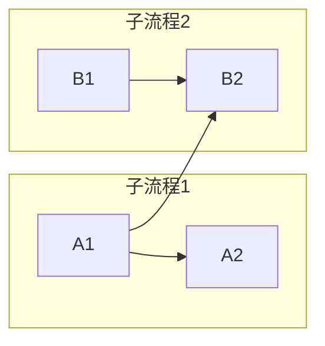

**flowchart：子流程可以连接**

```
flowchart LR
    subgraph sub1[子流程1]
    	A1-->A2
    end
    subgraph sub2[子流程2]
    	B1-->B2
    end
    sub1-->sub2
```

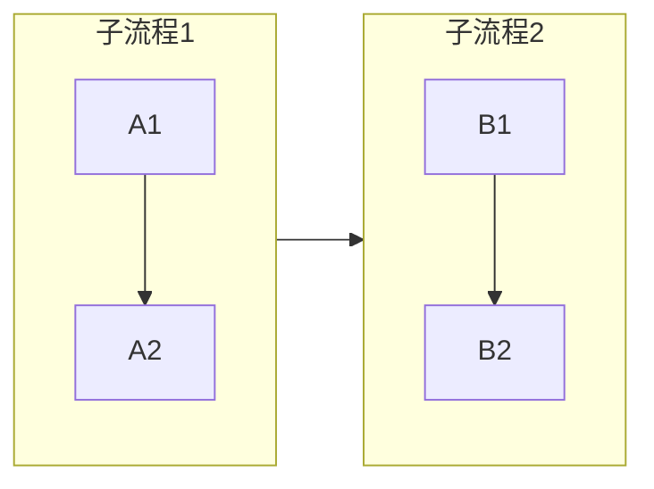

**flowchart：子流程方向**

> 💁‍♂️ Typora 不支持

```
flowchart LR
    subgraph sub1[子流程1]
      direction LR
    	A1-->A2
    end
    subgraph sub2[子流程2]
    	B1-->B2
    end
    sub1-->sub2
```

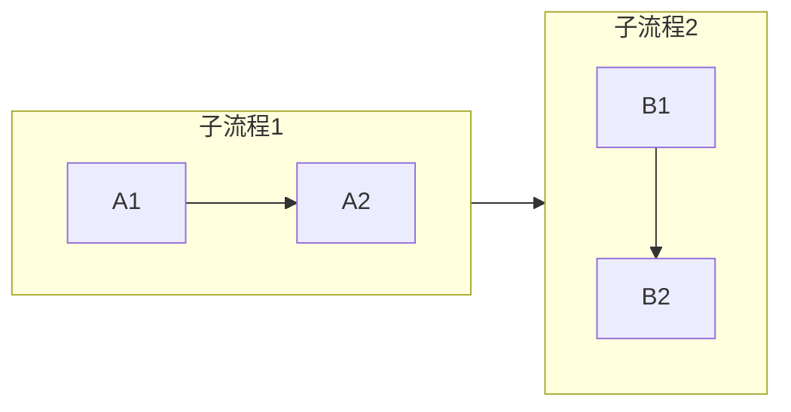

### 注释

```
graph LR
%% 这是注释 A --> B
	A --> B
```

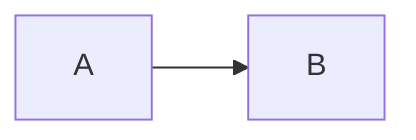

## 时序图

### 参与者

```
sequenceDiagram
    participant ZS as 张三
    participant LS as 李四
```

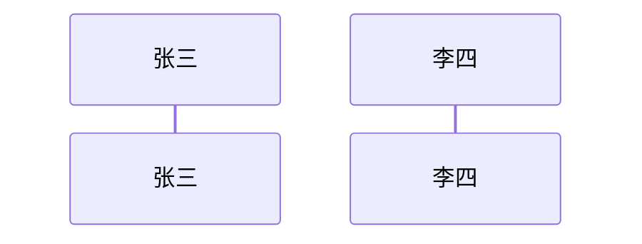

### 消息类型

| 类型 | 描述                         |
| ---- | ---------------------------- |
| ->   | 不带箭头的实线               |
| -->  | 不带箭头的虚线               |
| ->>  | 带箭头的实线                 |
| -->> | 带箭头的虚线                 |
| -x   | 十字箭头的实线               |
| --x  | 十字箭头的虚线               |
| -)   | 头部为空的箭头的实线（异步） |
| --)  | 头部为空的箭头的虚线（异步） |

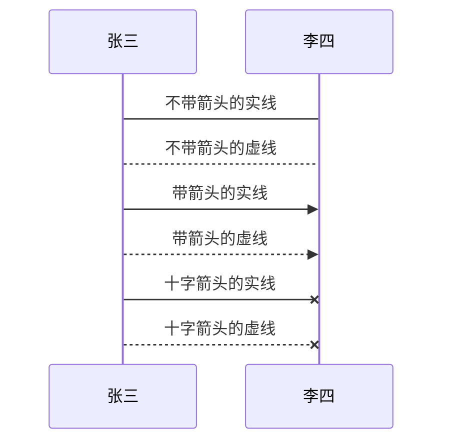

**Typora 不支持 `-)`：**


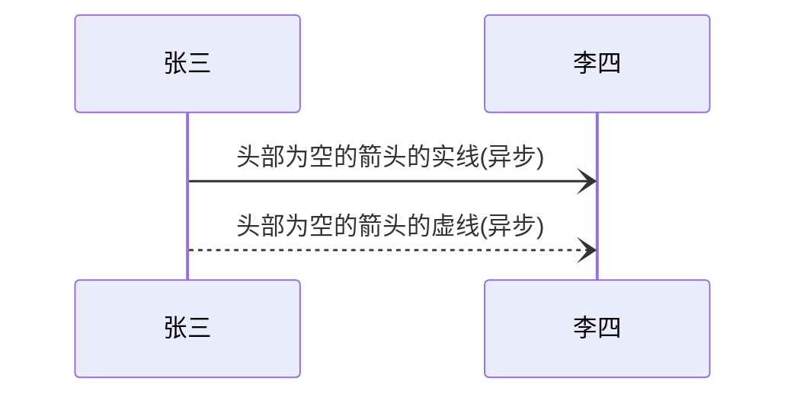

### 激活

**使用 `activate` 和 `deactivate`：**

```
sequenceDiagram
    张三->>李四: 李四你最近怎么样？
    activate 李四
    李四-->>张三: 很好！
    deactivate 李四
```

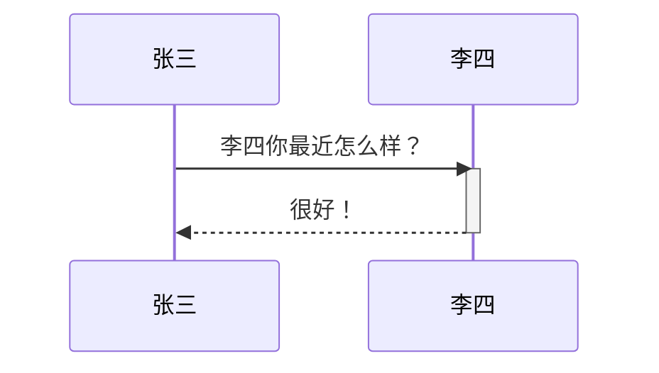

**也可以使用 `+/-`：**

```
sequenceDiagram
    张三->>+李四: 李四你最近怎么样？
    张三->>+李四: 李四李四，收到请回答！收到请回答！
    李四-->>-张三: 张三你好, 李四收到！李四收到！
    李四-->>-张三: 很好！
```

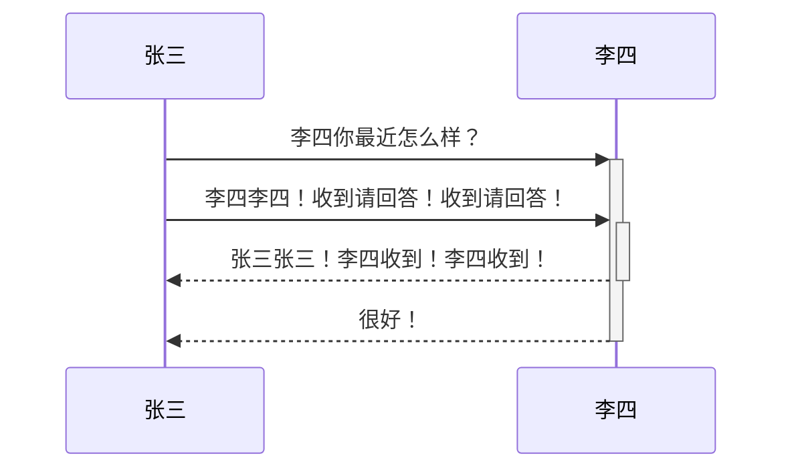

### 说明

```
sequenceDiagram
    Note right of 张三: 这个是说明
    张三->李四: 李四你好，最近怎么样？
    Note over 张三,李四: 一个经典的问题
```

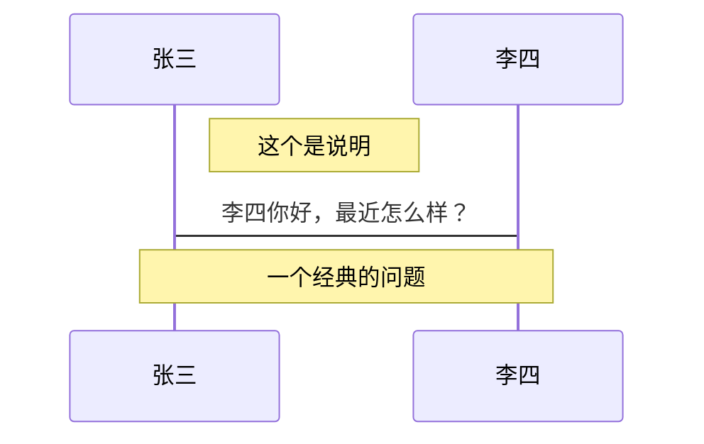

### 循环

```
sequenceDiagram
    张三->李四: 李四你好，你最近怎么样?
    loop 复读机
        李四-->>张三:很好！
    end
```

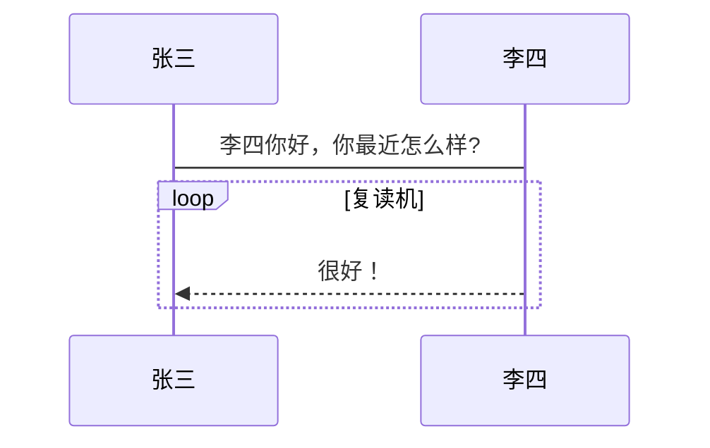

### 抉择和选项

```
sequenceDiagram
    张三->>李四: 李四你好，最近怎么样?
    alt 😷如果生病了
        李四->>张三: 😭不是很好
    else 😀如果一切顺利
        李四->>张三: 😎感觉很不错
    end
    opt 可能发生
        李四->>张三: 😒你那么关心我干嘛
    end
```

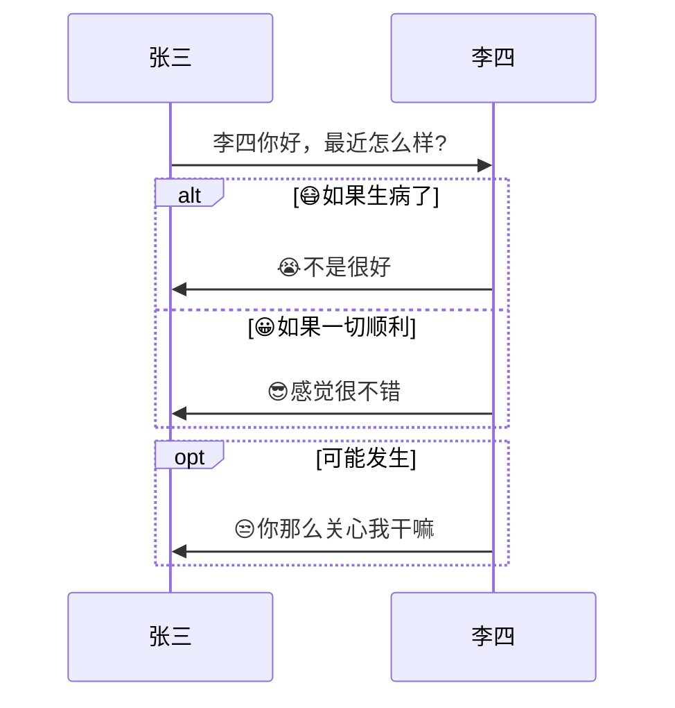

### 并行

```
sequenceDiagram
	par 张三对李四说
		张三->>李四:李四你好，你最近怎么样？
	and 张三对王五说
		张三->>王五:王五你好，李四最近怎么样？
	end
	李四->>张三:你管我怎么样
	王五->>张三:......
```

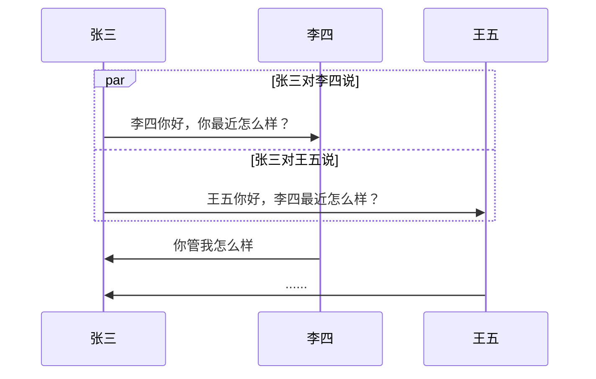

> 💁‍♂️ 并行可以嵌套

### 背景高亮

```
sequenceDiagram
    张三->>+李四: 李四你最近怎么样？
  rect rgb(0,255,0,.618)
    李四-->>-张三: 🪖被绿了
  end
```

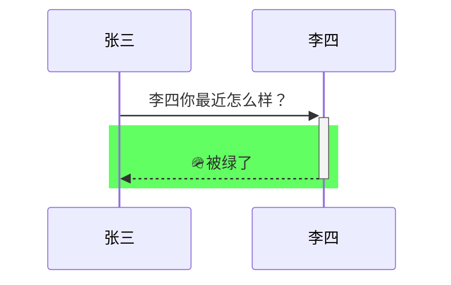

### 注释

```
%% 这是注释
```

### 转义符

```
sequenceDiagram
    张三->>李四: 我 #9829; 你！
    李四->>张三: 我 #9829; 你 #infin; 倍!
```

```mermaid
sequenceDiagram
    张三->>李四: 我 #9829; 你！
    李四->>张三: 我 #9829; 你 #infin; 倍!
```

> 💁‍♂️**参考：**
>
> - [在线编码解码](http://bianma.911cha.com/)
> - [实体名称](https://www.w3school.com.cn/charsets/ref_html_entities_4.asp)

### 序号

```
sequenceDiagram
    autonumber
    张三->>李四: 李四你最近怎么样？
    activate 李四
    李四-->>张三: 很好！
    deactivate 李四
```

```mermaid
sequenceDiagram
    autonumber
    张三->>李四: 李四你最近怎么样？
    activate 李四
    李四-->>张三: 很好！
    deactivate 李四
```

## 类图

### 定义类

```mermaid
classDiagram
  class FooClass~T~{
      +public name
      -private name
      #protected name
      ~package name

      +method(Type~T~ name) returnType
      +abstract()*
      +static()$
  }
```

### 可见性

- `+` Public
- `-` Private
- `#` Protected
- `~` Package/Internal

### 关系

```mermaid
classDiagram
  classA --|> classB : Inheritance
  classC --* classD : Composition
  classE --o classF : Aggregation
  classG --> classH : Association
  classI -- classJ : Link(Solid)
  classK ..> classL : Dependency
  classM ..|> classN : Realization
  classO .. classP : Link(Dashed)
```

| Type  | Description   |
| ----- | ------------- |
| <\|-- | Inheritance   |
| *--   | Composition   |
| o--   | Aggregation   |
| -->   | Association   |
| --    | Link (Solid)  |
| ..>   | Dependency    |
| ..\|> | Realization   |
| ..    | Link (Dashed) |

### 数量关系

- `1` Only 1
- `0..1` Zero or One
- `1..*` One or more
- `*` Many
- `n` n {where n>1}
- `0..n` zero to n {where n>1}
- `1..n` one to n {where n>1}

```mermaid
classDiagram
    Customer "1" --> "*" Ticket
    Student "1" --> "1..*" Course
    Galaxy --> "many" Star : Contains
```

### 类型

```mermaid
classDiagram
class Shape
<<interface>> Shape
```

## 参考

- [Mermaid 官方文档](https://mermaid-js.github.io/mermaid/#/)

