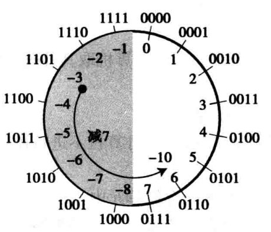
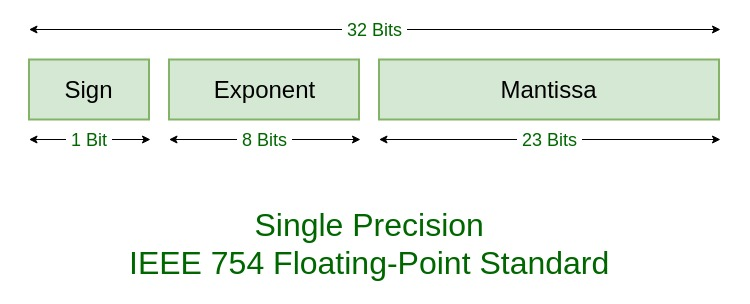
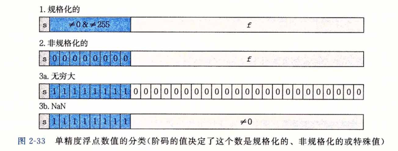

# 数值在计算机中的表示

## 原码、反码、补码

**原码**：最高位是符号位，0为正，1为负，其余为该二进制的绝对值

**反码**：原码符号位不变，其余按位取反

**补码**：两种计算方式

1. 反码+1
2. 右边第一个1及其右边的0不变，左边按位取反

> 计算机中都是存的补码，上面只是补码的计算方式，不是定义

### 补码

补码的出现，就是为了把减法变成加法。怎么变呢，我们以钟表为例，一圈刻度是0到11。如果要从10点回拨到8点：

1. 一种方式是直接-2
2. 另一个方式是+10

10怎么来的？10其实也是回拨2，只不过是在多一圈的基础上-2，即10=12-2，这里的10就类似于2的补码。

计算机中的补码根本原因就是因为n位二进制溢出循环机制类似于钟表循环：

- 减一个数m等于加上-m+2^(n+1)的正数
- 反过来，加一个数m等于加一个m-2^(n+1)的负数

根据下图，加左边的数就等于减去对应的补码

> 总结来说，补码就是2^(n+1)-m
>
> - 加上你的补码就是减去你
> - 虽然和你背靠背，那我绕地球一圈就是和你面对面

### 参考

- [原码，反码，补码杂谈](https://www.imooc.com/article/16813?block_id=tuijian_wz)

## 浮点数

IEEE（Institute of Electrical and Electronics Engineers，电气与电子工程师协会）标准浮点数表示：`V=(-1)^s * M * 2^E`

- S：符号（Sign），0 正，1 负
- E：阶码（Exponent），2 的 E 次幂，可能是负数
- M：尾数（Mantissa），二进制小数，[1,2) 或 [0,1)

单精度浮点数：

双精度浮点数：

### 分类

根据阶码和尾数的不同，可以分为几类：

- 规格化的值：e 不全为0和1，E=e-Bias，M=m+1

  > k 位阶码，偏置（Bias）为 2^(k-1)-1
  >
  > - 单精度 k 为8，偏置为127
  > - 双精度 k 为 11，偏置为1023

- 非规格化的值：e 全为0，E=1-Bias，M=m

  > **为什么非规格化 E=1-Bias，而不是 -Bias**：因为和规则化的值平滑衔接
  >
  > **为什么需要非规则化的值**：
  >
  > - 因为规格化整数位始终是1，即 M>=1，不能表示0。阶码和尾数全为0，分正负
  > - 表示非常接近0的数
- 无穷：e 全为1，m 全为0，分正负
- NaN：e 全为1，m 不为0，是一系列值

### 参考

- [程序员必知之浮点数运算原理详解](https://blog.csdn.net/tercel_zhang/article/details/52537726)
- [IEEE 754浮点数标准详解](http://c.biancheng.net/view/314.html)
- [IEEE浮点表示](https://zhuanlan.zhihu.com/p/107106675)

- 《深入理解计算机系统（第3版）》
- 《计算机科学导论（第3版）》

- [浮点在线数转二进制](http://www.binaryconvert.com/result_float.html)
