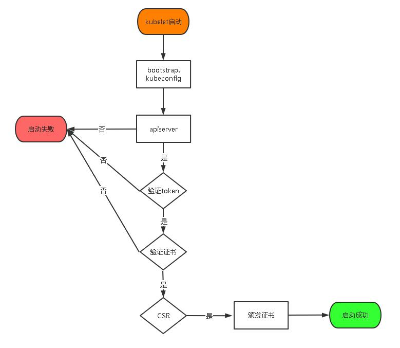

# 三、kubernetes 集群搭建(二进制方式)

## 1 安装要求

在开始之前，部署 Kubernetes 集群机器需要满足以下几个条件：

（1）一台或多台机器，操作系统 CentOS7.x-86_x64

（2）硬件配置：2GB 或更多 RAM，2 个 CPU 或更多 CPU，硬盘 30GB 或更多

（3）集群中所有机器之间网络互通

（4）可以访问外网，需要拉取镜像，如果服务器不能上网，需要提前下载镜像并导入节点

（5）禁止 swap 分区

## 2 准备环境

### 2.1 软件环境

| 软件       | 版本                   |
| ---------- | ---------------------- |
| 操作系统   | CentOS7.8_x64 （mini） |
| Docker     | 19-ce                  |
| Kubernetes | 1.19                   |

### 2.2 服务器规划

| 角色       | IP            | 组件                                                         |
| ---------- | ------------- | ------------------------------------------------------------ |
| k8s-master | 192.168.31.71 | kube-apiserver，kube-controller-manager，kube-scheduler，etcd |
| k8s-node1  | 192.168.31.72 | kubelet，kube-proxy，docker etcd                             |
| k8s-node2  | 192.168.31.73 | kubelet，kube-proxy，docker，etcd                            |

## 3 操作系统初始化配

```shell
# 关闭防火墙
systemctl stop firewalld
systemctl disable firewalld

# 关闭 selinux
sed -i 's/enforcing/disabled/' /etc/selinux/config # 永久
setenforce 0 # 临时

# 关闭 swap
swapoff -a # 临时
sed -ri 's/.*swap.*/#&/' /etc/fstab # 永久

# 根据规划设置主机名
hostnamectl set-hostname <hostname>

# 在 master 添加 hosts
cat >> /etc/hosts << EOF
192.168.44.147 m1
192.168.44.148 n1
EOF

# 将桥接的 IPv4 流量传递到 iptables 的链
cat > /etc/sysctl.d/k8s.conf << EOF
net.bridge.bridge-nf-call-ip6tables = 1
net.bridge.bridge-nf-call-iptables = 1
EOF
sysctl --system # 生效

# 时间同步
yum install ntpdate -y
ntpdate time.windows.com
```

## 4 部署 Etcd 集群

Etcd 是一个分布式键值存储系统，Kubernetes 使用 Etcd 进行数据存储，所以先准备一个 Etcd 数据库，为解决 Etcd 单点故障，应采用集群方式部署，这里使用 3 台组建集群，可容忍 1 台机器故障，当然，你也可以使用 5 台组建集群，可容忍 2 台机器故障。

| 节点名称 | IP            |
| -------- | ------------- |
| etcd-1   | 192.168.31.71 |
| etcd-2   | 192.168.31.72 |
| etcd-3   | 192.168.31.73 |

> 注：为了节省机器，这里与 K8s 节点机器复用。也可以独立于 k8s 集群之外部署，只要 apiserver 能连接到就行。

### 4.1 准备 cfssl 证书生成工具

cfssl 是一个开源的证书管理工具，使用 json 文件生成证书，相比 openssl 更方便使用。

找任意一台服务器操作，这里用 Master 节点。

```shell
wget https://pkg.cfssl.org/R1.2/cfssl_linux-amd64
wget https://pkg.cfssl.org/R1.2/cfssljson_linux-amd64
wget https://pkg.cfssl.org/R1.2/cfssl-certinfo_linux-amd64
chmod +x cfssl_linux-amd64 cfssljson_linux-amd64 cfssl-certinfo_linux-amd64
mv cfssl_linux-amd64 /usr/local/bin/cfssl
mv cfssljson_linux-amd64 /usr/local/bin/cfssljson
mv cfssl-certinfo_linux-amd64 /usr/local/bin/cfssl-certinfo
```

> 🙋‍♂️ 可以去 https://github.com/cloudflare/cfssl/releases 下载。
>
> `chmod +x cfssl cfssljson cfssl-certinfo`

### 4.2 生成 Etcd 证书

#### 4.2.1 自签证书颁发机构（CA）

创建工作目录：

```shell
mkdir -p ~/TLS/{etcd,k8s}
cd TLS/etcd
```

自签 CA：

```shell
cat > ca-config.json<< EOF
{
  "signing": {
    "default": {
      "expiry": "87600h"
    },
    "profiles": {
      "www": {
        "expiry": "87600h",
        "usages": [
          "signing",
          "key encipherment",
          "server auth",
          "client auth"
        ]
      }
    }
  }
}
EOF

cat > ca-csr.json<< EOF
{
  "CN": "etcd CA",
  "key": {
    "algo": "rsa",
    "size": 2048
  },
  "names": [
    {
      "C": "CN",
      "L": "Beijing",
      "ST": "Beijing"
    }
  ]
}
EOF
```

生成证书：

```shell
cfssl gencert -initca ca-csr.json | cfssljson -bare ca -
ls *pem
ca-key.pem
ca.pem
```

#### 4.2.2 使用自签 CA 签发 Etcd HTTPS 证书

创建证书申请文件：

```shell
cat > server-csr.json<< EOF
{
  "CN": "etcd",
  "hosts": [
    "192.168.31.71",
    "192.168.31.72",
    "192.168.31.73"
  ],
  "key": {
    "algo": "rsa",
    "size": 2048
  },
  "names": [
    {
      "C": "CN",
      "L": "BeiJing",
      "ST": "BeiJing"
    }
  ]
}
EOF
```

> 注：上述文件 hosts 字段中 IP 为所有 etcd 节点的集群内部通信 IP，一个都不能少！为了方便后期扩容可以多写几个预留的 IP。

生成证书：

```shell
cfssl gencert -ca=ca.pem -ca-key=ca-key.pem -config=ca-config.json -profile=www server-csr.json | cfssljson -bare server
ls server*pem
server-key.pem
server.pem
```

### 4.3 从 Github 下载二进制文件

下载地址：https://github.com/etcd-io/etcd/releases/download/v3.4.9/etcd-v3.4.9-linux-amd64.tar.gz

### 4.4 部署 Etcd 集群

以下在节点 1 上操作，为简化操作，待会将节点 1 生成的所有文件拷贝到节点 2 和节点 3.

#### 4.4.1 创建工作目录并解压二进制包

```shell
mkdir /opt/etcd/{bin,cfg,ssl} -p
tar zxvf etcd-v3.4.9-linux-amd64.tar.gz
mv etcd-v3.4.9-linux-amd64/{etcd,etcdctl} /opt/etcd/bin/
```

#### 4.4.2 创建 etcd 配置文件

```shell
cat > /opt/etcd/cfg/etcd.conf << EOF
#[Member]
ETCD_NAME="etcd-1"
ETCD_DATA_DIR="/var/lib/etcd/default.etcd"
ETCD_LISTEN_PEER_URLS="https://192.168.31.71:2380"
ETCD_LISTEN_CLIENT_URLS="https://192.168.31.71:2379"
#[Clustering]
ETCD_INITIAL_ADVERTISE_PEER_URLS="https://192.168.31.71:2380"
ETCD_ADVERTISE_CLIENT_URLS="https://192.168.31.71:2379"
ETCD_INITIAL_CLUSTER="etcd-1=https://192.168.31.71:2380,etcd-2=https://192.168.31.72:2380,etcd-3=https://192.168.31.73:2380"
ETCD_INITIAL_CLUSTER_TOKEN="etcd-cluster"
ETCD_INITIAL_CLUSTER_STATE="new"
EOF
```

- ETCD_NAME：节点名称，集群中唯一ETCD_DATA_DIR：数据目录

- ETCD_LISTEN_PEER_URLS：集群通信监听地址

- ETCD_LISTEN_CLIENT_URLS：客户端访问监听地址

- ETCD_INITIAL_ADVERTISE_PEER_URLS：集群通告地址

- ETCD_ADVERTISE_CLIENT_URLS：客户端通告地址

- ETCD_INITIAL_CLUSTER：集群节点地址

- ETCD_INITIAL_CLUSTER_TOKEN：集群 Token

- ETCD_INITIAL_CLUSTER_STATE：加入集群的当前状态，new 是新集群，existing 表示加入已有集群

#### 4.4.3 systemd 管理 etcd

```shell
cat > /usr/lib/systemd/system/etcd.service << EOF
[Unit]
Description=Etcd Server
After=network.target
After=network-online.target
Wants=network-online.target
[Service]
Type=notify
EnvironmentFile=/opt/etcd/cfg/etcd.conf
ExecStart=/opt/etcd/bin/etcd \
--cert-file=/opt/etcd/ssl/server.pem \
--key-file=/opt/etcd/ssl/server-key.pem \
--peer-cert-file=/opt/etcd/ssl/server.pem \
--peer-key-file=/opt/etcd/ssl/server-key.pem \
--trusted-ca-file=/opt/etcd/ssl/ca.pem \
--peer-trusted-ca-file=/opt/etcd/ssl/ca.pem \
--logger=zap
Restart=on-failure
LimitNOFILE=65536
[Install]
WantedBy=multi-user.target
EOF
```

#### 4.4.4 拷贝刚才生成的证书

把刚才生成的证书拷贝到配置文件中的路径：

```shell
cp ~/TLS/etcd/ca*pem ~/TLS/etcd/server*pem /opt/etcd/ssl/
```

#### 4.4.5 启动并设置开机启动

```shell
systemctl daemon-reload
systemctl start etcd
systemctl enable etcd
```

#### 4.4.6 将上面节点 1 所有生成的文件拷贝到节点 2 和节点 3

```shell
scp -r /opt/etcd/ root@192.168.31.72:/opt/
scp /usr/lib/systemd/system/etcd.service root@192.168.31.72:/usr/lib/systemd/system/
scp -r /opt/etcd/ root@192.168.31.73:/opt/
scp /usr/lib/systemd/system/etcd.service root@192.168.31.73:/usr/lib/systemd/system/
```

然后在节点 2 和节点 3 分别修改 etcd.conf 配置文件中的节点名称和当前服务器 IP：

```shell
vi /opt/etcd/cfg/etcd.conf
#[Member]
ETCD_NAME="etcd-1"
# 修改此处，节点 2 改为 etcd-2，节点 3 改为 etcd-3

ETCD_DATA_DIR="/var/lib/etcd/default.etcd"
ETCD_LISTEN_PEER_URLS="https://192.168.31.71:2380" # 修改此处为当前服务器 IP

ETCD_LISTEN_CLIENT_URLS="https://192.168.31.71:2379" # 修改此处为当前服务器 IP
#[Clustering]
ETCD_INITIAL_ADVERTISE_PEER_URLS="https://192.168.31.71:2380" # 修改此处为当前服务器 IP
ETCD_ADVERTISE_CLIENT_URLS="https://192.168.31.71:2379" # 修改此处为当前服务器IP
ETCD_INITIAL_CLUSTER="etcd-1=https://192.168.31.71:2380,etcd-2=https://192.168.31.72:2380,etcd-3=https://192.168.31.73:2380"
ETCD_INITIAL_CLUSTER_TOKEN="etcd-cluster"
ETCD_INITIAL_CLUSTER_STATE="new"
```

最后启动 etcd 并设置开机启动，同上。

#### 4.4.7 查看集群状态

```shell
ETCDCTL_API=3 /opt/etcd/bin/etcdctl --cacert=/opt/etcd/ssl/ca.pem --cert=/opt/etcd/ssl/server.pem --key=/opt/etcd/ssl/server-key.pem --endpoints="https://192.168.31.71:2379,https://192.168.31.72:2379,https://192.168.31.73:2379" endpoint health

https://192.168.31.71:2379 is healthy: successfully committed proposal: took = 8.154404ms
https://192.168.31.73:2379 is healthy: successfully committed proposal: took = 9.044117ms
https://192.168.31.72:2379 is healthy: successfully committed proposal: took = 10.000825ms
```

如果输出上面信息，就说明集群部署成功。如果有问题第一步先看日志：

/var/log/message 或 journalctl -u etcd

## 5 安装 Docker

下载地址：https://download.docker.com/linux/static/stable/x86_64/docker-19.03.9.tgz

以下在所有节点操作。这里采用二进制安装，用 yum 安装也一样。

### 5.1 解压二进制包

```shell
tar zxvf docker-19.03.9.tgz
mv docker/* /usr/bin
```

### 5.2 systemd 管理 docker

```shell
cat > /usr/lib/systemd/system/docker.service << EOF
[Unit]
Description=Docker Application Container Engine
Documentation=https://docs.docker.com
After=network-online.target firewalld.service
Wants=network-online.target
[Service]
Type=notify
ExecStart=/usr/bin/dockerd
ExecReload=/bin/kill -s HUP $MAINPID
LimitNOFILE=infinity
LimitNPROC=infinity
LimitCORE=infinity
TimeoutStartSec=0
Delegate=yes
KillMode=process
Restart=on-failure
StartLimitBurst=3
StartLimitInterval=60s
[Install]
WantedBy=multi-user.target
EOF
```

### 5.3 创建配置文件

```shell
mkdir /etc/docker
cat > /etc/docker/daemon.json << EOF
{
"registry-mirrors": ["https://b9pmyelo.mirror.aliyuncs.com"]
}
EOF
```

registry-mirrors 阿里云镜像加速器

### 5.4 启动并设置开机启动

```shell
systemctl daemon-reload
systemctl start docker
systemctl enable docker
```

## 6 部署 Master Node

### 6.1 生成 kube-apiserver 证书

#### 6.1.1 自签证书颁发机构（CA）

```shell
cat > ca-config.json<< EOF
{
  "signing": {
    "default": {
      "expiry": "87600h"
    },
    "profiles": {
      "kubernetes": {
        "expiry": "87600h",
        "usages": [
          "signing",
          "key encipherment",
          "server auth",
          "client auth"
        ]
      }
    }
  }
}
EOF

cat > ca-csr.json<< EOF
{
  "CN": "kubernetes",
  "key": {
    "algo": "rsa",
    "size": 2048
  },
  "names": [
    {
      "C": "CN",
      "L": "Beijing",
      "ST": "Beijing",
      "O": "k8s",
      "OU": "System"
    }
  ]
}
EOF
```

#### 6.1.2 生成证书：

```shell
cfssl gencert -initca ca-csr.json | cfssljson -bare ca -
ls *pem
ca-key.pem
ca.pem
```

#### 6.1.3 使用自签 CA 签发 kube-apiserver HTTPS 证书

创建证书申请文件：

```shell
cd TLS/k8s
cat > server-csr.json<< EOF
{
  "CN": "kubernetes",
  "hosts": [
    "10.0.0.1",
    "127.0.0.1",
    "192.168.31.71",
    "192.168.31.72",
    "192.168.31.73",
    "192.168.31.74",
    "192.168.31.81",
    "192.168.31.82",
    "192.168.31.88",
    "kubernetes",
    "kubernetes.default",
    "kubernetes.default.svc",
    "kubernetes.default.svc.cluster",
    "kubernetes.default.svc.cluster.local"
  ],
  "key": {
    "algo": "rsa",
    "size": 2048
  },
  "names": [
    {
      "C": "CN",
      "L": "BeiJing",
      "ST": "BeiJing",
      "O": "k8s",
      "OU": "System"
    }
  ]
}
EOF
```

生成证书：

```shell
cfssl gencert -ca=ca.pem -ca-key=ca-key.pem -config=ca-config.json -profile=kubernetes server-csr.json | cfssljson -bare server
ls server*pem
server-key.pem
server.pem
```

### 6.2 从 Github 下载二进制文件

下载地址：

https://github.com/kubernetes/kubernetes/blob/master/CHANGELOG/CHANGELOG-1.18.md#v1183

> 注：打开链接你会发现里面有很多包，下载一个 server 包就够了，包含了 Master 和 Worker Node 二进制文件。

### 6.3 解压二进制包

```shell
mkdir -p /opt/kubernetes/{bin,cfg,ssl,logs}
tar zxvf kubernetes-server-linux-amd64.tar.gz
cd kubernetes/server/bin
cp kube-apiserver kube-scheduler kube-controller-manager /opt/kubernetes/bin
cp kubectl /usr/bin/
```

### 6.4 部署 kube-apiserver

#### 6.4.1 创建配置文件

```shell
cat > /opt/kubernetes/cfg/kube-apiserver.conf << EOF
KUBE_APISERVER_OPTS="--logtostderr=false \\
--v=2 \\
--log-dir=/opt/kubernetes/logs \\
--etcd-servers=https://192.168.31.71:2379,https://192.168.31.72:2379,https://192.168.31.73:2379 \\
--bind-address=192.168.31.71 \\
--secure-port=6443 \\
--advertise-address=192.168.31.71 \\
--allow-privileged=true \\
--service-cluster-ip-range=10.0.0.0/24 \\
--enable-admission-plugins=NamespaceLifecycle,LimitRanger,ServiceAccount,ResourceQuota,NodeRestriction \\
--authorization-mode=RBAC,Node \\
--enable-bootstrap-token-auth=true \\
--token-auth-file=/opt/kubernetes/cfg/token.csv \\
--service-node-port-range=30000-32767 \\
--kubelet-client-certificate=/opt/kubernetes/ssl/server.pem \\
--kubelet-client-key=/opt/kubernetes/ssl/server-key.pem \\
--tls-cert-file=/opt/kubernetes/ssl/server.pem \\
--tls-private-key-file=/opt/kubernetes/ssl/server-key.pem \\
--client-ca-file=/opt/kubernetes/ssl/ca.pem \\
--service-account-key-file=/opt/kubernetes/ssl/ca-key.pem \\
--etcd-cafile=/opt/etcd/ssl/ca.pem \\
--etcd-certfile=/opt/etcd/ssl/server.pem \\
--etcd-keyfile=/opt/etcd/ssl/server-key.pem \\
--audit-log-maxage=30 \\
--audit-log-maxbackup=3 \\
--audit-log-maxsize=100 \\
--audit-log-path=/opt/kubernetes/logs/k8s-audit.log"
EOF
```

> 注：上面两个 `\\` 第一个是转义符，第二个是换行符，使用转义符是为了使用 EOF 保留换行符。

- logtostderr：启用日志
- v：日志等级
- log-dir：日志目录
- etcd-servers：etcd 集群地址
- bind-address：监听地址
- secure-port：https 安全端口
- advertise-address：集群通告地址
- allow-privileged：启用授权
- service-cluster-ip-range：Service 虚拟 IP 地址段
- enable-admission-plugins：准入控制模块
- authorization-mode：认证授权，启用 RBAC 授权和节点自管理
- enable-bootstrap-token-auth：启用 TLS bootstrap 机制
- token-auth-file：bootstrap token 文件
- service-node-port-range：Service nodeport 类型默认分配端口范围
- kubelet-client-xxx：apiserver 访问 kubelet 客户端证书
- tls-xxx-file：apiserver https 证书
- etcd-xxxfile：连接 Etcd 集群证书
- audit-log-xxx：审计日志

#### 6.4.2 拷贝刚才生成的证书

把刚才生成的证书拷贝到配置文件中的路径：

```shell
cp ~/TLS/k8s/ca*pem ~/TLS/k8s/server*pem /opt/kubernetes/ssl/
```

#### 6.4.3 启用 TLS Bootstrapping 机制

TLS Bootstraping：Master apiserver 启用 TLS 认证后，Node 节点 kubelet 和 kube-proxy 要与 kube-apiserver 进行通信，必须使用 CA 签发的有效证书才可以，当 Node节点很多时，这种客户端证书颁发需要大量工作，同样也会增加集群扩展复杂度。为了简化流程，Kubernetes 引入了 TLS bootstraping 机制来自动颁发客户端证书，kubelet会以一个低权限用户自动向 apiserver 申请证书，kubelet 的证书由 apiserver 动态签署。所以强烈建议在 Node 上使用这种方式，目前主要用于 kubelet，kube-proxy 还是由我们统一颁发一个证书。

TLS bootstraping 工作流程：



创建上述配置文件中 token 文件：

```shell
cat > /opt/kubernetes/cfg/token.csv << EOF
c47ffb939f5ca36231d9e3121a252940,kubelet-bootstrap,10001,"system:node-bootstrapper"
EOF
```

格式：token，用户名，UID，用户组

token 也可自行生成替换：

```shell
head -c 16 /dev/urandom | od -An -t x | tr -d ' '
```

#### 6.4.4 systemd 管理 apiserver

```shell
cat > /usr/lib/systemd/system/kube-apiserver.service << EOF
[Unit]
Description=Kubernetes API Server
Documentation=https://github.com/kubernetes/kubernetes
[Service]
EnvironmentFile=/opt/kubernetes/cfg/kube-apiserver.conf
ExecStart=/opt/kubernetes/bin/kube-apiserver \$KUBE_APISERVER_OPTS
Restart=on-failure
[Install]
WantedBy=multi-user.target
EOF
```

#### 6.4.5 启动并设置开机启动

```shell
systemctl daemon-reload
systemctl start kube-apiserver
systemctl enable kube-apiserver
```

#### 6.4.6 授权 kubelet-bootstrap 用户允许请求证书

```shell
kubectl create clusterrolebinding kubelet-bootstrap \
--clusterrole=system:node-bootstrapper \
--user=kubelet-bootstrap
```

### 6.5 部署 kube-controller-manager

#### 6.5.1 创建配置文件

```shell
cat > /opt/kubernetes/cfg/kube-controller-manager.conf << EOF
KUBE_CONTROLLER_MANAGER_OPTS="--logtostderr=false \\
--v=2 \\
--log-dir=/opt/kubernetes/logs \\
--leader-elect=true \\
--master=127.0.0.1:8080 \\
--bind-address=127.0.0.1 \\
--allocate-node-cidrs=true \\
--cluster-cidr=10.244.0.0/16 \\
--service-cluster-ip-range=10.0.0.0/24 \\
--cluster-signing-cert-file=/opt/kubernetes/ssl/ca.pem \\
--cluster-signing-key-file=/opt/kubernetes/ssl/ca-key.pem \\
--root-ca-file=/opt/kubernetes/ssl/ca.pem \\
--service-account-private-key-file=/opt/kubernetes/ssl/ca-key.pem \\
--experimental-cluster-signing-duration=87600h0m0s"
EOF
```

- master：通过本地非安全本地端口 8080 连接 apiserver。
- leader-elect：当该组件启动多个时，自动选举（HA）
- cluster-signing-cert-file/–cluster-signing-key-file：自动为 kubelet 颁发证书的 CA，与 apiserver 保持一致

#### 6.5.2 systemd 管理 controller-manager

```shell
cat > /usr/lib/systemd/system/kube-controller-manager.service << EOF
[Unit]
Description=Kubernetes Controller Manager
Documentation=https://github.com/kubernetes/kubernetes
[Service]
EnvironmentFile=/opt/kubernetes/cfg/kube-controller-manager.conf
ExecStart=/opt/kubernetes/bin/kube-controller-manager \$KUBE_CONTROLLER_MANAGER_OPTS
Restart=on-failure
[Install]
WantedBy=multi-user.target
EOF
```

#### 6.5.3 启动并设置开机启动

```shell
systemctl daemon-reload
systemctl start kube-controller-manager
systemctl enable kube-controller-manager
```

### 6.6 部署 kube-scheduler

#### 6.6.1 创建配置文件

```shell
cat > /opt/kubernetes/cfg/kube-scheduler.conf << EOF
KUBE_SCHEDULER_OPTS="--logtostderr=false \
--v=2 \
--log-dir=/opt/kubernetes/logs \
--leader-elect \
--master=127.0.0.1:8080 \
--bind-address=127.0.0.1"
EOF
```

- master：通过本地非安全本地端口 8080 连接 apiserver。
- leader-elect：当该组件启动多个时，自动选举（HA）

#### 6.6.2 systemd 管理 scheduler

```shell
cat > /usr/lib/systemd/system/kube-scheduler.service << EOF
[Unit]
Description=Kubernetes Scheduler
Documentation=https://github.com/kubernetes/kubernetes
[Service]
EnvironmentFile=/opt/kubernetes/cfg/kube-scheduler.conf
ExecStart=/opt/kubernetes/bin/kube-scheduler \$KUBE_SCHEDULER_OPTS
Restart=on-failure
[Install]
WantedBy=multi-user.target
EOF
```

#### 6.6.3 启动并设置开机启动

```shell
systemctl daemon-reload
systemctl start kube-scheduler
systemctl enable kube-scheduler
```

#### 6.6.4 查看集群状态

所有组件都已经启动成功，通过 kubectl 工具查看当前集群组件状态：

```shell
kubectl get cs
NAME                 STATUS    MESSAGE             ERROR
scheduler            Healthy   ok
controller-manager   Healthy   ok
etcd-0               Healthy   {"health":"true"}
etcd-1               Healthy   {"health":"true"}
etcd-2               Healthy   {"health":"true"}
```

如上输出说明 Master 节点组件运行正常。

## 7 部署 Worker Node

下面还是在 Master Node 上操作，即同时作为 Worker Node

### 7.1 创建工作目录并拷贝二进制文件

在所有 worker node 创建工作目录：

```shell
mkdir -p /opt/kubernetes/{bin,cfg,ssl,logs}
```

从 master 节点拷贝：

```shell
cd kubernetes/server/bin
cp kubelet kube-proxy /opt/kubernetes/bin # 本地拷贝
```

### 7.2 部署 kubelet

#### 7.2.1 创建配置文件

```shell
cat > /opt/kubernetes/cfg/kubelet.conf << EOF
KUBELET_OPTS="--logtostderr=false \\
--v=2 \\
--log-dir=/opt/kubernetes/logs \\
--hostname-override=k8s-master \\
--network-plugin=cni \\
--kubeconfig=/opt/kubernetes/cfg/kubelet.kubeconfig \\
--bootstrap-kubeconfig=/opt/kubernetes/cfg/bootstrap.kubeconfig \\
--config=/opt/kubernetes/cfg/kubelet-config.yml \\
--cert-dir=/opt/kubernetes/ssl \\
--pod-infra-container-image=lizhenliang/pause-amd64:3.0"
EOF
```

- hostname-override：显示名称，集群中唯一
- network-plugin：启用 CNI
- kubeconfig：空路径，会自动生成，后面用于连接 apiserver
- bootstrap-kubeconfig：首次启动向 apiserver 申请证书
- config：配置参数文件
- cert-dir：kubelet 证书生成目录
- pod-infra-container-image：管理 Pod 网络容器的镜像

#### 7.2.2 配置参数文件

```yaml
cat > /opt/kubernetes/cfg/kubelet-config.yml << EOF
kind: KubeletConfiguration
apiVersion: kubelet.config.k8s.io/v1beta1
address: 0.0.0.0
port: 10250
readOnlyPort: 10255
cgroupDriver: cgroupfs
clusterDNS:
- 10.0.0.2
clusterDomain: cluster.local
failSwapOn: false
authentication:
  anonymous:
    enabled: false
  webhook:
    cacheTTL: 2m0s
    enabled: true
  x509:
    clientCAFile: /opt/kubernetes/ssl/ca.pem
authorization:
  mode: Webhook
  webhook:
    cacheAuthorizedTTL: 5m0s
    cacheUnauthorizedTTL: 30s
evictionHard:
imagefs.available: 15%
memory.available: 100Mi
nodefs.available: 10%
nodefs.inodesFree: 5%
maxOpenFiles: 1000000
maxPods: 110
EOF
```

#### 7.2.3 生成 bootstrap.kubeconfig 文件

```shell
KUBE_APISERVER="https://192.168.31.71:6443" # apiserver IP:PORT
TOKEN="c47ffb939f5ca36231d9e3121a252940" # 与 token.csv 里保持一致

# 生成 kubelet bootstrap kubeconfig 配置文件

kubectl config set-cluster kubernetes \
  --certificate-authority=/opt/kubernetes/ssl/ca.pem \
  --embed-certs=true \
  --server=${KUBE_APISERVER} \
  --kubeconfig=bootstrap.kubeconfig
kubectl config set-credentials "kubelet-bootstrap" \
  --token=${TOKEN} \
  --kubeconfig=bootstrap.kubeconfig
kubectl config set-context default \
  --cluster=kubernetes \
  --user="kubelet-bootstrap" \
  --kubeconfig=bootstrap.kubeconfig
kubectl config use-context default --kubeconfig=bootstrap.kubeconfig
```

拷贝到配置文件路径：

```shell
cp bootstrap.kubeconfig /opt/kubernetes/cfg
```

#### 7.2.4 systemd 管理 kubelet

```shell
cat > /usr/lib/systemd/system/kubelet.service << EOF
[Unit]
Description=Kubernetes Kubelet
After=docker.service
[Service]
EnvironmentFile=/opt/kubernetes/cfg/kubelet.conf
ExecStart=/opt/kubernetes/bin/kubelet \$KUBELET_OPTS
Restart=on-failure
LimitNOFILE=65536
[Install]
WantedBy=multi-user.target
EOF
```

#### 7.2.5 启动并设置开机启动

```shell
systemctl daemon-reload
systemctl start kubelet
systemctl enable kubelet
```

### 7.3 批准 kubelet 证书申请并加入集群

```shell
# 查看 kubelet 证书请求
kubectl get csr

NAME                                                   AGE   SIGNERNAME                                    REQUESTOR           CONDITION
node-csr-uCEGPOIiDdlLODKts8J658HrFq9CZ--K6M4G7bjhk8A   17s   kubernetes.io/kube-apiserver-client-kubelet   kubelet-bootstrap   Pending

# 批准申请

kubectl certificate approve node-csr-uCEGPOIiDdlLODKts8J658HrFq9CZ--K6M4G7bjhk8A

# 查看节点

kubectl get node
```

> 注：由于网络插件还没有部署，节点会没有准备就绪 NotReady

### 7.4 部署 kube-proxy

#### 7.4.1 创建配置文件

```shell
cat > /opt/kubernetes/cfg/kube-proxy.conf << EOF
KUBE_PROXY_OPTS="--logtostderr=false \\
--v=2 \\
--log-dir=/opt/kubernetes/logs \\
--config=/opt/kubernetes/cfg/kube-proxy-config.yml"
EOF
```

#### 7.4.2 配置参数文件

```shell
cat > /opt/kubernetes/cfg/kube-proxy-config.yml << EOF
kind: KubeProxyConfiguration
apiVersion: kubeproxy.config.k8s.io/v1alpha1
bindAddress: 0.0.0.0
metricsBindAddress: 0.0.0.0:10249
clientConnection:
kubeconfig: /opt/kubernetes/cfg/kube-proxy.kubeconfig
hostnameOverride: k8s-master
clusterCIDR: 10.0.0.0/24
EOF
```

#### 7.4.3 生成 kube-proxy.kubeconfig 文件

```shell
生成 kube-proxy 证书：

# 切换工作目录

cd TLS/k8s

# 创建证书请求文件

cat > kube-proxy-csr.json<< EOF
{
  "CN": "system:kube-proxy",
  "hosts": [],
  "key": {
    "algo": "rsa",
    "size": 2048
  },
  "names": [
    {
      "C": "CN",
      "L": "BeiJing",
      "ST": "BeiJing",
      "O": "k8s",
      "OU": "System"
    }
  ]
}
EOF

# 生成证书
cfssl gencert -ca=ca.pem -ca-key=ca-key.pem -config=ca-config.json -profile=kubernetes kube-proxy-csr.json | cfssljson -bare kube-proxy
ls kube-proxy*pem
kube-proxy-key.pem
kube-proxy.pem
```

生成 kubeconfig 文件：

```shell
KUBE_APISERVER="https://192.168.31.71:6443"
kubectl config set-cluster kubernetes \
  --certificate-authority=/opt/kubernetes/ssl/ca.pem \
  --embed-certs=true \
  --server=${KUBE_APISERVER} \
  --kubeconfig=kube-proxy.kubeconfig
kubectl config set-credentials kube-proxy \
  --client-certificate=./kube-proxy.pem \
  --client-key=./kube-proxy-key.pem \
  --embed-certs=true \
  --kubeconfig=kube-proxy.kubeconfig
kubectl config set-context default \
  --cluster=kubernetes \
  --user=kube-proxy \
  --kubeconfig=kube-proxy.kubeconfig
kubectl config use-context default --kubeconfig=kube-proxy.kubeconfig
```

拷贝到配置文件指定路径：

```shell
cp kube-proxy.kubeconfig /opt/kubernetes/cfg/
```

#### 7.4.4 systemd 管理 kube-proxy

```shell
cat > /usr/lib/systemd/system/kube-proxy.service << EOF
[Unit]
Description=Kubernetes Proxy
After=network.target
[Service]
EnvironmentFile=/opt/kubernetes/cfg/kube-proxy.conf
ExecStart=/opt/kubernetes/bin/kube-proxy \$KUBE_PROXY_OPTS
Restart=on-failure
LimitNOFILE=65536
[Install]
WantedBy=multi-user.target
EOF
```

#### 7.4.5 启动并设置开机启动

```shell
systemctl daemon-reload
systemctl start kube-proxy
systemctl enable kube-proxy
```

### 7.5 部署 CNI 网络

先准备好 CNI 二进制文件：

下载地址：https://github.com/containernetworking/plugins/releases/download/v0.8.6/cni-plugins-linux-amd64-v0.8.6.tgz

解压二进制包并移动到默认工作目录：

```shell
mkdir /opt/cni/bin
tar zxvf cni-plugins-linux-amd64-v0.8.6.tgz -C /opt/cni/bin
```

部署 CNI 网络：

```shell
wget https://raw.githubusercontent.com/coreos/flannel/master/Documentation/kube-flannel.yml
sed -i -r "s#quay.io/coreos/flannel:.*-amd64#lizhenliang/flannel:v0.12.0-amd64#g" kube-flannel.yml
```

默认镜像地址无法访问，修改为 docker hub 镜像仓库。

```shell
kubectl apply -f kube-flannel.yml
kubectl get pods -n kube-system
kubectl get node
```

部署好网络插件，Node 准备就绪。

### 7.6 授权 apiserver 访问 kubelet

```yaml
cat > apiserver-to-kubelet-rbac.yaml<< EOF
apiVersion: rbac.authorization.k8s.io/v1
kind: ClusterRole
metadata:
  annotations:
    rbac.authorization.kubernetes.io/autoupdate: "true"
  labels:
    kubernetes.io/bootstrapping: rbac-defaults
  name: system:kube-apiserver-to-kubelet
rules:
  - apiGroups:
    - ""
  resources:
    - nodes/proxy
    - nodes/stats
    - nodes/log
    - nodes/spec
    - nodes/metrics
    - pods/log
  verbs:
    - "*"
---
apiVersion: rbac.authorization.k8s.io/v1
kind: ClusterRoleBinding
metadata:
  name: system:kube-apiserver
  namespace: ""
roleRef:
  apiGroup: rbac.authorization.k8s.io
  kind: ClusterRole
  name: system:kube-apiserver-to-kubelet
subjects:
  - apiGroup: rbac.authorization.k8s.io
  kind: User
  name: kubernetes
EOF
kubectl apply -f apiserver-to-kubelet-rbac.yaml
```
### 7.7 新增加 Worker Node

#### 7.7.1 拷贝已部署好的 Node 相关文件到新节点

在 master 节点将 Worker Node 涉及文件拷贝到新节点 192.168.31.72/73

```shell
scp -r /opt/kubernetes root@192.168.31.72:/opt/
scp -r /usr/lib/systemd/system/{kubelet,kube-proxy}.service root@192.168.31.72:/usr/lib/systemd/system
scp -r /opt/cni/ root@192.168.31.72:/opt/
scp /opt/kubernetes/ssl/ca.pem root@192.168.31.72:/opt/kubernetes/ssl
```

#### 7.7.2 删除 kubelet 证书和 kubeconfig 文件

```shell
rm /opt/kubernetes/cfg/kubelet.kubeconfig
rm -f /opt/kubernetes/ssl/kubelet*
```

> 注：这几个文件是证书申请审批后自动生成的，每个 Node 不同，必须删除重新生成。

#### 7.7.3 修改主机名

```shell
vi /opt/kubernetes/cfg/kubelet.conf --hostname-override=k8s-node1
vi /opt/kubernetes/cfg/kube-proxy-config.yml hostnameOverride: k8s-node1
```

#### 7.7.4 启动并设置开机启动

```shell
systemctl daemon-reload
systemctl start kubelet
systemctl enable kubelet
systemctl start kube-proxy
systemctl enable kube-proxy
```

#### 7.7.5 在 Master 上批准新 Node kubelet 证书申请

```shell
NAME                                                   AGE   SIGNERNAME                                    REQUESTOR           CONDITION
node-csr-4zTjsaVSrhuyhIGqsefxzVoZDCNKei-aE2jyTP81Uro   13m   kubernetes.io/kube-apiserver-client-kubelet   kubelet-bootstrap   Approved,Issued

kubectl certificate approve node-csr-4zTjsaVSrhuyhIGqsefxzVoZDCNKei-aE2jyTP81Uro
```

#### 7.7.6 查看 Node 状态

```shell
Kubectl get node
```

Node2（192.168.31.73 ）节点同上。记得修改主机名！

