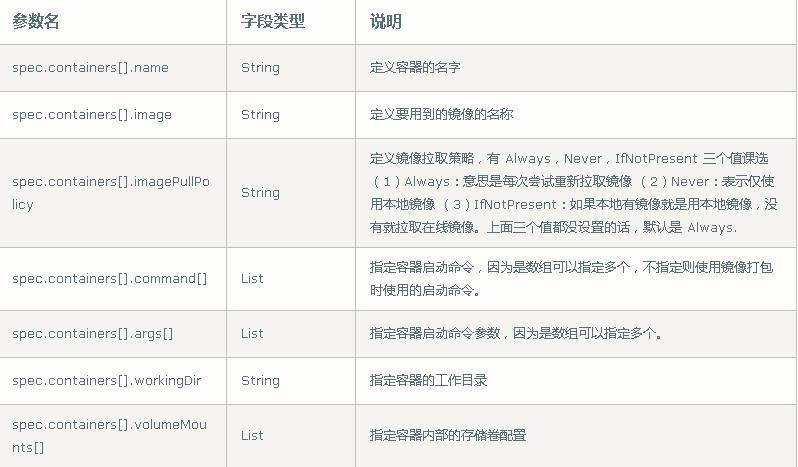
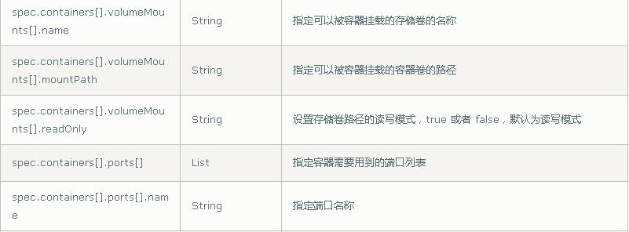
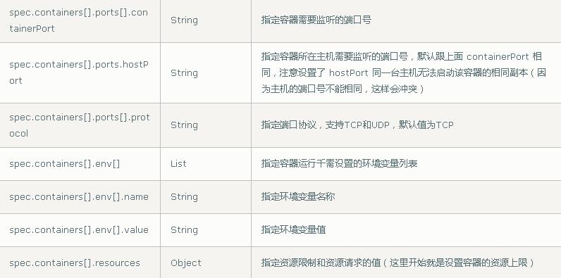
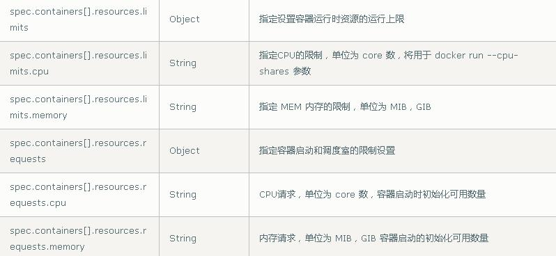
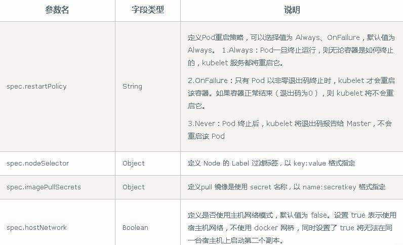

# 四、kubernetes 集群 YAML 文件详解

## 1 YAML 文件概述

k8s 集群中对资源管理和资源对象编排部署都可以通过声明样式（YAML）文件来解决，也就是可以把需要对资源对象操作编辑到 YAML 格式文件中，我们把这种文件叫做资源清单文件，通过 kubectl 命令直接使用资源清单文件就可以实现对大量的资源对象进行编排部署了。

## 2 YAML 文件书写格式

### 2.1 YAML 介绍

YAML ：仍是一种标记语言。为了强调这种语言以数据做为中心，而不是以标记语言为重点。

YAML 是一个可读性高，用来表达数据序列的格式。

### 2.2 YAML 基本语法

* 使用空格做为缩进

* 缩进的空格数目不重要，只要相同层级的元素左侧对齐即可

* 低版本缩进时不允许使用 Tab 键，只允许使用空格

* 使用#标识注释，从这个字符一直到行尾，都会被解释器忽略

### 2.3 YAML 支持的数据结构

#### 2.3.1 对象

键值对的集合，又称为映射(mapping) / 哈希（hashes） / 字典（dictionary）

```yaml
# 对象类型：对象的一组键值对，使用冒号结构表示
name: Tom
age: 18

# Yaml 也允许另一种写法，将所有键值对写成一个行内对象
hash: { name: Tom, age: 18 }
```

#### 2.3.2 数组

一组按次序排列的值，又称为序列（sequence） / 列表 （list）

```yaml
# 数组类型：一组连词线开头的行，构成一个数组
People
- Tom
- Jack

# 数组也可以采用行内表示法
People: [Tom， Jack]
```

#### 2.3.3 纯量（scalars）

单个的、不可再分的值

```yaml
# 纯量：纯量是最基本的、不可再分的值。以下数据类型都属于纯量

# 数值直接以字面量的形式表示
number: 12.30

# 布尔值用true和false表示
isSet: true

# null 用 ~ 表示
parent: ~

# 时间采用 IS08601 格式
iso8601: 2001-12-14t21:59:43.10-05:00

# 日期采用复合 iso8601 格式的年、月、日表示
date: 1976-07-31

# YAML 允许使用两个感叹号，强制转换数据类型
e: !!str 123
f: !!str true

# 字符串默认不使用引号表示
str: 这是一行字符串

# 如果字符串之中包含空格或特殊字符，需要放在引号之中
str: '内容:    字符串'

# 单引号和双引号都可以使用，双引号不会对特殊字符转义
s1: '内容\n字符串'
s2: "内容\n字符串"

# 单引号之中如果还有单引号，必须连续使用两个单引号转义
str: 'Tabor''s day'

# 字符串可以写成多行，从第二行开始，必须有一个单空格缩进。换行符会被转为空格
str: 这是一段
 多行
 字符串

# 多行字符串可以使用|保留换行符，也可以使用>折叠换行
this: |
Foo
Bar
that
Foo
Bar
```

## 3 资源清单描述方法

在 k8s 中，一般使用 YAML 格式的文件来创建符合我们预期期望的 pod，这样的 YAML文件称为资源清单。

### 3.1 常用字段

#### 3.1.1 必须存在的属性


#### 3.1.2 spec 主要对象








#### 3.1.3 额外的参数



### 3.2 举例说明

#### 3.2.1 创建一个namespace

```yaml
apiVersion: v1
kind: Namespace
metadata:
  name: test
```

#### 3.2.2 创建一个pod

```yaml
apiVersion: v1
kind: Pod
metadata:
  name: pod1
spec:
  containers:
  - name: nginx-containers
    image: nginx:latest
```

## 3 如何快速编写 yaml 文件

### 3.1 kubectl create

```shell
# dry run（排练、演习）
kubectl create deployment web --image=nginx -o yaml --dry-run
```

### 3.2 kubectl get

```shell
kubectl get deploy nginx -o=yaml --e
```

