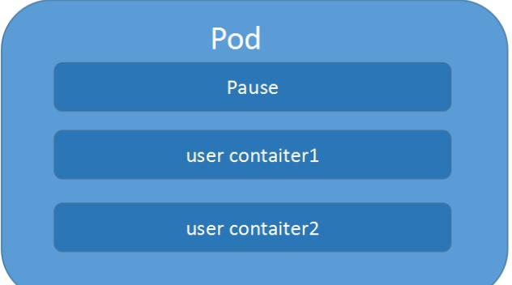
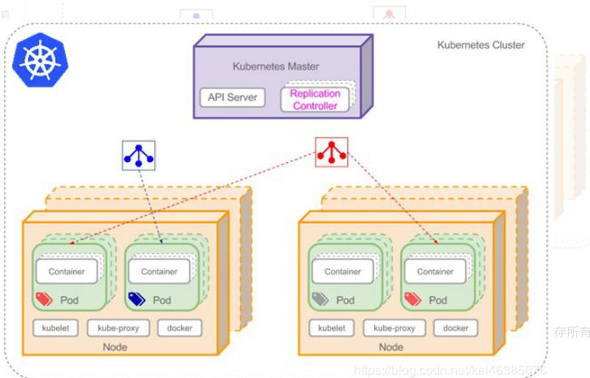

# 六、kubernetes 核心技术-Pod

## 1 Pod 概述

Pod 是 k8s 系统中可以创建和管理的最小单元，是资源对象模型中由用户创建或部署的最小资源对象模型，也是在 k8s 上运行容器化应用的资源对象，其他的资源对象都是用来支撑或者扩展 Pod 对象功能的，比如控制器对象是用来管控 Pod 对象的，Service 或者Ingress 资源对象是用来暴露 Pod 引用对象的，PersistentVolume 资源对象是用来为 Pod提供存储等等，k8s 不会直接处理容器，而是 Pod，Pod 是由一个或多个 container 组成

Pod 是 Kubernetes 的最重要概念，每一个 Pod 都有一个特殊的被称为”根容器“的 Pause容器。Pause 容器对应的镜 像属于 Kubernetes 平台的一部分，除了 Pause 容器，每个 Pod还包含一个或多个紧密相关的用户业务容器





### 1.1 Pod vs 应用

每个 Pod 都是应用的一个实例，有专用的 IP

### 1.2 Pod vs 容器

一个 Pod 可以有多个容器，彼此间共享网络和存储资源，每个 Pod 中有一个 Pause 容器保存所有的容器状态， 通过管理 pause 容器，达到管理 pod 中所有容器的效果

### 1.3 Pod vs 节点

同一个 Pod 中的容器总会被调度到相同 Node 节点，不同节点间 Pod 的通信基于虚拟二层网络技术实现

### 1.4 Pod vs Pod

普通的 Pod 和静态 Pod

## 2 Pod 特性

### 2.1 资源共享

一个 Pod 里的多个容器可以共享存储和网络，可以看作一个逻辑的主机。共享的如 namespace,cgroups 或者其他的隔离资源。

多个容器共享同一 network namespace，由此在一个 Pod 里的多个容器共享 Pod 的 IP 和端口 namespace，所以一个 Pod 内的多个容器之间可以通过 localhost 来进行通信,所需要注意的是不同容器要注意不要有端口冲突即可。不同的 Pod 有不同的 IP,不同 Pod 内的多个容器之前通信，不可以使用 IPC（如果没有特殊指定的话）通信，通常情况下使用 Pod的 IP 进行通信。

一个 Pod 里的多个容器可以共享存储卷，这个存储卷会被定义为 Pod 的一部分，并且可以挂载到该 Pod 里的所有容器的文件系统上。

### 2.2 生命周期短暂

Pod 属于生命周期比较短暂的组件，比如，当 Pod 所在节点发生故障，那么该节点上的 Pod会被调度到其他节点，但需要注意的是，被重新调度的 Pod 是一个全新的 Pod,跟之前的Pod 没有半毛钱关系。

### 2.3 平坦的网络

K8s 集群中的所有 Pod 都在同一个共享网络地址空间中，也就是说每个 Pod 都可以通过其他 Pod 的 IP 地址来实现访问。

## 3 Pod 定义

下面是 yaml 文件定义的 Pod 的完整内容

```yaml
apiVersion: v1                      # 必选，版本号，例如v1
kind: Pod                           # 必选，Pod
metadata:                           # 必选，元数据
  name: string                      # 必选，Pod名称
  namespace: string                 # 创建资源所属于的命名空间，不写的话默认创建在default空间
  labels:                           # 自定义标签
  - name: string                    # 自定义标签名字
  annotations:                      # 自定义注释列表
  - name: string
spec:                               # 必选，Pod中容器的详细定义
  containers:                       # 必选，Pod中容器列表
  - name: string                    # 必选，容器名称
    image: string                   # 必选，容器的镜像名称
    imagePullPolicy: [Always| Never | IfNotPresent]
    # 获取镜像的策略 Alawys表示下载镜像 IfnotPresent表示优先使用本地镜像，否则下载镜像，Nerver表示仅使用本地镜像
    command: [string]               # 容器的启动命令列表，如不指定，使用打包时使用的启动命令
    args: [string]                  # 容器的启动命令参数列表
    workingDir: string              # 容器的工作目录
    volumeMounts:                   # 挂载到容器内部的存储卷配置
    - name: string                  # 引用pod定义的共享存储卷的名称，需用volumes[]部分定义的的卷名
      mountPath: string             # 存储卷在容器内mount的绝对路径，应少于512字符
      readOnly: boolean             # 是否为只读模式
    ports:                          # 需要暴露的端口库号列表
    - name: string                  # 端口号名称
      containerPort: int            # 容器需要监听的端口号
      hostPort: int                 # 容器所在主机需要监听的端口号，默认与Container相同
      protocol: string              # 端口协议，支持TCP和UDP，默认TCP
    env:                            # 容器运行前需设置的环境变量列表
    - name: string                  # 环境变量名称
      value: string                 # 环境变量的值
    resources:                      # 资源限制和请求的设置
      limits:                       # 资源限制的设置
        cpu: string                 # Cpu的限制，单位为core数，将用于docker run --cpu-shares参数
        memory: string              # 内存限制，单位可以为Mib/Gib，将用于docker run --memory参数
      requests:                     # 资源请求的设置
        cpu: string                 # Cpu请求，容器启动的初始可用数量
        memory: string              # 内存清楚，容器启动的初始可用数量
    livenessProbe:                  # 对Pod内个容器健康检查的设置，当探测无响应几次后将自动重启该容器，检查方法有exec、httpGet和tcpSocket，对一个容器只需设置其中一种方法即可
      exec:                         # 对Pod容器内检查方式设置为exec方式
        command: [string]           # exec方式需要制定的命令或脚本
      httpGet:                      # 对Pod内个容器健康检查方法设置为HttpGet，需要制定Path、port
        path: string
        port: number
        host: string
        scheme: string
        HttpHeaders:
        - name: string
          value: string
      tcpSocket:                    # 对Pod内个容器健康检查方式设置为tcpSocket方式
         port: number
       initialDelaySeconds: 0       # 容器启动完成后首次探测的时间，单位为秒
       timeoutSeconds: 0            # 对容器健康检查探测等待响应的超时时间，单位秒，默认1秒
       periodSeconds: 0             # 对容器监控检查的定期探测时间设置，单位秒，默认10秒一次
       successThreshold: 0
       failureThreshold: 0
       securityContext:
         privileged: false
  restartPolicy: [Always | Never | OnFailure]
  # Pod的重启策略，Always表示一旦不管以何种方式终止运行，kubelet都将重启，OnFailure表示只有Pod以非0退出码退出才重启，Nerver表示不再重启该Pod
  nodeSelector: obeject             # 设置NodeSelector表示将该Pod调度到包含这个label的node上，以key：value的格式指定
  imagePullSecrets:                 # Pull镜像时使用的secret名称，以key：secretkey格式指定
  - name: string
  hostNetwork: false                # 是否使用主机网络模式，默认为false，如果设置为true，表示使用宿主机网络
  volumes:                          # 在该pod上定义共享存储卷列表
  - name: string                    # 共享存储卷名称 （volumes类型有很多种）
    emptyDir: {}                    # 类型为emtyDir的存储卷，与Pod同生命周期的一个临时目录。为空值
    hostPath: string                # 类型为hostPath的存储卷，表示挂载Pod所在宿主机的目录
      path: string                  # Pod所在宿主机的目录，将被用于同期中mount的目录
    secret:                         # 类型为secret的存储卷，挂载集群与定义的secre对象到容器内部
      scretname: string  
      items:     
      - key: string
        path: string
    configMap:                      # 类型为configMap的存储卷，挂载预定义的configMap对象到容器内部
      name: string
      items:
      - key: string
        path: string
```

## 4 Pod 的基本使用方法

在 kubernetes 中对运行容器的要求为：容器的主程序需要一直在前台运行，而不是后台运行。应用需要改造成前 台运行的方式。如果我们创建的 Docker 镜像的启动命令是后台执行程序，则在 kubelet 创建包含这个容器的 pod 之 后运行完该命令，即认为 Pod 已经结束，将立刻销毁该 Pod。如果为该 Pod 定义了 RC，则创建、销毁会陷入一个无限循环的过程中。Pod 可以由 1 个或多个容器组合而成。

### 4.1 一个容器组成的 Pod 的 yaml 示例

一个容器组成的 Pod：

```yaml
apiVersion: v1
kind: Pod
metadata:
  name: mytomcat
  labels:
    name: mytomcat
spec:
  containers:
  - name: mytomcat
    image: tomcat
    ports:
    - containerPort: 8080
```

### 4.2 多个容器组成的 Pod 的 yaml 示例

两个紧密耦合的容器：

```yaml
apiVersion: v1
kind: Pod
metadata:
  name: myweb
  labels:
    name: tomcat-redis
spec:
  containers:
  - name: tomcat
    image: tomcat
    ports:
    - containerPort: 8080
  - name: redis
    image: redis
    ports:
    - containerPort: 6379
```

### 4.3 创建

```shell
kubectl create -f xxx.yaml
```

### 4.4 查看

```shell
kubectl get pod/po <Pod_name>
kubectl get pod/po <Pod_name> -o wide
kubectl describe pod/po <Pod_name>
```

### 4.5 删除

```shell
kubectl delete -f pod pod_name.yaml
kubectl delete pod --all/[pod_name]
```

## 5 Pod 的分类

Pod 有两种类型

### 5.1 普通 Pod

普通 Pod 一旦被创建，就会被放入到 etcd 中存储，随后会被 Kubernetes Master 调度到某个具体的 Node 上并进行绑定，随后该 Pod 对应的 Node 上的 kubelet 进程实例化成一组相关的 Docker 容器并启动起来。在默认情 况下，当 Pod 里某个容器停止时，Kubernetes 会自动检测到这个问题并且重新启动这个 Pod 里某所有容器， 如果 Pod 所在的 Node 宕机，则会将这个 Node 上的所有 Pod 重新调度到其它节点上。

### 5.2 静态 Pod

静态 Pod 是由 kubelet 进行管理的仅存在于特定 Node 上的 Pod,它们不能通过 API Server进行管理，无法与 ReplicationController、Deployment 或 DaemonSet 进行关联，并且kubelet 也无法对它们进行健康检查。

## 6 Pod 生命周期和重启策略

### 6.1 Pod 的状态

| 状态值    | 说明                                                         |
| --------- | ------------------------------------------------------------ |
| Pending   | API Server已经创建了该Pod,但Pod中的一个或多个容器的镜像还没有创建，包括镜像下载过程 |
| Running   | Pod内所有容器已创建，且至少一个容器处于运行状态、正在启动状态或正在重启状态 |
| Completed | Pod内所有容器均成功执行退出，且不会再重启                    |
| Failed    | Pod内所有容器均已退出，但至少一个容器退出失败                |
| Unknown   | 由于某种原因无法获取Pod状态，例如网络通信不畅                |

### 6.2 Pod 重启策略

Pod 的重启策略包括 Always、OnFailure 和 Never，默认值是 Always

| 重启策略  | 说明                                                   |
| --------- | ------------------------------------------------------ |
| Always    | 当容器失效时，由kubelet自动重启该容器                  |
| OnFailure | 当容器终止运行且退出码不为0时，由kubelet自动重启该容器 |
| Never     | 不论容器运行状态如何，kubelet都不会重启该容器          |

### 6.3 常见状态转换

| Pod包含的容器数 | Pod当前的状态 | 发生事件        | Pod的结果状态        |                         |                     |
| --------------- | ------------- | --------------- | -------------------- | ----------------------- | ------------------- |
|                 |               |                 | RestartPolicy=Always | RestartPolicy=Onfailure | RestartPolicy=Never |
| 包含一个容 器   | Running       | 容器成功退出    | Running              | Succeeded               | succeeded           |
| 包含一个容 器   | Running       | 容器失败退出    | Running              | Running                 | Failure             |
| 包含两个容器    | Running       | 1个容器失败退出 | Running              | Running                 | Running             |
| 包含两个容器    | Running       | 容器被OOM杀掉   | Running              | Running                 | Falure              |

## 7 Pod 资源配置

每个 Pod 都可以对其能使用的服务器上的计算资源设置限额，Kubernetes 中可以设置限额的计算资源有 CPU 与 Memory 两种，其中 CPU 的资源单位为 CPU 数量,是一个绝对值而非相对值。Memory 配额也是一个绝对值，它的单 位是内存字节数。

Kubernetes 里，一个计算资源进行配额限定需要设定以下两个参数： Requests 该资源最小申请数量，系统必须满足要求 Limits 该资源最大允许使用的量，不能突破，当容器试图使用超过这个量的资源时，可能会被 Kubernetes Kill 并重启

### 7.1 举例

```yaml
sepc:
  containers:
  - name: db
    image: mysql
    resources:
      requests:
        memory: "64Mi"
        cpu: "250m"
      limits:
        memory: "128Mi"
        cpu: "500m"
```

上述代码表明 MySQL 容器申请最少 0.25 个 CPU 以及 64MiB 内存，在运行过程中容器所能使用的资源配额为 0.5 个 CPU 以及 128MiB 内存。

