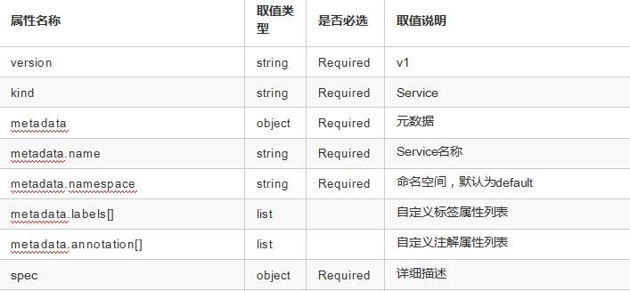
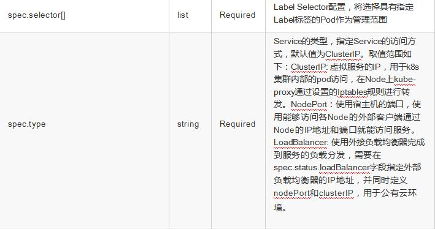
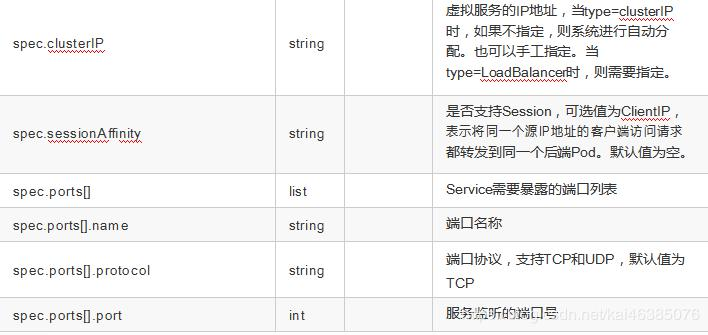
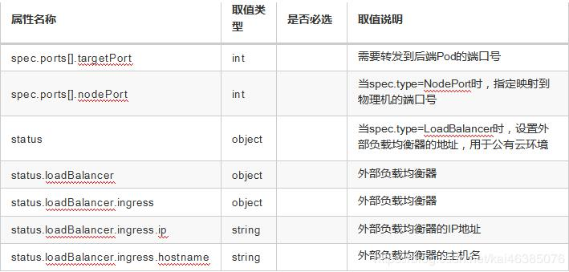

# 十四、kubernetes 核心技术-Service

## 1 Service 概述

Service 是 Kubernetes 最核心概念，通过创建 Service，可以为一组具有相同功能的容器应用提供一个统一的入口地 址，并且将请求负载分发到后端的各个容器应用上。

## 2 Service 的定义

yaml 格式的 Service 定义文件

```yaml
apiVersion: v1
kind: Service
matadata:
  name: string
  namespace: string
  labels:
  - name: string
  annotations:
  - name: string
spec:
  selector: []
  type: string
  clusterIP: string
  sessionAffinity: string
  ports:
  - name: string
    protocol: string
    port: int
    targetPort: int
    nodePort: int
status:
  loadBalancer:
    ingress:
    ip: string
    hostname: string
```









## 3 Service 的基本用法

一般来说，对外提供服务的应用程序需要通过某种机制来实现，对于容器应用最简便的方式就是通过 TCP/IP 机制及监听 IP 和端口号来实现。创建一个基本功能的 Service：

```yaml
apiVersion: v1
kind: ReplicationController
metadata:
  name: mywebapp
spec:
  replicas: 2
  template:
    metadata:
      name: mywebapp
      labels:
        app: mywebapp
    spec:
      containers:
      - name: mywebapp
        image: tomcat
        ports:
        - containerPort: 8080
```

我们可以通过 `kubectl get pods -l app=mywebapp -o yaml | grep podIP` 来获取Pod 的 IP 地址和端口号来访问 Tomcat 服务，但是直接通过 Pod 的 IP 地址和端口访问应用服务是不可靠的，因为当 Pod 所在的 Node 发生故障时， Pod 将被 kubernetes 重新调度到另一台 Node，Pod 的地址会发生改变。我们可以通过配置文件来定义 Service，再 通过 kubectl create 来创建，这样可以通过 Service 地址来访问后端的 Pod。

```yaml
apiVersion: v1
kind: Service
metadata:
  name: my-web-app-service
spec:
  ports:
  - port: 8081
    targetPort: 8080
  selector:
    app: mywebapp
```

## 4 多端口 Service

有时一个容器应用也可能需要提供多个端口的服务，那么在 Service 的定义中也可以相应地设置为将多个端口对应 到多个应用服务。

```yaml
apiVersion: v1
kind: Service
metadata:
  name: my-web-app-service
spec:
  ports:
  - port: 8080
    targetPort: 8080
    name: web
  - port: 8005
    targetPort: 8005
    name: management
  selector:
    app: mywebapp
```

## 5 外部服务 Service

在某些特殊环境中，应用系统需要将一个外部数据库作为后端服务进行连接，或将另一个集群或 Namespace 中的 服务作为服务的后端，这时可以通过创建一个无 Label Selector的 Service 来实现。

```yaml
apiVersion: v1
kind: Service
metadata:
  name: my-service
spec:
  ports:
  - protocol: TCP
    port: 80
    targetPort: 80
---
apiVersion: v1
kind: Endpoints
metadata:
  name: my-service
subsets:
  - addresses:
    - IP: 10.254.74.3
  ports:
    - port: 8080
```

