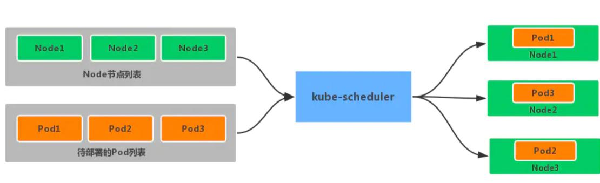
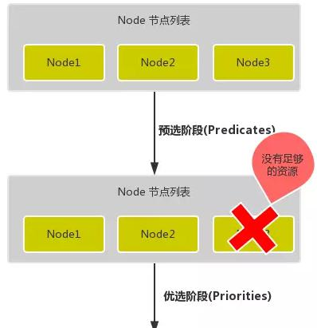
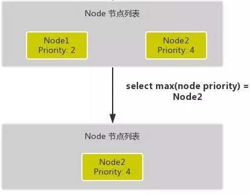

# 十九、kubernetes 核心技术-调度器

## 1 概述

一个容器平台的主要功能就是为容器分配运行时所需要的计算，存储和网络资源。容器调度系统负责选择在最合适的主机上启动容器，并且将它们关联起来。它必须能够自动的处理容器故障并且能够在更多的主机上自动启动更多的容器来应对更多的应用访问。目前三大主流的容器平台 Swarm, Mesos 和 Kubernetes 具有不同的容器调度系统。

1. Swarm 的特点是直接调度 Docker 容器，并且提供和标准 Docker API 一致的 API。
2. Mesos 针对不同的运行框架采用相对独立的调度系统，其中 Marathon 框架提供了 Docker 容器的原生支持。
3. Kubernetes 则采用了 Pod 和 Label 这样的概念把容器组合成一个个的互相存在依赖关系的逻辑单元。相关容器被组合成 Pod 后被共同部署和调度，形成服务（Service）。这个是 Kubernetes 和 Swarm，Mesos 的主要区别。相对来说，Kubernetes 采用这样的方式简化了集群范围内相关容器被共同调度管理的复杂性。换一种角度来看，Kubernetes 采用这种方式能够相对容易的支持更强大，更复杂的容器调度算法。

## 2 k8s 调度工作方式

Kubernetes 调度器作为集群的大脑，在如何提高集群的资源利用率、保证集群中服务的稳定运行中也会变得越来越重要Kubernetes 的资源分为两种属性。

1. 可压缩资源（例如 CPU 循环，Disk I/O 带宽）都是可以被限制和被回收的，对于一个Pod 来说可以降低这些资源的使用量而不去杀掉 Pod。
2. 不可压缩资源（例如内存、硬盘空间）一般来说不杀掉 Pod 就没法回收。未来Kubernetes 会加入更多资源，如网络带宽，存储 IOPS 的支持。

## 3 k8s 调度器

kube-scheduler 是 kubernetes 系统的核心组件之一，主要负责整个集群资源的调度功能，根据特定的调度算法和策略，将 Pod 调度到最优的工作节点上面去，从而更加合理、更加充分的利用集群的资源，这也是选择使用kubernetes 一个非常重要的理由。如果一门新的技术不能帮助企业节约成本、提供效率，我相信是很难推进的。

**调度流程**

默认情况下，kube-scheduler 提供的默认调度器能够满足我们绝大多数的要求，之前接触的示例也基本上用的默认的策略，都可以保证我们的 Pod 可以被分配到资源充足的节点上运行。但是在实际的线上项目中，可能我们自己会比 kubernetes 更加了解我们自己的应用，比如我们希望一个 Pod 只能运行在特定的几个节点上，或者这几个节点只能用来运行特定类型的应用，这就需要我们的调度器能够可控。

kube-scheduler 是 kubernetes 的调度器，它的主要作用就是根据特定的调度算法和调度策略将 Pod 调度到合适的 Node 节点上去，是一个独立的二进制程序，启动之后会一直监听 API Server，获取到 PodSpec.NodeName 为空的 Pod，对每个 Pod 都会创建一个binding。



调度主要分为以下几个部分：

- 首先是预选过程，过滤掉不满足条件的节点，这个过程称为 Predicates
- 然后是优选过程，对通过的节点按照优先级排序，称之为 Priorities
- 最后从中选择优先级最高的节点，如果中间任何一步骤有错误，就直接返回错误 Predicates 阶段首先遍历全部节点，过滤掉不满足条件的节点，属于强制性规则，这一阶段输出的所有满足要求的 Node 将被记录并作为第二阶段的输入，如果所有的节点都不满足条件，那么 Pod 将会一直处于 Pending 状态，直到有节点满足条件，在这期间调度器会不断的重试。

所以我们在部署应用的时候，如果发现有 Pod 一直处于 Pending 状态，那么就是没有满足调度条件的节点，这个时候可以去检查下节点资源是否可用。Priorities 阶段即再次对节点进行筛选，如果有多个节点都满足条件的话，那么系统会按照节点的优先级(priorites)大小对节点进行排序，最后选择优先级最高的节点来部署 Pod 应用。

下面是调度过程的简单示意图：





**更详细的流程是这样的：**

首先，客户端通过 API Server 的 REST API 或者 kubectl 工具创建 Pod 资源。

API Server 收到用户请求后，存储相关数据到 etcd 数据库中。

调度器监听 API Server 查看为调度(bind)的 Pod 列表，循环遍历地为每个 Pod 尝试分配节点，这个分配过程就是我们上面提到的两个阶段：

- 预选阶段(Predicates)，过滤节点，调度器用一组规则过滤掉不符合要求的 Node 节点，比如 Pod 设置了资源的 request，那么可用资源比 Pod 需要的资源少的主机显然就会被过滤掉。
- 优选阶段(Priorities)，为节点的优先级打分，将上一阶段过滤出来的 Node 列表进行打分，调度器会考虑一些整体的优化策略，比如把 Deployment 控制的多个 Pod 副本分布到不同的主机上，使用最低负载的主机等等策略。

经过上面的阶段过滤后选择打分最高的 Node 节点和 Pod 进行 binding 操作，然后将结果存储到 etcd 中。

最后被选择出来的 Node 节点对应的 kubelet 去执行创建 Pod 的相关操作。

其中 Predicates 过滤有一系列的算法可以使用，我们这里单列举几个：

- **PodFitsResources：** 节点上剩余的资源是否大于 Pod 请求的资源。
- **PodFitsHost：** 如果 Pod 指定了 NodeName，检查节点名称是否和 NodeName 匹配。
- **PodFitsHostPorts：** 节点上已经使用的 port 是否和 Pod 申请的 port 冲突。
- **PodSelectorMatches：** 过滤掉和 Pod 指定的 label 不匹配的节点。
- **NoDiskConflict：** 已经 mount 的 volume 和 Pod 指定的 volume 不冲突，除非它们都是只读的。
- **CheckNodeDiskPressure：** 检查节点磁盘空间是否符合要求。
- **CheckNodeMemoryPressure：** 检查节点内存是否够用。

除了这些过滤算法之外，还有一些其他的算法，更多更详细的我们可以查看源码文件：k8s.io/kubernetes/pkg/scheduler/algorithm/predicates/predicates.go。

而 Priorities 优先级是由一系列键值对组成的，键是该优先级的名称，值是它的权重值，同样，我们这里给大家列举几个具有代表性的选项：

- **LeastRequestedPriority：** 通过计算 CPU 和内存的使用率来决定权重，使用率越低权重越高，当然正常肯定也是资源是使用率越低权重越高，能给别的 Pod 运行的可能性就越
- **SelectorSpreadPriority：** 为了更好的高可用，对同属于一个 Deployment 或者 RC 下面的多个 Pod 副本，尽量调度到多个不同的节点上，当一个 Pod 被调度的时候，会先去查找该 Pod 对应的 controller，然后查看该 controller 下面的已存在的 Pod，运行 Pod越少的节点权重越高
- **ImageLocalityPriority：** 就是如果在某个节点上已经有要使用的镜像节点了，镜像总大小值越大，权重就越高
- **NodeAffinityPriority：** 这个就是根据节点的亲和性来计算一个权重值，后面我们会详细讲解亲和性的使用方法

## 4 节点调度亲和性

节点亲和性规则：硬亲和性 required 、软亲和性 preferred。

硬亲和性规则不满足时，Pod 会置于 Pending 状态，软亲和性规则不满足时，会选择一个不匹配的节点。当节点标签改变而不再符合此节点亲和性规则时，不会将 Pod 从该节点移出，仅对新建的 Pod 对象生效。

### 4.1 节点硬亲和性

requiredDuringSchedulingIgnoredDuringExecution

方式一：Pod 使用 spec.nodeSelector (基于等值关系)

方式二：Pod 使用 spec.affinity 支持 matchExpressions 属性 (复杂标签选择机制)

```shell
# 调度至 zone = foo 的节点
kubectl label nodes kube-node1 zone=foo
```

pod 定义：

```yaml
apiVersion: v1
kind: Pod
metadata:
  name: with-required-nodeaffinity
spec:
  affinity:
    nodeAffinity:
      requiredDuringSchedulingIgnoredDuringExecution: # 定义硬亲和性
        nodeSelectorTerms:
        - matchExpressions: # 集合选择器
          - {key: zone, operator: In, values: ["foo"]}
  containers:
  - name: myapp
    image: ikubernetes/myapp:v1
```

### 4.2 节点软亲和性

preferredDuringSchedulingIgnoredDuringExecution

柔性控制逻辑，当条件不满足时，能接受被编排于其他不符合条件的节点之上

权重 weight 定义优先级，1-100 值越大优先级越高

```yaml
apiVersion: apps/v1
kind: Deployment
metadata:
  name: myapp-deploy-with-node-affinity
spec:
  replicas: 2
  selector:
    matchLabels:
      app: myapp
  template:
    metadata:
      name: myapp-pod
      labels:
        app: myapp
    spec:
      affinity:
        nodeAffinity:
          preferredDuringSchedulingIgnoredDuringExecution: # 节点软亲和性
          - weight: 60
            preference:
              matchExpressions:
              - {key: zone, operator: In, values: ["foo"]}
          - weight: 30
            preference:
              matchExpressions:
              - {key: ssd, operator: Exists, values: []}
      containers:
      - name: myapp
        image: ikubernetes/myapp:v1
```

## 5 Pod 资源亲和调度

Pod 对象间亲和性，将一些 Pod 对象组织在相近的位置(同一节点、机架、区域、地区)

Pod 对象间反亲和性，将一些 Pod 在运行位置上隔开

### 5.1 Pod 硬亲和调度

requiredDuringSchedulingIgnoredDuringExecution

Pod 亲和性描述一个 Pod 与具有某特征的现存 Pod 运行位置的依赖关系；即需要事先存在被依赖的 Pod 对象

```shell
# 被依赖 Pod
kubectl run tomcat -l app=tomcat --image tomcat:alpine
kubectl explain pod.spec.affinity.podAffinity.requiredDuringSchedulingIgnoredDuringExecution.topologyKey
```

pod 定义：

```yaml
apiVersion: v1
kind: Pod
metadata:
  name: with-pod-affinity
spec:
  affinity:
    podAffinity:
      requiredDuringSchedulingIgnoredDuringExecution: # 硬亲和调度
      - labelSelector:
          matchExpressions: # 集合选择器
          - {key: app, operator: In, values: ["tomcat"]} # 选择被依赖 Pod
          # 上面意思是，当前 pod 要跟标签为 app 值为 tomcat 的 pod 在一起
        topologyKey: kubernetes.io/hostname # 根据挑选出的 Pod 所有节点的 hostname作为同一位置的判定
  containers:
  - name: myapp
    image: ikubernetes/myapp:v1
```

### 5.2 Pod 软亲和调度

```yaml
apiVersion: apps/v1
kind: Deployment
metadata:
  name: myapp-with-preferred-pod-affinity
spec:
  replicas: 3
  selector:
    matchLabels:
      app: myapp
  template:
    metadata:
      name: myapp
      labels:
        app: myapp
    spec:
      affinity:
        podAffinity:
          preferredDuringSchedulingIgnoredDuringExecution:
          - weight: 80
            podAffinityTerm:
              labelSelector:
                matchExpressions:
                - {key: app, operator: In, values: ["cache"]}
              topologyKey: zone
          - weight: 20
            podAffinityTerm:
              labelSelector:
                matchExpressions:
                - {key: app, operator: In, values: ["db"]}
              topologyKey: zone
      containers:
      - name: myapp
        image: ikubernetes/myapp:v1
```

### 5.3 Pod 反亲和调度

Pod 反亲和调度用于分散同一类应用，调度至不同的区域、机架或节点等将 spec.affinity.podAffinity 替换为
spec.affinity.podAntiAffinity

反亲和调度也分为柔性约束和强制约束

```yaml
apiVersion: v1
kind: Pod
metadata:
  name: pod-first
  labels:
    app: myapp
    tier: fronted
spec:
  containers:
  - name: myapp
    image: ikubernetes/myapp:v1
---
apiVersion: v1
kind: Pod
metadata:
  name: pod-second
  labels:
    app: backend
    tier: db
spec:
  containers:
  - name: busybox
    image: busybox:latest
    imagePullPolicy: IfNotPresent
    command: ["/bin/sh","-c","sleep 3600"]
  affinity:
    podAntiAffinity:
      requiredDuringSchedulingIgnoredDuringExecution:
      - labelSelector:
          matchExpressions:
          - {key: app, operator: In, values: ["myapp"]}
        topologyKey: zone
```

## 6 污点和容忍度

污点 taints 是定义在节点上的键值型属性数据，用于让节点拒绝将 Pod 调度运行于其上，除非 Pod 有接纳节点污点的容忍度容忍度 tolerations 是定义在 Pod 上的键值属性数据，用于配置可容忍的污点，且调度器将 Pod 调度至其能容忍该节点污点的节点上或没有污点的节点上

**使用 PodToleratesNodeTaints 预选策略和 TaintTolerationPriority 优选函数完成该机制**

节点亲和性使得 Pod 对象被吸引到一类特定的节点 (nodeSelector 和 affinity)

污点提供让节点排斥特定 Pod 对象的能力

### 6.1 定义污点和容忍度

污点定义于 nodes.spec.taints 容忍度定义于 pods.spec.tolerations

语法：`key=value:effect`

### 6.2 effect 定义排斥等级

NoSchedule，不能容忍，但仅影响调度过程，已调度上去的 pod 不受影响，仅对新增加的pod 生效。

PreferNoSchedule，柔性约束，节点现存 Pod 不受影响，如果实在是没有符合的节点，也可以调度上来

NoExecute，不能容忍，当污点变动时，Pod 对象会被驱逐

### 6.3 在 Pod 上定义容忍度时

等值比较 容忍度与污点在 key、value、effect 三者完全匹配

存在性判断 key、effect 完全匹配，value 使用空值

一个节点可配置多个污点，一个 Pod 也可有多个容忍度

### 6.4 管理节点的污点

同一个键值数据，effect 不同，也属于不同的污点

给节点添加污点：

```shell
kubectl taint node <node-name> <key>=<value>:<effect>
kubectl taint node node2 node-type=production:NoShedule # 举例
```

查看节点污点：

```shell
kubectl get nodes <nodename> -o go-template={{.spec.taints}}
```

删除节点污点：

```shell
kubectl taint node <node-name> <key>[:<effect>]-
kubectl patch nodes <node-name> -p '{"spec":{"taints":[]}}'
kubectl taint node kube-node1 node-type=production:NoSchedule
kubectl get nodes kube-node1 -o go-template={{.spec.taints}}
```

删除 key 为 node-type，effect 为 NoSchedule 的污点

```shell
kubectl taint node kube-node1 node-type:NoSchedule-
```

删除 key 为 node-type 的所有污点

```shell
kubectl taint node kube-node1 node-type-
```

删除所有污点

```shell
kubectl patch nodes kube-node1 -p '{"spec":{"taints":[]}}'
```

给 Pod 对象容忍度

```shell
spec.tolerations 字段添加
tolerationSeconds 用于定义延迟驱逐 Pod 的时长
```

等值判断：

```yaml
tolerations:
- key: "key1"
  operator: "Equal" # 判断条件为 Equal
  value: "value1"
  effect: "NoExecute"
  tolerationSeconds: 3600
```

存在性判断

```yaml
tolerations:
- key: "key1"
  operator: "Exists" # 存在性判断，只要污点键存在，就可以匹配
  effect: "NoExecute"
  tolerationSeconds: 3600
```

示例：

```yaml
apiVersion: apps/v1
kind: Deployment
metadata:
  name: myapp-deploy
  namespace: default
spec:
  replicas: 3
  selector:
    matchLabels:
      app: myapp
      release: canary
  template:
    metadata:
      labels:
        app: myapp
        release: canary
    spec:
      containers:
      - name: myapp
        image: ikubernetes/myapp:v1
        ports:
        - name: http
          containerPort: 80
      tolerations:
      - key: "node-type"
        operator: "Equal"
        value: "production"
        effect: "NoExecute"
        tolerationSeconds: 3600
```

### 6.5 问题节点标识

自动为节点添加污点信息，使用 NoExecute 效用标识，会驱逐现有 Pod

K8s 核心组件通常都容忍此类污点

node.kubernetes.io/not-ready 节点进入 NotReady 状态时自动添加

node.alpha.kubernetes.io/unreachable 节点进入 NotReachable 状态时自动添加

node.kubernetes.io/out-of-disk 节点进入 OutOfDisk 状态时自动添加

node.kubernetes.io/memory-pressure 节点内存资源面临压力

node.kubernetes.io/disk-pressure 节点磁盘面临压力

node.kubernetes.io/network-unavailable 节点网络不可用

node.cloudprovider.kubernetes.io/uninitialized kubelet 由外部云环境程序启动时，自动添加，待到去控制器初始化此节点时再将其删除

### 6.6 Pod 优选级和抢占式调度

优选级，Pod 对象的重要程度

优选级会影响节点上 Pod 的调度顺序和驱逐次序

一个 Pod 对象无法被调度时，调度器会尝试抢占(驱逐)较低优先级的 Pod 对象，以便可以调度当前 Pod

### 6.7 Pod 优选级和抢占机制默认处于禁用状态

启用：同时为 kube-apiserver、kube-scheduler、kubelet 程序的 --feature-gates 添加PodPriority=true

使用：事先创建优先级类别，并在创建 Pod 资源时通过 priorityClassName 属性指定所属优选级类别

