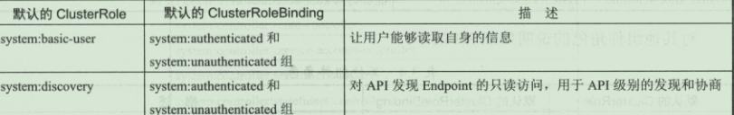
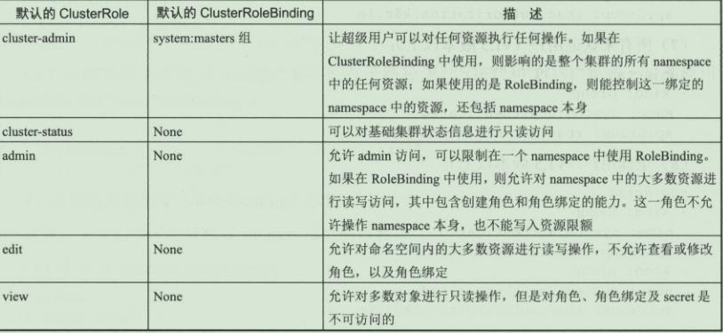
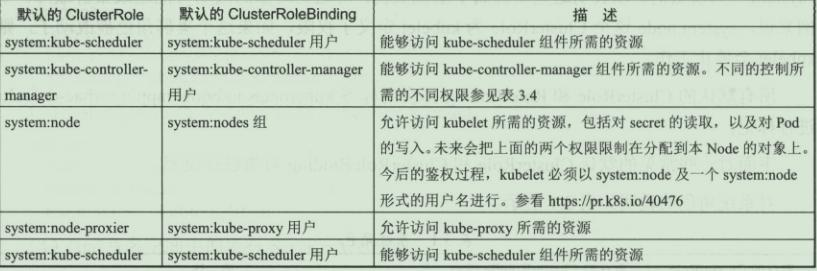

# 二十、kubernetes 核心技术-集群安全机制 RBAC

## 1、基本概念

RBAC(Role-Based Access Control，基于角色的访问控制)在 k8s v1.5 中引入，在 v1.6 版本时升级为 Beta 版本，并成为 kubeadm 安装方式下的默认选项，相对于其他访问控制方式，新的 RBAC 具有如下优势：

- 对集群中的资源和非资源权限均有完整的覆盖

- 整个 RBAC 完全由几个 API 对象完成，同其他 API 对象一样，可以用 kubectl 或 API进行操作

- 可以在运行时进行调整，无需重启 API Server

要使用 RBAC 授权模式，需要在 API Server 的启动参数中加上 `--authorization-mode=RBAC`

## 2、RBAC 原理和用法

### 2.1 RBAC 的 API 资源对象说明

RBAC 引入了 4 个新的顶级资源对象：Role、ClusterRole、RoleBinding、ClusterRoleBinding。同其他 API 资源对象一样，用户可以使用 kubectl 或者 API 调用等方式操作这些资源对象。

#### 2.1.1 角色(Role)

一个角色就是一组权限的集合，这里的权限都是许可形式的，不存在拒绝的规则。在一个命名空间中，可以用角色来定义一个角色，如果是集群级别的，就需要使用 ClusterRole了。角色只能对命名空间内的资源进行授权，下面的例子中定义的角色具备读取 Pod 的权限：

```yaml
kind: Role
apiVersion: rbac.authorization.k8s.io/v1
metadata:
  namespace: default
  name: pod-reader
rules:
- apiGroups: [""] # 空字符串表示核心 API 群
  resource: ["pods"]
  verbs: ["get", "watch", "list"]
```

rules 中的参数说明：
- apiGroup：支持的 API 组列表，例如：`APIVersion: batch/v1`、`APIVersion: extensions/v1`、`apiVersion: apps/v1` 等
- resources：支持的资源对象列表，例如：pods、deployments、jobs 等
- verbs：对资源对象的操作方法列表，例如：get、watch、list、delete、replace 等

#### 2.1.2 集群角色(ClusterRole)

集群角色除了具有和角色一致的命名空间内资源的管理能力，因其集群级别的范围，还可以用于以下特殊元素的授权。
- 集群范围的资源，例如 Node
- 非资源型的路径，例如 /healthz
- 包含全部命名空间的资源，例如 pods

下面的集群角色可以让用户有权访问任意一个或所有命名空间的 secrets：

```yaml
kind: ClusterRole
apiVersion: rbac.authorization.k8s.io/v1
metadata:
# name: secret-reader
# ClusterRole 不受限于命名空间，所以省略了 namespace name 的定义
rules:
- apiGroups: [""]
  resources: ["secrets"]
  verbs: ["get", "watch", "list"]
```

#### 2.1.3 角色绑定(RoleBinding)和集群角色绑定(ClusterRoleBinding)

角色绑定或集群角色绑定用来把一个角色绑定到一个目标上，绑定目标可以是 User、Group 或者 Service Account。使用 RoleBinding 为某个命名空间授权，ClusterRoleBinding 为集群范围内授权。

RoleBinding 可以引用 Role 进行授权，下例中的 RoleBinding 将在 default 命名空间中把 pod-reader 角色授予用户 jane，可以让 jane 用户读取 default 命名空间的 Pod：

```yaml
kind: RoleBinding
apiVersion: rbac.authorization.k8s.io/v1
metadata:
  name: read-pods
  namespace: default
subjects:
- kind: User
  name: jane
  apiGroup: rbac.authorization.k8s.io
roleRef:
  kind: Role
  name: pod-reader
  apiGroup: rbac.authorization.k8s.io
```

RoleBinding 也可以引用 ClusterRole，对属于同一命名空间内 ClusterRole 定义的资源主体进行授权。一种常见的做法是集群管理员为集群范围预先定义好一组角色(ClusterRole)，然后在多个命名空间中重复使用这些 ClusterRole。

使用 RoleBinding 绑定集群角色 secret-reader，使 dave 只能读取 development 命名空间中的 secret：

```yaml
kind: RoleBinding
apiVersion: rbac.authorization.k8s.io/v1
metadata:
  name: read-secrets
  namespace: development
subjects:
- kind: User
  name: dave
  apiGroup: rbac.authorization.k8s.io
roleRef:
  kind: ClusterRole
  name: secret-reader
  apiGroup: rbac.authorization.k8s.io
```

集群角色绑定中的角色只能是集群角色，用于进行集群级别或者对所有命名空间都生效授权。允许 manager 组的用户读取任意 namespace 中的 secret

```yaml
kind: ClusterRoleBinding
apiVersion: rbac.authorization.k8s.io/v1
metadata:
  name: read-secrets-global
subjects:
- kind: Group
  name: manager
  apiGroup: rbac.authorization.k8s.io
roleRef:
  kind: ClusterRole
  name: secret-reader
  apiGroup: rbac.authorization.k8s.io
```

### 2.2 对资源的引用方式

多数资源可以用其名称的字符串来表达，也就是 Endpoint 中的 URL 相对路径，例如 pods。然后，某些 Kubernetes API 包含下级资源，例如 Pod 的日志(logs)。Pod 日志的 Endpoint 是 GET /api/v1/namespaces/{namespaces}/pods/{name}/log。

Pod 是一个命名空间内的资源，log 就是一个下级资源。要在一个 RBAC 角色中体现，则需要用斜线/来分割资源和下级资源。若想授权让某个主体同时能够读取 Pod 和 Pod log，则可以配置 resources 为一个数组：

```yaml
kind: Role
apiVersion: rbac.authorization.k8s.io/v1
metadata:
  namespace: default
name: pod-and-pod-logs-reader
rules:
- apiGroups: [""]
  resources: ["pods", "pods/log"]
  verbs: ["get", "list"]
```

资源还可以通过名字(ResourceName)进行引用。在指定 ResourceName 后，使用 get、delete、update、patch 动词的请求，就会被限制在这个资源实例范围内。例如下面的声明让一个主体只能对一个叫 my-configmap 的 configmap 进行 get 和 update 操作：

```yaml
kind: Role
apiVersion: rbac.authorization.k8s.io/v1
metadata:
  namespace: default
name: configmap-updater
rules:
- apiGroups: [""]
  resources: ["configmap"]
  resourceNames: ["my-configmap"]
  verbs: ["update", "get"]
```

### 2.3 常见的角色(Role)示例

1、允许读取核心 API 组中 Pod 的资源：

```yaml
rules:
- apiGroups: [""]
  resources: ["pods"]
  verbs: ["get", "list", "watch"]
```

2、允许读写"extensions"和"apps"两个 API 组中的 deployment 资源

```yaml
rules:
- apiGroups: ["extensions", "apps"]
  resources: ["deployments"]
  verbs: ["get", "list", "watch", "create", "update", "patch", "delete"]
```

3、允许读写 pods 及读写 jobs

```yaml
rules:
- apiGroups: [""]
  resources: ["pods"]
  verbs: ["get", "list", "watch"]
- apiGroups: ["batch", "extensions"]
  resources: ["jobs"]
  verbs: ["get", "list", "watch", "create", "update", "patch", "delete"]
```

4、允许读取一个名为 my-config 的 ConfigMap(必须绑定到一个 RoleBinding 来限制到一个 namespace 下的 ConfigMap)：

```yaml
rules:
- apiGroups: [""]
  resources: ["configmaps"]
  resourceNames: ["my-config"]
  verbs: ["get"]
```

5、读取核心组的 node 资源(Node 属于集群级别的资源，必须放在 ClusterRole 中，并使用 ClusterRoleBinding 进行绑定)：

```yaml
rules:
- apiGroups: [""]
  resources: ["nodes"]
  verbs: ["get", "list", "watch"]
```

6、允许对非资源端点/healthz 及其所有子路径进行 GET/POST 操作(必须使用ClusterRole 和 ClusterRoleBinding)：

```yaml
rules:
- nonResourceURLs: ["/healthz", "/healthz/*"]
  verbs: ["get", "post"]
```

### 2.4 常用的角色绑定

- 用户名 Alice@example.com

```yaml
subjects:
- kind: User
  name: "Alice@example.com"
  apiGroup: rbac.authorization.k8s.io
```

- 组名 frontend-admins

```yaml
subjects:
- kind: Group
  name: "frontend-admins"
  apiGroup: rbac.authorization.k8s.io
```

- kube-system 命名空间中的默认 Service Account

```yaml
subjects:
- kind: ServiceAccount
  name: default
  namespace: kube-system
```

- qa 命名空间中的所有 Service Account

```yaml
subjects:
- kind: Group
  name: system:serviceaccounts:qa
  apiGroup: rbac.authorization.k8s.io
```

- 所有 Service Account

```yaml
subjects:
- kind: Group
  name: system:serviceaccounts
  apiGroup: rbac.authorization.k8s.io
```

- 所有认证用户

```yaml
subjects:
- kind: Group
  name: system:authentication
  apiGroup: rbac.authorization.k8s.io
```

- 所有未认证用户

```yaml
subjects:
- kind: Group
  name: system:unauthentication
  apiGroup: rbac.authorization.k8s.io
```

- 全部用户

```yaml
subjects:
- kind: Group
  name: system:authentication
  apiGroup: rbac.authorization.k8s.io
- kind: Group
  name: system:unauthentication
  apiGroup: rbac.authorization.k8s.io
```

### 2.5 默认的角色和角色绑定

API Server 会创建一套默认的 ClusterRole 和 ClusterRoleBinding 对象，其中很多是以 system: 为前缀的，以表明这些资源属于基础架构，对这些对象的改动可能造成集群故障。

所有默认的 ClusterRole 和 RoleBinding 都会用标签 kubernetes.io/bootstrapping=rbac-defaults 进行标记。

**常见的系统角色如下：**



有些默认角色不是以 system:为前缀的，这部分角色是针对用户的，其中包含超级用户角色 cluster-admin，有的用于集群一级的角色 cluster-status，还有针对 namespace 的角色 admin、edit、view。

**常见的用户角色如下：**



**核心 Master 组件角色：**



### 2.6 授权注意事项：预防提权和授权初始化

RBAC API 拒绝用户利用编辑角色或者角色绑定的方式进行提权。这一限制是在 API 层面做出的，因此即使 RBAC 没有启用也仍然有效。

用户只能在拥有一个角色的所有权限，且与该角色的生效范围一致的前提下，才能对角色进行创建和更新。例如用户 user-1 没有列出集群中所有 secret 的权限，就不能创建具有这一权限的集群角色。要让一个用户能够创建或更新角色，需要以下权限：

**为其授予一个允许创建/更新 Role 或 ClusterRole 资源对象的角色；**

- 为用户授予角色，要覆盖该用户所能控制的所有权限范围。用户如果尝试创建超出其自身权限的角色或者集群角色，则该 API 调用会被禁止。

- 如果一个用户的权限包含了一个角色的所有权限，那么就可以为其创建和更新角色绑
  定；或者如果被授予了针对某个角色的绑定授权，则也有权完成此操作。

例如：user1 没有列出集群内所有 secret 的权限，就无法为一个具有这样权限的角色。

创建集群角色绑定。要使用户能够创建、更新这一角色绑定，则需要有如下做法：

**为其授予一个允许创建和更新角色绑定或者集群角色绑定的角色**

为其授予绑定某一角色的权限，有隐式或显式两种方法

- 隐式：让其具有所有该角色的权限
- 显式：让用户授予针对该角色或集群角色绑定操作的权限，让 user-1 有对 user-1-namespace 命名空间中的其他用户授予 admin、edit 及 view 角色

```yaml
apiVersion: rbac.authorization.k8s.io/v1
kind: ClusterRole
metadata:
  name: role-grantor
rules:
- apiGroups: ["rbac.authorization.k8s.io"]
  resources: ["rolebindings"]
  verbs: ["create"]
- apiGroups: ["rbac.authorization.k8s.io"]
  resources: ["clusterroles"]
  verbs: ["bind"]
  resourceNames: ["admin", "edit", "view"]
---
apiVersion: rbac.authorization.k8s.io/v1
kind: RoleBinding
metadata:
  name: role-grantor-binding
  namespace: user-1-namespace
roleRef:
  apiGroup: rbac.authorization.k8s.io
  kind: ClusterRole
  name: role-grantor
subjects:
- apiGroup: rbac.authorization.k8s.io
  kind: User
  name: user-1
```

在进行第一个角色和角色绑定时，必须让初始用户具备其尚未被授予的权限，要进行初始的角色和角色绑定设置，有以下两种方法：
- 使用属于 system:masters 组的身份，这一群组默认具有 cluster-admin 这一超级角色的绑定。
- 如果 API Server 以--insecure-port 参数运行，则客户端通过这个非安全端口进行接口调用，这一端口没有认证鉴权的限制。